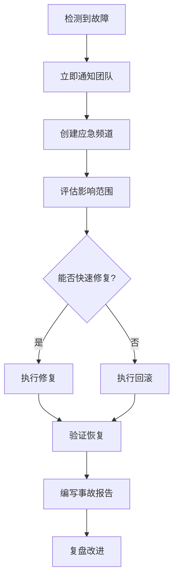

# ReflectGuard 运维手册

> 日常运维、监控、备份和故障恢复的完整指南

**最后更新：** 2026-02-06
**版本：** 2.2.0
**目标读者：** 运维工程师、系统管理员

---

## 目录

- [日常运维](#日常运维)
- [监控告警](#监控告警)
- [日志管理](#日志管理)
- [备份恢复](#备份恢复)
- [性能优化](#性能优化)
- [安全管理](#安全管理)
- [升级维护](#升级维护)
- [应急响应](#应急响应)

---

## 日常运维

### 每日检查清单

#### 1. 服务状态检查

```bash
# 检查 API 服务
curl -s http://localhost:3000/health | jq '.'

# 检查 PM2 进程（如果使用）
pm2 status

# 检查端口占用
netstat -tuln | grep 3000
# 或
lsof -i :3000
```

**预期输出：**
```json
{
  "status": "healthy",
  "timestamp": "2026-02-06T10:00:00.000Z",
  "uptime": 86400.123
}
```

#### 2. 系统资源检查

```bash
# CPU 使用率
top -l 1 | grep "CPU usage"

# 内存使用
free -h  # Linux
vm_stat  # macOS

# 磁盘空间
df -h ~/.prism-gateway

# 进程资源占用
ps aux | grep prism-gateway
```

**健康指标：**
- CPU 使用率 < 80%
- 内存使用 < 80%
- 磁盘可用空间 > 20%

#### 3. 日志检查

```bash
# 查看最近的错误日志
tail -n 100 logs/prism-gateway.log | grep "ERROR"

# 查看今天的违规记录
cat level-2-warm/violations.jsonl | grep "$(date +%Y-%m-%d)" | wc -l

# 查看日志统计
cat logs/prism-gateway.log | jq -r '.level' | sort | uniq -c
```

#### 4. 数据完整性检查

```bash
# 检查原则文件
cat level-1-hot/principles.json | jq '.principles | length'
# 输出应为 5

# 检查模式文件
cat level-1-hot/patterns/success_patterns.json | jq '.total_patterns'
# 输出应为 23

# 检查索引文件
cat level-2-warm/retros/index.jsonl | wc -l
```

### 每周维护任务

#### 1. 清理旧日志

```bash
#!/bin/bash
# cleanup-logs.sh

# 删除 30 天前的日志
find logs/ -name "*.log" -mtime +30 -delete

# 压缩 7 天前的日志
find logs/ -name "*.log" -mtime +7 -exec gzip {} \;

echo "日志清理完成: $(date)"
```

**添加到 crontab：**
```bash
# 每周日凌晨 2 点执行
0 2 * * 0 /path/to/cleanup-logs.sh
```

#### 2. 数据备份

```bash
#!/bin/bash
# backup-data.sh

BACKUP_DIR="/backup/prism-gateway/$(date +%Y-%m-%d)"
mkdir -p "$BACKUP_DIR"

# 备份 Hot 数据
cp -r level-1-hot "$BACKUP_DIR/"

# 备份 Warm 数据（最近 7 天）
find level-2-warm/retros -type f -mtime -7 -exec cp --parents {} "$BACKUP_DIR/" \;
cp level-2-warm/violations.jsonl "$BACKUP_DIR/"

# 备份配置文件
cp .env "$BACKUP_DIR/"
cp hooks.config.json "$BACKUP_DIR/"

# 压缩备份
tar -czf "$BACKUP_DIR.tar.gz" -C /backup/prism-gateway "$(basename $BACKUP_DIR)"
rm -rf "$BACKUP_DIR"

echo "备份完成: $BACKUP_DIR.tar.gz"
```

#### 3. 性能分析

```bash
# 查看 Gateway 检查性能
bun run src/cli/index.ts stats --period week --metrics performance

# 查看违规趋势
bun run src/cli/index.ts stats --period week --metrics violations

# 查看缓存命中率
bun run src/cli/index.ts stats --period week --metrics cache
```

### 每月维护任务

#### 1. 安全审计

```bash
# 检查依赖漏洞
bun audit

# 检查文件权限
find ~/.prism-gateway -type f -name ".env" -exec ls -l {} \;

# 检查敏感信息泄露
grep -r "JWT_SECRET" ~/.prism-gateway --exclude-dir=node_modules
grep -r "password" ~/.prism-gateway --exclude-dir=node_modules
```

#### 2. 容量规划

```bash
# 查看数据增长趋势
du -sh level-1-hot level-2-warm level-3-cold analytics logs

# 预测未来增长（基于最近 30 天）
# 可以使用 Analytics Service 的趋势分析功能
```

#### 3. 系统更新

```bash
# 更新依赖
bun update

# 检查过时的包
bun outdated

# 运行测试验证
bun test
```

---

## 监控告警

### 关键指标监控

#### 1. 服务可用性

**监控指标：**
- API 健康检查状态
- 服务响应时间
- 错误率

**告警阈值：**
- 健康检查失败 → P0 告警
- 响应时间 > 3秒 → P2 告警
- 错误率 > 5% → P1 告警

**监控脚本：**
```bash
#!/bin/bash
# monitor-availability.sh

# 健康检查
response=$(curl -s -w "\n%{http_code}" http://localhost:3000/health)
http_code=$(echo "$response" | tail -n1)
body=$(echo "$response" | head -n-1)

if [ "$http_code" != "200" ]; then
  echo "CRITICAL: API 服务不可用 (HTTP $http_code)"
  # 发送告警（邮件、Slack 等）
  exit 2
fi

status=$(echo "$body" | jq -r '.status')
if [ "$status" != "healthy" ]; then
  echo "WARNING: API 服务不健康"
  exit 1
fi

echo "OK: API 服务正常"
exit 0
```

#### 2. 性能指标

**监控指标：**
- Gateway 检查时间
- Analytics 查询时间
- 内存使用
- CPU 使用

**告警阈值：**
- Gateway 检查 > 1000ms → P2 告警
- 内存使用 > 90% → P1 告警
- CPU 使用 > 90% 持续 5分钟 → P1 告警

**监控脚本：**
```bash
#!/bin/bash
# monitor-performance.sh

# 获取性能指标
metrics=$(curl -s http://localhost:3000/api/metrics)

# Gateway 检查时间
gateway_time=$(echo "$metrics" | jq -r '.gateway.check_time_avg')
if (( $(echo "$gateway_time > 1000" | bc -l) )); then
  echo "WARNING: Gateway 检查时间过长: ${gateway_time}ms"
fi

# 内存使用
memory_usage=$(echo "$metrics" | jq -r '.system.memory_percent')
if [ "$memory_usage" -gt 90 ]; then
  echo "CRITICAL: 内存使用过高: ${memory_usage}%"
fi
```

#### 3. 业务指标

**监控指标：**
- 违规率趋势
- 复盘完成率
- 活跃用户数

**告警阈值：**
- 违规率突增 > 50% → P2 告警
- 每日复盘数 = 0 → P3 告警（提醒）

### 告警配置

#### 告警级别定义

| 级别 | 响应时间 | 示例场景 |
|------|---------|---------|
| **P0** | 立即（< 15分钟） | 服务完全不可用、数据丢失 |
| **P1** | 紧急（< 1小时） | 性能严重下降、部分功能不可用 |
| **P2** | 尽快（< 4小时） | 性能轻微下降、非核心功能异常 |
| **P3** | 正常（< 24小时） | 提醒类通知、非紧急问题 |

#### 告警通知渠道

**邮件通知：**
```bash
#!/bin/bash
# send-alert-email.sh

recipient="ops@example.com"
subject="[$1] ReflectGuard 告警"
body="$2"

echo "$body" | mail -s "$subject" "$recipient"
```

**Slack 通知：**
```bash
#!/bin/bash
# send-alert-slack.sh

webhook_url="https://hooks.slack.com/services/YOUR/WEBHOOK/URL"
message="$1"

curl -X POST -H 'Content-type: application/json' \
  --data "{\"text\":\"$message\"}" \
  "$webhook_url"
```

**集成示例：**
```bash
#!/bin/bash
# monitor-with-alerts.sh

# 检查服务
if ! /path/to/monitor-availability.sh; then
  # P0 告警
  /path/to/send-alert-email.sh "P0" "API 服务不可用"
  /path/to/send-alert-slack.sh "🚨 P0: API 服务不可用"
fi
```

### 可视化监控

#### 使用 Analytics Service

```bash
# 启动内置监控看板
bun run src/cli/index.ts dashboard

# 访问 http://localhost:3000/dashboard
```

#### Grafana 集成（可选）

**暴露 Prometheus 指标：**
```typescript
// src/api/metrics.ts
import { register, Counter, Histogram } from 'prom-client';

export const gatewayCheckCounter = new Counter({
  name: 'prism_gateway_checks_total',
  help: 'Gateway 检查总次数',
  labelNames: ['status']
});

export const gatewayCheckDuration = new Histogram({
  name: 'prism_gateway_check_duration_seconds',
  help: 'Gateway 检查耗时',
  buckets: [0.1, 0.5, 1, 2, 5]
});

// 在 API 路由中使用
app.get('/metrics', async (c) => {
  c.header('Content-Type', register.contentType);
  return c.body(await register.metrics());
});
```

**Grafana 配置：**
```json
{
  "dashboard": {
    "title": "ReflectGuard 监控",
    "panels": [
      {
        "title": "Gateway 检查速率",
        "targets": [
          {
            "expr": "rate(prism_gateway_checks_total[5m])"
          }
        ]
      },
      {
        "title": "Gateway 检查耗时",
        "targets": [
          {
            "expr": "histogram_quantile(0.95, prism_gateway_check_duration_seconds)"
          }
        ]
      }
    ]
  }
}
```

---

## 日志管理

### 日志级别

| 级别 | 用途 | 示例 |
|------|------|------|
| **DEBUG** | 调试信息 | 函数入口/出口、变量值 |
| **INFO** | 正常操作 | 服务启动、请求处理 |
| **WARN** | 警告信息 | 降级使用、配置问题 |
| **ERROR** | 错误信息 | 异常、失败操作 |

### 日志格式

**JSON 格式（推荐生产环境）：**
```json
{
  "level": "INFO",
  "time": "2026-02-06T10:00:00.000Z",
  "msg": "Gateway 检查完成",
  "intent": "实现用户登录",
  "status": "PASS",
  "duration": 123,
  "requestId": "abc123"
}
```

**文本格式（开发环境）：**
```log
[2026-02-06 10:00:00] INFO: Gateway 检查完成 | intent=实现用户登录 status=PASS duration=123ms
```

### 日志查询

#### 使用 jq 查询 JSON 日志

```bash
# 查询所有 ERROR 级别日志
cat logs/prism-gateway.log | jq 'select(.level == "ERROR")'

# 查询特定时间范围的日志
cat logs/prism-gateway.log | jq 'select(.time >= "2026-02-06" and .time < "2026-02-07")'

# 查询包含特定关键词的日志
cat logs/prism-gateway.log | jq 'select(.msg | contains("Gateway"))'

# 统计各级别日志数量
cat logs/prism-gateway.log | jq -r '.level' | sort | uniq -c

# 计算平均响应时间
cat logs/prism-gateway.log | jq -s 'map(.duration) | add / length'
```

#### 使用 grep 查询文本日志

```bash
# 查询错误日志
grep "ERROR" logs/prism-gateway.log

# 查询特定时间段
grep "2026-02-06 10:" logs/prism-gateway.log

# 统计请求量
grep "INFO" logs/prism-gateway.log | wc -l

# 查找慢请求
grep "duration" logs/prism-gateway.log | awk -F'duration=' '{print $2}' | awk '$1 > 1000'
```

### 日志轮转

#### 使用 logrotate

**配置文件：** `/etc/logrotate.d/prism-gateway`
```
~/.prism-gateway/logs/*.log {
    daily
    rotate 14
    compress
    delaycompress
    missingok
    notifempty
    create 0644 user group
    sharedscripts
    postrotate
        pm2 reload prism-gateway-api
    endscript
}
```

**测试配置：**
```bash
sudo logrotate -d /etc/logrotate.d/prism-gateway
```

#### 应用内日志轮转

```typescript
// src/utils/logger.ts
import pino from 'pino';

export const logger = pino({
  level: process.env.LOG_LEVEL || 'info',
  transport: {
    target: 'pino/file',
    options: {
      destination: './logs/prism-gateway.log',
      mkdir: true,
      size: '100M',      // 单文件最大 100MB
      rotation: true,    // 启用轮转
      maxFiles: 30       // 保留 30 天
    }
  }
});
```

---

## 备份恢复

### 备份策略

#### 1. 备份类型

**完整备份：**
- 频率：每周一次
- 内容：所有数据和配置
- 保留：4 周

**增量备份：**
- 频率：每日一次
- 内容：变化的文件
- 保留：7 天

**实时备份：**
- 频率：实时
- 内容：违规记录
- 保留：根据容量

#### 2. 备份内容

| 目录 | 内容 | 备份频率 | 保留时间 |
|------|------|---------|---------|
| `level-1-hot/` | 原则、模式 | 每周 | 4 周 |
| `level-2-warm/` | 复盘、违规 | 每日 | 4 周 |
| `level-3-cold/` | SOP、模板 | 每周 | 4 周 |
| `analytics/` | 分析数据 | 每日 | 2 周 |
| `config/` | 配置文件 | 每周 | 永久 |
| `.env` | 环境变量 | 手动 | 永久 |

### 备份脚本

#### 完整备份脚本

```bash
#!/bin/bash
# backup-full.sh

set -e

BACKUP_ROOT="/backup/prism-gateway"
DATE=$(date +%Y-%m-%d)
BACKUP_DIR="$BACKUP_ROOT/full/$DATE"

mkdir -p "$BACKUP_DIR"

echo "开始完整备份: $DATE"

# 1. 备份 Hot 数据
echo "备份 Hot 数据..."
cp -r level-1-hot "$BACKUP_DIR/"

# 2. 备份 Warm 数据
echo "备份 Warm 数据..."
cp -r level-2-warm "$BACKUP_DIR/"

# 3. 备份 Cold 数据
echo "备份 Cold 数据..."
cp -r level-3-cold "$BACKUP_DIR/"

# 4. 备份 Analytics 数据
echo "备份 Analytics 数据..."
cp -r analytics "$BACKUP_DIR/" 2>/dev/null || true

# 5. 备份配置文件
echo "备份配置文件..."
mkdir -p "$BACKUP_DIR/config"
cp .env "$BACKUP_DIR/config/" 2>/dev/null || true
cp hooks.config.json "$BACKUP_DIR/config/" 2>/dev/null || true
cp tsconfig.json "$BACKUP_DIR/config/" 2>/dev/null || true

# 6. 创建备份清单
echo "创建备份清单..."
find "$BACKUP_DIR" -type f -exec sha256sum {} \; > "$BACKUP_DIR/SHA256SUMS"

# 7. 压缩备份
echo "压缩备份..."
tar -czf "$BACKUP_DIR.tar.gz" -C "$BACKUP_ROOT/full" "$(basename $BACKUP_DIR)"
rm -rf "$BACKUP_DIR"

# 8. 上传到远程（可选）
# aws s3 cp "$BACKUP_DIR.tar.gz" s3://backup-bucket/prism-gateway/

echo "备份完成: $BACKUP_DIR.tar.gz"
```

#### 增量备份脚本

```bash
#!/bin/bash
# backup-incremental.sh

set -e

BACKUP_ROOT="/backup/prism-gateway"
DATE=$(date +%Y-%m-%d)
BACKUP_DIR="$BACKUP_ROOT/incremental/$DATE"

mkdir -p "$BACKUP_DIR"

echo "开始增量备份: $DATE"

# 1. 备份最近变化的违规记录
echo "备份违规记录..."
find level-2-warm -name "*.jsonl" -mtime -1 -exec cp --parents {} "$BACKUP_DIR/" \;

# 2. 备份新的复盘记录
echo "备份复盘记录..."
find level-2-warm/retros -type f -mtime -1 -exec cp --parents {} "$BACKUP_DIR/" \;

# 3. 备份日志
echo "备份日志..."
find logs -name "*.log" -mtime -1 -exec cp --parents {} "$BACKUP_DIR/" \;

# 4. 创建备份清单
find "$BACKUP_DIR" -type f -exec sha256sum {} \; > "$BACKUP_DIR/SHA256SUMS"

# 5. 压缩
tar -czf "$BACKUP_DIR.tar.gz" -C "$BACKUP_ROOT/incremental" "$(basename $BACKUP_DIR)"
rm -rf "$BACKUP_DIR"

echo "增量备份完成: $BACKUP_DIR.tar.gz"
```

#### 恢复脚本

```bash
#!/bin/bash
# restore.sh

set -e

if [ -z "$1" ]; then
  echo "用法: $0 <备份文件路径>"
  exit 1
fi

BACKUP_FILE="$1"
RESTORE_DIR="/tmp/prism-gateway-restore-$(date +%s)"

echo "开始恢复: $BACKUP_FILE"

# 1. 解压备份
echo "解压备份文件..."
mkdir -p "$RESTORE_DIR"
tar -xzf "$BACKUP_FILE" -C "$RESTORE_DIR"

# 2. 验证备份完整性
echo "验证备份完整性..."
cd "$RESTORE_DIR"/*
if [ -f "SHA256SUMS" ]; then
  sha256sum -c SHA256SUMS
  if [ $? -ne 0 ]; then
    echo "错误：备份校验失败"
    exit 1
  fi
fi

# 3. 停止服务
echo "停止服务..."
pm2 stop prism-gateway-api 2>/dev/null || true

# 4. 备份当前数据
echo "备份当前数据..."
mv ~/.prism-gateway ~/.prism-gateway.backup.$(date +%s)

# 5. 恢复数据
echo "恢复数据..."
cp -r . ~/.prism-gateway/

# 6. 重启服务
echo "重启服务..."
pm2 start prism-gateway-api

# 7. 验证恢复
echo "验证恢复..."
curl -s http://localhost:3000/health | jq '.'

echo "恢复完成"
```

### 备份验证

#### 自动验证脚本

```bash
#!/bin/bash
# verify-backup.sh

BACKUP_FILE="$1"

if [ ! -f "$BACKUP_FILE" ]; then
  echo "错误: 备份文件不存在: $BACKUP_FILE"
  exit 1
fi

echo "验证备份: $BACKUP_FILE"

# 1. 检查文件完整性
echo "检查文件完整性..."
tar -tzf "$BACKUP_FILE" > /dev/null
if [ $? -ne 0 ]; then
  echo "错误: 备份文件损坏"
  exit 1
fi

# 2. 解压并验证清单
echo "验证备份清单..."
TEMP_DIR=$(mktemp -d)
tar -xzf "$BACKUP_FILE" -C "$TEMP_DIR"
cd "$TEMP_DIR"/*

if [ -f "SHA256SUMS" ]; then
  sha256sum -c SHA256SUMS
  if [ $? -ne 0 ]; then
    echo "错误: 备份校验失败"
    rm -rf "$TEMP_DIR"
    exit 1
  fi
fi

# 3. 验证必需文件
echo "验证必需文件..."
required_files=(
  "level-1-hot/principles.json"
  "level-1-hot/patterns/success_patterns.json"
  "level-1-hot/patterns/failure_patterns.json"
)

for file in "${required_files[@]}"; do
  if [ ! -f "$file" ]; then
    echo "错误: 缺少必需文件: $file"
    rm -rf "$TEMP_DIR"
    exit 1
  fi
done

rm -rf "$TEMP_DIR"
echo "备份验证通过"
```

---

## 性能优化

### 缓存优化

#### 1. Analytics 缓存配置

**高并发场景：**
```bash
# .env
ANALYTICS_CACHE_MAX_SIZE=1000
ANALYTICS_CACHE_DEFAULT_TTL=3600
```

**内存受限场景：**
```bash
ANALYTICS_CACHE_MAX_SIZE=50
ANALYTICS_CACHE_DEFAULT_TTL=300
```

#### 2. 缓存预热

```typescript
// scripts/warmup-cache.ts
import { AnalyticsService } from '../src/core/analytics/AnalyticsService.js';
import { TimePeriod } from '../src/core/analytics/models/TimePeriod.js';

async function warmupCache() {
  const service = new AnalyticsService();

  console.log('开始缓存预热...');

  // 预热常用查询
  await service.getUsageMetrics(TimePeriod.today());
  await service.getUsageMetrics(TimePeriod.week());
  await service.getQualityMetrics(TimePeriod.today());
  await service.getTrendAnalysis('violations', TimePeriod.week());

  console.log('缓存预热完成');
}

warmupCache().catch(console.error);
```

#### 3. 缓存监控

```bash
# 查看缓存统计
bun run src/cli/index.ts stats --metrics cache

# 清除缓存
bun run src/cli/index.ts cache-clear
```

### 数据库优化

#### 1. 文件组织优化

```bash
# 定期归档旧复盘记录
find level-2-warm/retros -type f -mtime +90 -exec mv {} level-3-cold/archive/ \;

# 压缩历史违规记录
gzip level-2-warm/violations.jsonl.2026-01-*
```

#### 2. 索引优化

```bash
# 重建违规索引
bun run src/cli/index.ts rebuild-index --type violations
```

### 内存优化

#### 1. 流式处理大文件

```typescript
// 使用流式处理代替一次性读取
import { createReadStream } from 'fs';
import { createInterface } from 'readline';

async function processViolations() {
  const fileStream = createReadStream('level-2-warm/violations.jsonl');
  const rl = createInterface({
    input: fileStream,
    crlfDelay: Infinity
  });

  for await (const line of rl) {
    const violation = JSON.parse(line);
    // 处理单个违规
  }
}
```

#### 2. 内存限制

**PM2 配置：**
```javascript
// ecosystem.config.js
module.exports = {
  apps: [{
    name: 'prism-gateway-api',
    max_memory_restart: '1G',
    node_args: '--max-old-space-size=1024'
  }]
};
```

---

## 安全管理

### 访问控制

#### 1. JWT 密钥轮换

```bash
#!/bin/bash
# rotate-jwt-secret.sh

# 1. 生成新密钥
NEW_SECRET=$(openssl rand -base64 32)

# 2. 更新 .env 文件
sed -i.bak "s/JWT_SECRET=.*/JWT_SECRET=$NEW_SECRET/" .env

# 3. 重启服务
pm2 restart prism-gateway-api

# 4. 通知用户重新登录（如果有活动会话）

echo "JWT 密钥已轮换"
```

**建议频率：** 每 90 天

#### 2. 文件权限检查

```bash
#!/bin/bash
# check-permissions.sh

# 检查敏感文件权限
find ~/.prism-gateway -type f -name ".env" -exec chmod 600 {} \;
find ~/.prism-gateway -type d -exec chmod 755 {} \;

# 验证
ls -la ~/.prism-gateway/.env
```

### 安全审计

#### 1. 依赖漏洞扫描

```bash
# 扫描依赖漏洞
bun audit

# 自动修复（如果可能）
bun audit fix
```

#### 2. 代码安全扫描

```bash
# 使用 ESLint 安全插件
bun run lint

# 使用 Snyk 扫描
npx snyk test
```

---

## 升级维护

### 版本升级流程

#### 1. 升级前准备

```bash
# 1. 备份当前数据
./backup-full.sh

# 2. 查看当前版本
cat package.json | jq '.version'

# 3. 查看升级日志
cat CHANGELOG.md | grep -A 20 "新版本"
```

#### 2. 执行升级

```bash
# 1. 拉取最新代码
git pull origin main

# 2. 安装新依赖
bun install

# 3. 运行数据迁移（如果需要）
bun run src/cli/migrate.ts

# 4. 运行测试
bun test

# 5. 重启服务
pm2 restart prism-gateway-api
```

#### 3. 验证升级

```bash
# 1. 健康检查
curl http://localhost:3000/health

# 2. 功能测试
bun run src/cli/index.ts check "测试任务"

# 3. 性能验证
bun run src/cli/index.ts stats --period today
```

### 回滚流程

```bash
#!/bin/bash
# rollback.sh

set -e

VERSION=$1

if [ -z "$VERSION" ]; then
  echo "用法: $0 <目标版本>"
  exit 1
fi

echo "回滚到版本: $VERSION"

# 1. 停止服务
pm2 stop prism-gateway-api

# 2. 切换到目标版本
git checkout $VERSION

# 3. 安装依赖
bun install

# 4. 恢复数据（如果需要）
# ./restore.sh /backup/prism-gateway/full/YYYY-MM-DD.tar.gz

# 5. 重启服务
pm2 start prism-gateway-api

# 6. 验证
curl http://localhost:3000/health

echo "回滚完成"
```

---

## 应急响应

### 故障分级

| 级别 | 定义 | 响应时间 | 示例 |
|------|------|---------|------|
| **P0** | 服务完全不可用 | < 15 分钟 | API 宕机、数据丢失 |
| **P1** | 严重功能异常 | < 1 小时 | Gateway 检查失败 |
| **P2** | 性能下降 | < 4 小时 | 响应慢、部分功能异常 |
| **P3** | 轻微问题 | < 24 小时 | UI 问题、非核心功能 |

### 应急流程

#### P0 故障处理流程



**实际操作：**

```bash
# 1. 立即停止受影响的服务
pm2 stop prism-gateway-api

# 2. 切换到维护模式
curl -X POST http://localhost:3000/api/maintenance/on

# 3. 尝试快速修复（如果 < 5 分钟）
# ... 执行修复 ...

# 4. 如果无法修复，执行回滚
./rollback.sh v2.1.0

# 5. 验证恢复
./verify-deployment.sh

# 6. 通知用户
echo "服务已恢复" | mail -s "ReflectGuard 服务恢复" users@example.com
```

### 事故报告模板

```markdown
# 事故报告

## 基本信息
- **事故编号：** INC-2026-001
- **发生时间：** 2026-02-06 10:00:00 UTC
- **恢复时间：** 2026-02-06 10:30:00 UTC
- **持续时间：** 30 分钟
- **严重级别：** P0

## 影响范围
- 受影响用户：全部用户
- 受影响功能：所有 API 接口
- 数据丢失：无

## 根本原因
- 触发原因：数据库连接池耗尽
- 根本原因：连接泄漏未处理
- 检测时间：10 分钟

## 处理过程
1. 10:00 - 监控告警
2. 10:05 - 停止服务
3. 10:10 - 执行回滚
4. 10:15 - 服务恢复
5. 10:30 - 验证完成

## 改进措施
1. 修复连接泄漏问题
2. 增加连接池监控
3. 设置自动告警阈值

## 行动项
- [ ] 代码审查
- [ ] 增加测试用例
- [ ] 更新文档
```

---

## 相关文档

- [部署指南](./DEPLOYMENT_GUIDE.md)
- [故障排查指南](./TROUBLESHOOTING_GUIDE.md)
- [数据迁移指南](./MIGRATION_GUIDE.md)
- [API 文档](../api/README.md)

---

**文档维护者：** ReflectGuard Team
**许可证：** MIT License
**PAI 版本：** 2.5
