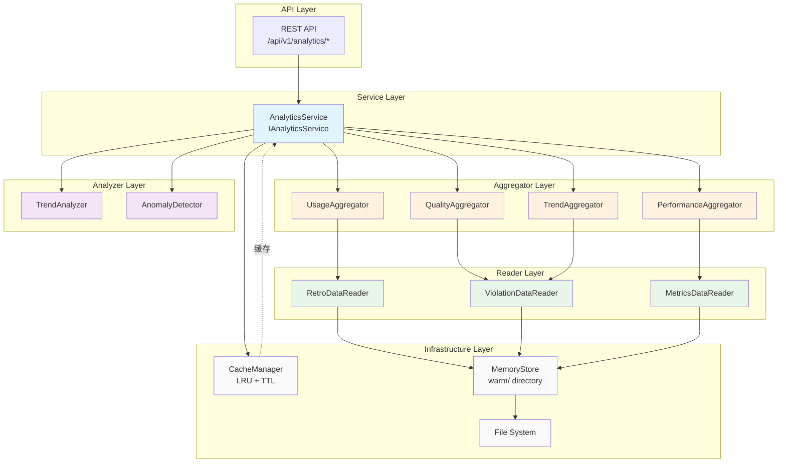
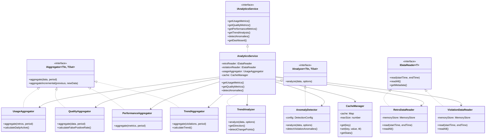
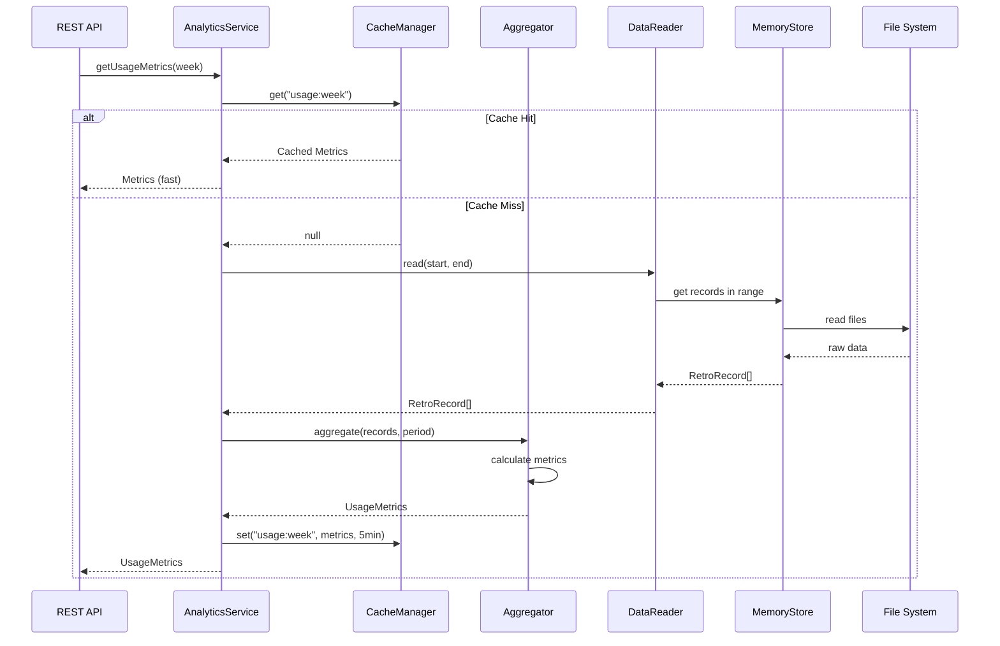

# ReflectGuard Analytics 模块架构设计

**文档版本：** 1.0.0
**创建时间：** 2026-02-04
**架构师：** Architect Agent
**模块状态：** 设计中

---

## 目录

1. [架构概述](#1-架构概述)
2. [模块结构设计](#2-模块结构设计)
3. [类设计](#3-类设计)
4. [数据流设计](#4-数据流设计)
5. [架构图](#5-架构图)
6. [REST API 集成方案](#6-rest-api-集成方案)
7. [实施计划](#7-实施计划)
8. [测试策略](#8-测试策略)
9. [风险评估](#9-风险评估)

---

## 1. 架构概述

### 1.1 模块定位

Analytics 模块是 ReflectGuard Phase 2 的核心新增模块，负责**数据聚合、指标计算、趋势分析和异常检测**。

**核心职责：**
- 从 MemoryStore 读取 warm/ 目录数据
- 聚合计算使用、质量、性能、趋势四类指标
- 提供时间范围过滤（day, week, month, year）
- 检测数据异常并触发告警
- 支持 REST API 查询接口

### 1.2 设计原则

| 原则 | 说明 | 应用 |
|------|------|------|
| **单一职责** | 每个类只负责一类指标 | UsageAnalyzer, QualityAnalyzer 分离 |
| **依赖倒置** | 依赖抽象接口而非实现 | IDataReader 接口抽象数据源 |
| **开闭原则** | 扩展开放，修改关闭 | 新增指标通过 Plugin 扩展 |
| **KISS** | 保持简单直接 | 使用原生 Map 而非复杂缓存 |
| **SOLID** | 面向接口编程 | IAnalyticsService 接口驱动 |

### 1.3 性能目标

| 指标 | 目标 | 优化策略 |
|------|------|----------|
| 聚合查询 | <100ms | 内存聚合、索引缓存 |
| 趋势计算 | <200ms | 预计算 + 增量更新 |
| 异常检测 | <500ms | 统计算法、简单阈值 |
| 内存占用 | <50MB | LRU 缓存、惰性加载 |

---

## 2. 模块结构设计

### 2.1 目录结构

```
src/
├── core/
│   └── analytics/
│       ├── AnalyticsService.ts           # 主服务类
│       ├── readers/
│       │   ├── IDataReader.ts            # 数据读取接口
│       │   ├── RetroDataReader.ts        # 复盘数据读取
│       │   ├── ViolationDataReader.ts    # 违规数据读取
│       │   └── MetricsDataReader.ts      # 指标数据读取
│       ├── aggregators/
│       │   ├── IAggregator.ts            # 聚合器接口
│       │   ├── UsageAggregator.ts        # 使用指标聚合
│       │   ├── QualityAggregator.ts      # 质量指标聚合
│       │   ├── PerformanceAggregator.ts  # 性能指标聚合
│       │   └── TrendAggregator.ts        # 趋势指标聚合
│       ├── analyzers/
│       │   ├── IAnalyzer.ts              # 分析器接口
│       │   ├── TrendAnalyzer.ts          # 趋势分析
│       │   └── AnomalyDetector.ts        # 异常检测
│       ├── cache/
│       │   ├── CacheManager.ts           # 缓存管理器
│       │   └── CacheKey.ts               # 缓存键生成
│       ├── models/
│       │   ├── Metrics.ts                # 指标数据模型
│       │   ├── TimePeriod.ts             # 时间范围类型
│       │   └── Anomaly.ts                # 异常模型
│       └── utils/
│           ├── TimeUtils.ts              # 时间工具
│           └── MathUtils.ts              # 数学工具
│
├── infrastructure/
│   └── metrics/
│       ├── MetricsCollector.ts           # 指标收集器
│       └── MetricsStore.ts               # 指标存储
│
├── api/
│   └── routes/
│       └── analytics.ts                  # Analytics 路由
│
└── tests/
    ├── unit/
    │   └── analytics/
    │       ├── AnalyticsService.test.ts
    │       ├── aggregators/
    │       ├── analyzers/
    │       └── cache/
    └── integration/
        └── analytics-integration.test.ts
```

### 2.2 文件职责划分

| 文件 | 职责 | 行数估计 |
|------|------|----------|
| `AnalyticsService.ts` | 主服务编排、接口实现 | ~300 |
| `IDataReader.ts` | 数据读取抽象接口 | ~50 |
| `RetroDataReader.ts` | 复盘记录读取实现 | ~150 |
| `ViolationDataReader.ts` | 违规记录读取实现 | ~150 |
| `MetricsDataReader.ts` | 指标数据读取实现 | ~150 |
| `UsageAggregator.ts` | 使用指标聚合逻辑 | ~200 |
| `QualityAggregator.ts` | 质量指标聚合逻辑 | ~200 |
| `PerformanceAggregator.ts` | 性能指标聚合逻辑 | ~150 |
| `TrendAggregator.ts` | 趋势指标聚合逻辑 | ~200 |
| `TrendAnalyzer.ts` | 趋势分析算法 | ~250 |
| `AnomalyDetector.ts` | 异常检测算法 | ~200 |
| `CacheManager.ts` | 缓存管理（LRU） | ~150 |
| `Metrics.ts` | 数据模型定义 | ~200 |
| `TimeUtils.ts` | 时间范围处理 | ~100 |
| `MathUtils.ts` | 统计计算工具 | ~100 |

**总计：** ~2500 行代码（含注释）

---

## 3. 类设计

### 3.1 核心接口

#### IAnalyticsService

```typescript
/**
 * Analytics 服务接口
 *
 * 提供四类核心能力：
 * 1. 使用指标分析（Usage）
 * 2. 质量指标分析（Quality）
 * 3. 趋势分析（Trend）
 * 4. 异常检测（Anomaly）
 */
interface IAnalyticsService {
  /**
   * 获取使用指标
   * @param period 时间范围
   * @returns 使用指标数据
   */
  getUsageMetrics(period: TimePeriod): Promise<UsageMetrics>;

  /**
   * 获取质量指标
   * @param period 时间范围
   * @returns 质量指标数据
   */
  getQualityMetrics(period: TimePeriod): Promise<QualityMetrics>;

  /**
   * 获取性能指标
   * @param period 时间范围
   * @returns 性能指标数据
   */
  getPerformanceMetrics(period: TimePeriod): Promise<PerformanceMetrics>;

  /**
   * 获取趋势分析
   * @param metric 指标名称
   * @param period 时间范围
   * @returns 趋势数据
   */
  getTrendAnalysis(metric: string, period: TimePeriod): Promise<TrendData>;

  /**
   * 检测异常
   * @returns 检测到的异常列表
   */
  detectAnomalies(): Promise<Anomaly[]>;

  /**
   * 获取概览仪表板数据
   * @param period 时间范围
   * @returns 仪表板数据
   */
  getDashboard(period: TimePeriod): Promise<DashboardData>;
}
```

#### IDataReader

```typescript
/**
 * 数据读取器接口
 *
 * 抽象数据来源，支持未来扩展（数据库、远程API等）
 */
interface IDataReader<T> {
  /**
   * 读取指定时间范围的数据
   * @param startTime 开始时间
   * @param endTime 结束时间
   * @returns 数据列表
   */
  read(startTime: Date, endTime: Date): Promise<T[]>;

  /**
   * 读取所有数据
   * @returns 所有数据列表
   */
  readAll(): Promise<T[]>;

  /**
   * 获取数据源信息
   * @returns 数据源元信息
   */
  getMetadata(): Promise<DataSourceMetadata>;
}
```

#### IAggregator

```typescript
/**
 * 聚合器接口
 *
 * 定义聚合操作的通用契约
 */
interface IAggregator<TInput, TOutput> {
  /**
   * 聚合数据
   * @param data 原始数据列表
   * @param period 时间范围
   * @returns 聚合结果
   */
  aggregate(data: TInput[], period: TimePeriod): Promise<TOutput>;

  /**
   * 增量聚合（用于缓存更新）
   * @param previous 上次聚合结果
   * @param newData 新增数据
   * @returns 更新后的聚合结果
   */
  aggregateIncremental(
    previous: TOutput,
    newData: TInput[]
  ): Promise<TOutput>;
}
```

#### IAnalyzer

```typescript
/**
 * 分析器接口
 *
 * 定义分析操作的通用契约
 */
interface IAnalyzer<TInput, TOutput> {
  /**
   * 分析数据
   * @param data 输入数据
   * @param options 分析选项
   * @returns 分析结果
   */
  analyze(data: TInput, options?: AnalysisOptions): Promise<TOutput>;
}
```

### 3.2 核心实现类

#### AnalyticsService

```typescript
/**
 * Analytics 服务主类
 *
 * 职责：
 * 1. 编排各类聚合器和分析器
 * 2. 管理缓存
 * 3. 实现 IAnalyticsService 接口
 */
class AnalyticsService implements IAnalyticsService {
  // 依赖注入
  constructor(
    private readonly retroReader: IDataReader<RetroRecord>,
    private readonly violationReader: IDataReader<ViolationRecord>,
    private readonly metricsReader: IDataReader<MetricsRecord>,
    private readonly usageAggregator: UsageAggregator,
    private readonly qualityAggregator: QualityAggregator,
    private readonly performanceAggregator: PerformanceAggregator,
    private readonly trendAggregator: TrendAggregator,
    private readonly trendAnalyzer: TrendAnalyzer,
    private readonly anomalyDetector: AnomalyDetector,
    private readonly cache: CacheManager,
    private readonly logger: Logger
  ) {}

  /**
   * 获取使用指标（带缓存）
   */
  async getUsageMetrics(period: TimePeriod): Promise<UsageMetrics> {
    const cacheKey = CacheKey.forUsage(period);
    const cached = await this.cache.get<UsageMetrics>(cacheKey);
    if (cached) return cached;

    // 读取数据
    const { start, end } = TimePeriod.toDateRange(period);
    const retros = await this.retroReader.read(start, end);

    // 聚合
    const metrics = await this.usageAggregator.aggregate(retros, period);

    // 缓存结果（5分钟 TTL）
    await this.cache.set(cacheKey, metrics, 5 * 60 * 1000);

    return metrics;
  }

  // ... 其他方法类似实现
}
```

#### UsageAggregator

```typescript
/**
 * 使用指标聚合器
 *
 * 聚合指标：
 * - totalChecks: 总检查次数
 * - totalRetrospectives: 总复盘次数
 * - dailyActiveUsers: 日活用户数
 * - avgSessionDuration: 平均会话时长
 */
class UsageAggregator implements IAggregator<RetroRecord, UsageMetrics> {
  async aggregate(
    retros: RetroRecord[],
    period: TimePeriod
  ): Promise<UsageMetrics> {
    // 计算总复盘数
    const totalRetrospectives = retros.length;

    // 提取用户ID（假设 RetroRecord 有 userId 字段）
    const uniqueUsers = new Set(
      retros.map(r => r.userId || 'anonymous')
    );
    const dailyActiveUsers = this.calculateDailyActive(retros);

    // 计算平均会话时长
    const durations = retros
      .filter(r => r.duration > 0)
      .map(r => r.duration);
    const avgSessionDuration = durations.length > 0
      ? MathUtils.mean(durations)
      : 0;

    // 计算总检查次数（从违规记录推算）
    const totalChecks = await this.getTotalChecks(period);

    return {
      totalChecks,
      totalRetrospectives,
      dailyActiveUsers,
      avgSessionDuration,
      period: TimePeriod.toString(period),
      calculatedAt: new Date().toISOString()
    };
  }

  private calculateDailyActive(retros: RetroRecord[]): number {
    // 按日期分组，计算平均日活
    const byDate = new Map<string, Set<string>>();

    for (const retro of retros) {
      const date = TimeUtils.toDateKey(retro.timestamp);
      if (!byDate.has(date)) {
        byDate.set(date, new Set());
      }
      byDate.get(date)!.add(retro.userId || 'anonymous');
    }

    const dailyCounts = Array.from(byDate.values()).map(s => s.size);
    return dailyCounts.length > 0 ? MathUtils.mean(dailyCounts) : 0;
  }

  private async getTotalChecks(period: TimePeriod): Promise<number> {
    // 从指标存储获取
    // 实现细节...
    return 0;
  }

  async aggregateIncremental(
    previous: UsageMetrics,
    newData: RetroRecord[]
  ): Promise<UsageMetrics> {
    // 增量更新逻辑
    return {
      ...previous,
      totalRetrospectives: previous.totalRetrospectives + newData.length,
      calculatedAt: new Date().toISOString()
    };
  }
}
```

#### QualityAggregator

```typescript
/**
 * 质量指标聚合器
 *
 * 聚合指标：
 * - violationRate: 违规率
 * - falsePositiveRate: 误报率
 * - patternMatchAccuracy: 模式匹配准确率
 */
class QualityAggregator implements IAggregator<
  CombinedRecord,
  QualityMetrics
> {
  async aggregate(
    data: CombinedRecord[],
    period: TimePeriod
  ): Promise<QualityMetrics> {
    const { violations, checks } = this.separateRecords(data);

    // 违规率 = 违规次数 / 总检查次数
    const violationRate = checks.length > 0
      ? violations.length / checks.length
      : 0;

    // 误报率（需要从标记的误报数据计算）
    const falsePositiveRate = await this.calculateFalsePositiveRate(period);

    // 模式匹配准确率
    const patternMatchAccuracy = await this.calculatePatternAccuracy(period);

    return {
      violationRate: MathUtils.round(violationRate, 4),
      falsePositiveRate: MathUtils.round(falsePositiveRate, 4),
      patternMatchAccuracy: MathUtils.round(patternMatchAccuracy, 4),
      period: TimePeriod.toString(period),
      calculatedAt: new Date().toISOString()
    };
  }

  // ... 辅助方法
}
```

#### PerformanceAggregator

```typescript
/**
 * 性能指标聚合器
 *
 * 聚合指标：
 * - avgCheckTime: 平均检查时间
 * - avgExtractTime: 平均提取时间
 * - p95CheckTime: P95 检查时间
 * - p99CheckTime: P99 检查时间
 */
class PerformanceAggregator implements IAggregator<
  MetricsRecord,
  PerformanceMetrics
> {
  async aggregate(
    metrics: MetricsRecord[],
    period: TimePeriod
  ): Promise<PerformanceMetrics> {
    const checkTimes = metrics
      .filter(m => m.checkTime > 0)
      .map(m => m.checkTime);
    const extractTimes = metrics
      .filter(m => m.extractTime > 0)
      .map(m => m.extractTime);

    return {
      avgCheckTime: MathUtils.mean(checkTimes),
      avgExtractTime: MathUtils.mean(extractTimes),
      p95CheckTime: MathUtils.percentile(checkTimes, 95),
      p99CheckTime: MathUtils.percentile(checkTimes, 99),
      minCheckTime: MathUtils.min(checkTimes),
      maxCheckTime: MathUtils.max(checkTimes),
      period: TimePeriod.toString(period),
      calculatedAt: new Date().toISOString()
    };
  }

  async aggregateIncremental(
    previous: PerformanceMetrics,
    newData: MetricsRecord[]
  ): Promise<PerformanceMetrics> {
    // 增量更新需要重新计算百分位数
    // 实现细节...
    return previous;
  }
}
```

#### TrendAggregator

```typescript
/**
 * 趋势指标聚合器
 *
 * 聚合指标：
 * - violationTrend: 违规趋势（up/down/stable）
 * - improvementRate: 改进率
 * - topViolations: 最常见违规
 */
class TrendAggregator implements IAggregator<
  ViolationRecord[],
  TrendMetrics
> {
  async aggregate(
    violations: ViolationRecord[],
    period: TimePeriod
  ): Promise<TrendMetrics> {
    // 按原则ID分组
    const byPrinciple = this.groupByPrinciple(violations);

    // 计算趋势（与上一周期对比）
    const violationTrend = await this.calculateTrend(
      'violations',
      period
    );

    // 改进率
    const improvementRate = await this.calculateImprovementRate(period);

    // Top 违规
    const topViolations = this.getTopViolations(byPrinciple, 5);

    return {
      violationTrend,
      improvementRate,
      topViolations,
      period: TimePeriod.toString(period),
      calculatedAt: new Date().toISOString()
    };
  }

  private groupByPrinciple(violations: ViolationRecord[]): Map<string, number> {
    const grouped = new Map<string, number>();
    for (const v of violations) {
      const count = grouped.get(v.principleId) || 0;
      grouped.set(v.principleId, count + 1);
    }
    return grouped;
  }

  private getTopViolations(
    grouped: Map<string, number>,
    limit: number
  ): TopViolation[] {
    return Array.from(grouped.entries())
      .sort((a, b) => b[1] - a[1])
      .slice(0, limit)
      .map(([principleId, count]) => ({
        principleId,
        principleName: this.getPrincipleName(principleId),
        count,
        percentage: 0 // 计算占比
      }));
  }

  // ... 其他方法
}
```

#### TrendAnalyzer

```typescript
/**
 * 趋势分析器
 *
 * 分析方法：
 * - 线性回归（趋势方向）
 * - 移动平均（平滑）
 * - 同比/环比（变化率）
 */
class TrendAnalyzer implements IAnalyzer<TrendData, TrendAnalysis> {
  async analyze(
    data: TrendData,
    options?: AnalysisOptions
  ): Promise<TrendAnalysis> {
    const { points } = data;

    // 线性回归
    const regression = MathUtils.linearRegression(
      points.map((p, i) => ({ x: i, y: p.value }))
    );

    // 趋势方向
    const direction = this.getDirection(regression.slope);

    // 移动平均
    const smoothed = this.movingAverage(points, options?.windowSize || 7);

    // 变化点检测
    const changePoints = this.detectChangePoints(points);

    return {
      direction,
      slope: regression.slope,
      rSquared: regression.rSquared,
      smoothed,
      changePoints,
      confidence: this.calculateConfidence(regression.rSquared)
    };
  }

  private getDirection(slope: number): 'up' | 'down' | 'stable' {
    const threshold = 0.01;
    if (Math.abs(slope) < threshold) return 'stable';
    return slope > 0 ? 'up' : 'down';
  }

  private movingAverage(
    points: DataPoint[],
    windowSize: number
  ): DataPoint[] {
    const result: DataPoint[] = [];
    for (let i = 0; i < points.length; i++) {
      const start = Math.max(0, i - windowSize + 1);
      const window = points.slice(start, i + 1);
      const avg = MathUtils.mean(window.map(p => p.value));
      result.push({ ...points[i], value: avg });
    }
    return result;
  }

  private detectChangePoints(points: DataPoint[]): ChangePoint[] {
    const changes: ChangePoint[] = [];
    const threshold = MathUtils.standardDeviation(
      points.map(p => p.value)
    ) * 2;

    for (let i = 1; i < points.length; i++) {
      const diff = Math.abs(points[i].value - points[i - 1].value);
      if (diff > threshold) {
        changes.push({
          index: i,
          timestamp: points[i].timestamp,
          before: points[i - 1].value,
          after: points[i].value,
          magnitude: diff
        });
      }
    }
    return changes;
  }

  private calculateConfidence(rSquared: number): number {
    return Math.max(0, Math.min(1, rSquared));
  }
}
```

#### AnomalyDetector

```typescript
/**
 * 异常检测器
 *
 * 检测方法：
 * - Z-score: 统计异常
 * - IQR: 四分位距异常
 * - 阈值: 固定阈值异常
 */
class AnomalyDetector implements IAnalyzer<MetricsData, Anomaly[]> {
  private readonly config: AnomalyDetectionConfig;

  constructor(config: AnomalyDetectionConfig = defaultConfig) {
    this.config = config;
  }

  async analyze(
    data: MetricsData,
    options?: AnalysisOptions
  ): Promise<Anomaly[]> {
    const anomalies: Anomaly[] = [];

    // 1. 检测违规率异常
    const violationAnomalies = this.detectViolationAnomalies(data);
    anomalies.push(...violationAnomalies);

    // 2. 检测性能异常
    const performanceAnomalies = this.detectPerformanceAnomalies(data);
    anomalies.push(...performanceAnomalies);

    // 3. 检测使用异常（如突然下降）
    const usageAnomalies = this.detectUsageAnomalies(data);
    anomalies.push(...usageAnomalies);

    return anomalies;
  }

  private detectViolationAnomalies(data: MetricsData): Anomaly[] {
    const violations = data.violations || [];
    const values = violations.map(v => v.count || 1);

    // Z-score 检测
    const zScoreThreshold = this.config.zScoreThreshold;
    const mean = MathUtils.mean(values);
    const std = MathUtils.standardDeviation(values);

    const anomalies: Anomaly[] = [];
    for (let i = 0; i < violations.length; i++) {
      const zScore = Math.abs((violations[i].count - mean) / std);
      if (zScore > zScoreThreshold) {
        anomalies.push({
          id: `violation-${i}`,
          type: 'violation_spike',
          severity: zScore > 3 ? 'high' : 'medium',
          metric: 'violations',
          value: violations[i].count,
          expected: mean,
          timestamp: violations[i].timestamp,
          description: `违规数量异常: ${violations[i].count} (期望: ${mean.toFixed(2)})`
        });
      }
    }

    return anomalies;
  }

  private detectPerformanceAnomalies(data: MetricsData): Anomaly[] {
    const checkTimes = data.performance?.checkTimes || [];
    const threshold = this.config.performanceThreshold;

    return checkTimes
      .filter(t => t > threshold)
      .map((value, i) => ({
        id: `perf-${i}`,
        type: 'performance_degradation',
        severity: value > threshold * 2 ? 'high' : 'medium',
        metric: 'check_time',
        value,
        expected: threshold,
        timestamp: data.performance?.timestamps[i] || new Date().toISOString(),
        description: `检查时间过长: ${value}ms (阈值: ${threshold}ms)`
      }));
  }

  private detectUsageAnomalies(data: MetricsData): Anomaly[] {
    // 检测日活突然下降
    const dailyActive = data.usage?.dailyActive || [];
    const anomalies: Anomaly[] = [];

    for (let i = 1; i < dailyActive.length; i++) {
      const drop = dailyActive[i - 1] - dailyActive[i];
      const dropRate = drop / (dailyActive[i - 1] || 1);

      if (dropRate > 0.5) { // 下降超过50%
        anomalies.push({
          id: `usage-${i}`,
          type: 'usage_drop',
          severity: 'high',
          metric: 'daily_active_users',
          value: dailyActive[i],
          expected: dailyActive[i - 1],
          timestamp: data.usage?.timestamps[i] || new Date().toISOString(),
          description: `日活用户骤降: ${dailyActive[i]} (前日: ${dailyActive[i - 1]})`
        });
      }
    }

    return anomalies;
  }
}

interface AnomalyDetectionConfig {
  zScoreThreshold: number;
  performanceThreshold: number;
  minDataPoints: number;
}

const defaultConfig: AnomalyDetectionConfig = {
  zScoreThreshold: 2.5,
  performanceThreshold: 1000, // ms
  minDataPoints: 10
};
```

#### CacheManager

```typescript
/**
 * 缓存管理器（LRU）
 *
 * 特性：
 * - LRU 淘汰策略
 * - TTL 过期
 * - 命中率统计
 */
class CacheManager {
  private cache: Map<string, CacheEntry>;
  private maxSize: number;
  private hits = 0;
  private misses = 0;

  constructor(maxSize = 1000) {
    this.cache = new Map();
    this.maxSize = maxSize;
  }

  async get<T>(key: string): Promise<T | null> {
    const entry = this.cache.get(key);

    if (!entry) {
      this.misses++;
      return null;
    }

    // 检查过期
    if (entry.expiresAt && Date.now() > entry.expiresAt) {
      this.cache.delete(key);
      this.misses++;
      return null;
    }

    // LRU: 更新访问时间
    entry.lastAccessed = Date.now();
    this.hits++;

    return entry.value as T;
  }

  async set<T>(
    key: string,
    value: T,
    ttl?: number
  ): Promise<void> {
    // 检查容量
    if (this.cache.size >= this.maxSize && !this.cache.has(key)) {
      this.evictLRU();
    }

    this.cache.set(key, {
      value,
      createdAt: Date.now(),
      lastAccessed: Date.now(),
      expiresAt: ttl ? Date.now() + ttl : undefined
    });
  }

  async delete(key: string): Promise<void> {
    this.cache.delete(key);
  }

  async clear(): Promise<void> {
    this.cache.clear();
    this.hits = 0;
    this.misses = 0;
  }

  getStats(): CacheStats {
    const hitRate = this.hits + this.misses > 0
      ? this.hits / (this.hits + this.misses)
      : 0;
    return {
      size: this.cache.size,
      maxSize: this.maxSize,
      hits: this.hits,
      misses: this.misses,
      hitRate: Math.round(hitRate * 10000) / 100
    };
  }

  private evictLRU(): void {
    let oldestKey: string | null = null;
    let oldestTime = Infinity;

    for (const [key, entry] of this.cache.entries()) {
      if (entry.lastAccessed < oldestTime) {
        oldestTime = entry.lastAccessed;
        oldestKey = key;
      }
    }

    if (oldestKey) {
      this.cache.delete(oldestKey);
    }
  }
}

interface CacheEntry {
  value: unknown;
  createdAt: number;
  lastAccessed: number;
  expiresAt?: number;
}

interface CacheStats {
  size: number;
  maxSize: number;
  hits: number;
  misses: number;
  hitRate: number;
}
```

### 3.3 数据模型

#### TimePeriod

```typescript
/**
 * 时间范围类型
 */
type TimePeriodValue =
  | 'today'
  | 'yesterday'
  | 'week'
  | 'last_week'
  | 'month'
  | 'last_month'
  | 'year'
  | 'last_year'
  | { start: string; end: string }; // ISO 8601

class TimePeriod {
  constructor(private readonly value: TimePeriodValue) {}

  static today(): TimePeriod {
    return new TimePeriod('today');
  }

  static week(): TimePeriod {
    return new TimePeriod('week');
  }

  static month(): TimePeriod {
    return new TimePeriod('month');
  }

  static custom(start: Date, end: Date): TimePeriod {
    return new TimePeriod({
      start: start.toISOString(),
      end: end.toISOString()
    });
  }

  toDateRange(): { start: Date; end: Date } {
    const now = new Date();

    switch (this.value) {
      case 'today':
        return {
          start: new Date(now.setHours(0, 0, 0, 0)),
          end: new Date()
        };
      case 'yesterday':
        return {
          start: new Date(now.setDate(now.getDate() - 1)),
          end: new Date(now.setHours(23, 59, 59, 999))
        };
      case 'week':
        return {
          start: new Date(now.setDate(now.getDate() - 7)),
          end: new Date()
        };
      case 'month':
        return {
          start: new Date(now.setMonth(now.getMonth() - 1)),
          end: new Date()
        };
      case 'year':
        return {
          start: new Date(now.setFullYear(now.getFullYear() - 1)),
          end: new Date()
        };
      case 'last_week':
        return {
          start: new Date(now.setDate(now.getDate() - 14)),
          end: new Date(now.setDate(now.getDate() - 7))
        };
      case 'last_month':
        return {
          start: new Date(now.setMonth(now.getMonth() - 2)),
          end: new Date(now.setMonth(now.getMonth() - 1))
        };
      case 'last_year':
        return {
          start: new Date(now.setFullYear(now.getFullYear() - 2)),
          end: new Date(now.setFullYear(now.getFullYear() - 1))
        };
      default:
        if (typeof this.value === 'object' && 'start' in this.value) {
          return {
            start: new Date(this.value.start),
            end: new Date(this.value.end)
          };
        }
        throw new Error(`Invalid TimePeriod: ${this.value}`);
    }
  }

  toString(): string {
    if (typeof this.value === 'object') {
      return `${this.value.start}/${this.value.end}`;
    }
    return this.value;
  }

  static fromString(s: string): TimePeriod {
    return new TimePeriod(s as TimePeriodValue);
  }
}
```

#### Metrics Models

```typescript
/**
 * 使用指标
 */
interface UsageMetrics {
  totalChecks: number;
  totalRetrospectives: number;
  dailyActiveUsers: number;
  avgSessionDuration: number;
  period: string;
  calculatedAt: string;
}

/**
 * 质量指标
 */
interface QualityMetrics {
  violationRate: number;
  falsePositiveRate: number;
  patternMatchAccuracy: number;
  period: string;
  calculatedAt: string;
}

/**
 * 性能指标
 */
interface PerformanceMetrics {
  avgCheckTime: number;
  avgExtractTime: number;
  p95CheckTime: number;
  p99CheckTime: number;
  minCheckTime: number;
  maxCheckTime: number;
  period: string;
  calculatedAt: string;
}

/**
 * 趋势指标
 */
interface TrendMetrics {
  violationTrend: 'up' | 'down' | 'stable';
  improvementRate: number;
  topViolations: TopViolation[];
  period: string;
  calculatedAt: string;
}

interface TopViolation {
  principleId: string;
  principleName: string;
  count: number;
  percentage: number;
}

/**
 * 趋势数据
 */
interface TrendData {
  metric: string;
  period: string;
  points: DataPoint[];
}

interface DataPoint {
  timestamp: string;
  value: number;
}

/**
 * 趋势分析结果
 */
interface TrendAnalysis {
  direction: 'up' | 'down' | 'stable';
  slope: number;
  rSquared: number;
  smoothed: DataPoint[];
  changePoints: ChangePoint[];
  confidence: number;
}

interface ChangePoint {
  index: number;
  timestamp: string;
  before: number;
  after: number;
  magnitude: number;
}

/**
 * 异常
 */
interface Anomaly {
  id: string;
  type: string;
  severity: 'low' | 'medium' | 'high';
  metric: string;
  value: number;
  expected: number;
  timestamp: string;
  description: string;
}

/**
 * 仪表板数据
 */
interface DashboardData {
  summary: {
    totalChecks: number;
    totalRetrospectives: number;
    avgViolationRate: number;
    avgPerformance: number;
  };
  trends: {
    violationTrend: 'up' | 'down' | 'stable';
    usageTrend: 'up' | 'down' | 'stable';
  };
  alerts: Anomaly[];
  topViolations: TopViolation[];
  period: string;
  generatedAt: string;
}
```

---

## 4. 数据流设计

### 4.1 数据读取流程

```
                    ┌─────────────────┐
                    │ AnalyticsService│
                    └────────┬────────┘
                             │
         ┌───────────────────┼───────────────────┐
         │                   │                   │
    ┌────▼─────┐      ┌─────▼──────┐     ┌─────▼──────┐
    │ Retro    │      │ Violation  │     │ Metrics    │
    │ Reader   │      │ Reader     │     │ Reader     │
    └────┬─────┘      └─────┬──────┘     └─────┬──────┘
         │                   │                   │
         └───────────────────┼───────────────────┘
                             │
                    ┌────────▼────────┐
                    │  MemoryStore    │
                    │  (warm/ dir)    │
                    └────────┬────────┘
                             │
                    ┌────────▼────────┐
                    │  File System    │
                    │  retros/        │
                    │  violations.jsonl│
                    └─────────────────┘
```

### 4.2 聚合计算流程

```
┌──────────────┐     ┌──────────────┐     ┌──────────────┐
│  Usage       │     │  Quality     │     │ Performance  │
│  Aggregator  │     │  Aggregator  │     │  Aggregator  │
└──────┬───────┘     └──────┬───────┘     └──────┬───────┘
       │                     │                     │
       │   ┌─────────────────┼─────────────────┐   │
       │   │                 │                 │   │
       └───┼─────────────────┼─────────────────┼───┘
           │                 │                 │
    ┌──────▼─────────────────▼─────────────────▼──────┐
    │              CacheManager (LRU)                  │
    │              TTL: 5 minutes                      │
    └──────┬──────────────────────────────────────────┘
           │
    ┌──────▼──────────────────────────────────────────┐
    │              AnalyticsService                    │
    │              getMetrics()                       │
    └──────┬──────────────────────────────────────────┘
           │
    ┌──────▼──────────────────────────────────────────┐
    │              REST API Response                  │
    └─────────────────────────────────────────────────┘
```

### 4.3 数据源集成

#### MemoryStore 集成

```typescript
/**
 * 复盘数据读取器
 *
 * 从 MemoryStore 读取复盘记录
 */
class RetroDataReader implements IDataReader<RetroRecord> {
  constructor(
    private readonly memoryStore: MemoryStore
  ) {}

  async read(startTime: Date, endTime: Date): Promise<RetroRecord[]> {
    // 读取索引文件
    const indexRecords = await this.memoryStore.readIndex();

    // 按时间过滤
    const filtered = indexRecords.filter(record => {
      const timestamp = new Date(record.timestamp);
      return timestamp >= startTime && timestamp <= endTime;
    });

    // 读取详细记录
    const retros: RetroRecord[] = [];
    for (const record of filtered) {
      const detail = await this.memoryStore.getRetroRecord(record.id);
      if (detail) {
        retros.push(detail);
      }
    }

    return retros;
  }

  async readAll(): Promise<RetroRecord[]> {
    return this.memoryStore.listAllRetros();
  }

  async getMetadata(): Promise<DataSourceMetadata> {
    const all = await this.readAll();
    return {
      type: 'retrospective',
      count: all.length,
      oldestTimestamp: all[0]?.timestamp || null,
      newestTimestamp: all[all.length - 1]?.timestamp || null
    };
  }
}
```

#### 违规数据读取器

```typescript
/**
 * 违规数据读取器
 *
 * 从 violations.jsonl 读取违规记录
 */
class ViolationDataReader implements IDataReader<ViolationRecord> {
  private readonly violationsPath: string;

  constructor(
    private readonly memoryStore: MemoryStore
  ) {
    this.violationsPath = path.join(
      memoryStore.getWarmPath(),
      'violations.jsonl'
    );
  }

  async read(startTime: Date, endTime: Date): Promise<ViolationRecord[]> {
    const all = await this.readAll();
    return all.filter(v => {
      const timestamp = new Date(v.detectedAt);
      return timestamp >= startTime && timestamp <= endTime;
    });
  }

  async readAll(): Promise<ViolationRecord[]> {
    const content = await fs.readFile(this.violationsPath, 'utf-8');
    const lines = content.trim().split('\n');

    return lines
      .filter(line => line.length > 0)
      .map(line => {
        try {
          return JSON.parse(line) as ViolationRecord;
        } catch {
          return null;
        }
      })
      .filter((v): v is ViolationRecord => v !== null);
  }

  async getMetadata(): Promise<DataSourceMetadata> {
    const all = await this.readAll();
    return {
      type: 'violation',
      count: all.length,
      oldestTimestamp: all[0]?.detectedAt || null,
      newestTimestamp: all[all.length - 1]?.detectedAt || null
    };
  }
}
```

---

## 5. 架构图

### 5.1 模块依赖关系图



### 5.2 类层次结构图



### 5.3 数据流图



---

## 6. REST API 集成方案

### 6.1 API 路由设计

```typescript
// src/api/routes/analytics.ts

import { Hono } from 'hono';
import { AnalyticsService } from '../../core/analytics/AnalyticsService';

const app = new Hono();
const analyticsService = new AnalyticsService(/* deps */);

/**
 * GET /api/v1/analytics/usage
 *
 * 获取使用指标
 *
 * Query Params:
 * - period: today | week | month | year
 *
 * Response:
 * {
 *   "success": true,
 *   "data": UsageMetrics
 * }
 */
app.get('/usage', async (c) => {
  const period = c.req.query('period') || 'week';
  const metrics = await analyticsService.getUsageMetrics(
    TimePeriod.fromString(period)
  );
  return c.json({ success: true, data: metrics });
});

/**
 * GET /api/v1/analytics/quality
 *
 * 获取质量指标
 */
app.get('/quality', async (c) => {
  const period = c.req.query('period') || 'week';
  const metrics = await analyticsService.getQualityMetrics(
    TimePeriod.fromString(period)
  );
  return c.json({ success: true, data: metrics });
});

/**
 * GET /api/v1/analytics/performance
 *
 * 获取性能指标
 */
app.get('/performance', async (c) => {
  const period = c.req.query('period') || 'week';
  const metrics = await analyticsService.getPerformanceMetrics(
    TimePeriod.fromString(period)
  );
  return c.json({ success: true, data: metrics });
});

/**
 * GET /api/v1/analytics/trends/:metric
 *
 * 获取趋势分析
 */
app.get('/trends/:metric', async (c) => {
  const metric = c.req.param('metric');
  const period = c.req.query('period') || 'month';
  const trend = await analyticsService.getTrendAnalysis(
    metric,
    TimePeriod.fromString(period)
  );
  return c.json({ success: true, data: trend });
});

/**
 * GET /api/v1/analytics/anomalies
 *
 * 获取异常检测结果
 */
app.get('/anomalies', async (c) => {
  const anomalies = await analyticsService.detectAnomalies();
  return c.json({ success: true, data: anomalies });
});

/**
 * GET /api/v1/analytics/dashboard
 *
 * 获取仪表板数据（综合）
 */
app.get('/dashboard', async (c) => {
  const period = c.req.query('period') || 'week';
  const dashboard = await analyticsService.getDashboard(
    TimePeriod.fromString(period)
  );
  return c.json({ success: true, data: dashboard });
});

/**
 * GET /api/v1/analytics/cache/stats
 *
 * 获取缓存统计
 */
app.get('/cache/stats', async (c) => {
  const stats = await analyticsService.getCacheStats();
  return c.json({ success: true, data: stats });
});

/**
 * DELETE /api/v1/analytics/cache
 *
 * 清除缓存
 */
app.delete('/cache', async (c) => {
  await analyticsService.clearCache();
  return c.json({ success: true, message: 'Cache cleared' });
});

export default app;
```

### 6.2 API 响应示例

#### Usage Metrics Response

```json
{
  "success": true,
  "data": {
    "totalChecks": 1234,
    "totalRetrospectives": 56,
    "dailyActiveUsers": 8.5,
    "avgSessionDuration": 180000,
    "period": "week",
    "calculatedAt": "2026-02-04T12:00:00Z"
  },
  "meta": {
    "timestamp": "2026-02-04T12:00:00Z",
    "requestId": "req_abc123",
    "version": "2.0.0"
  }
}
```

#### Trend Analysis Response

```json
{
  "success": true,
  "data": {
    "metric": "violations",
    "period": "month",
    "points": [
      { "timestamp": "2026-01-01T00:00:00Z", "value": 12 },
      { "timestamp": "2026-01-02T00:00:00Z", "value": 15 },
      { "timestamp": "2026-01-03T00:00:00Z", "value": 10 }
    ],
    "analysis": {
      "direction": "down",
      "slope": -0.5,
      "rSquared": 0.85,
      "confidence": 0.85,
      "changePoints": [
        {
          "index": 5,
          "timestamp": "2026-01-06T00:00:00Z",
          "before": 20,
          "after": 10,
          "magnitude": 10
        }
      ]
    }
  }
}
```

---

## 7. 实施计划

### 7.1 任务分解

| 任务 | 描述 | 估计时间 | 依赖 |
|------|------|----------|------|
| **Task 1: 基础设施** | | | |
| 1.1 | 创建目录结构 | 0.5h | - |
| 1.2 | 实现数据模型 | 1h | 1.1 |
| 1.3 | 实现 TimePeriod 类 | 1h | 1.2 |
| 1.4 | 实现 CacheManager | 2h | 1.2 |
| **Task 2: 数据读取** | | | |
| 2.1 | 实现 IDataReader 接口 | 0.5h | 1.2 |
| 2.2 | 实现 RetroDataReader | 2h | 2.1 |
| 2.3 | 实现 ViolationDataReader | 2h | 2.1 |
| 2.4 | 实现 MetricsDataReader | 1h | 2.1 |
| **Task 3: 聚合器** | | | |
| 3.1 | 实现 IAggregator 接口 | 0.5h | 1.2 |
| 3.2 | 实现 UsageAggregator | 3h | 3.1, 2.2 |
| 3.3 | 实现 QualityAggregator | 3h | 3.1, 2.3 |
| 3.4 | 实现 PerformanceAggregator | 2h | 3.1, 2.4 |
| 3.5 | 实现 TrendAggregator | 2h | 3.1, 2.3 |
| **Task 4: 分析器** | | | |
| 4.1 | 实现 IAnalyzer 接口 | 0.5h | 1.2 |
| 4.2 | 实现 TrendAnalyzer | 3h | 4.1 |
| 4.3 | 实现 AnomalyDetector | 3h | 4.1 |
| **Task 5: 主服务** | | | |
| 5.1 | 实现 AnalyticsService | 3h | 3.2-3.5, 4.2-4.3 |
| 5.2 | 实现 Dashboard 聚合 | 1h | 5.1 |
| **Task 6: REST API** | | | |
| 6.1 | 实现 API 路由 | 2h | 5.1 |
| 6.2 | 添加中间件 | 1h | 6.1 |
| **Task 7: 测试** | | | |
| 7.1 | 单元测试 - 聚合器 | 4h | 3.2-3.5 |
| 7.2 | 单元测试 - 分析器 | 3h | 4.2-4.3 |
| 7.3 | 单元测试 - 服务 | 2h | 5.1 |
| 7.4 | 集成测试 | 3h | 6.1 |
| 7.5 | 性能测试 | 2h | 7.4 |
| **Task 8: 文档** | | | |
| 8.1 | API 文档 | 2h | 6.1 |
| 8.2 | 使用指南 | 1h | 8.1 |

**总计：** ~45 小时（5-7 天）

### 7.2 实施里程碑

| 里程碑 | 交付物 | 预计时间 |
|--------|--------|----------|
| M1: 基础设施完成 | 数据模型、缓存、时间处理 | Day 1 |
| M2: 数据读取完成 | 3 个 Reader 实现 | Day 2 |
| M3: 聚合器完成 | 5 个 Aggregator 实现 | Day 3-4 |
| M4: 分析器完成 | TrendAnalyzer, AnomalyDetector | Day 4-5 |
| M5: 主服务完成 | AnalyticsService | Day 5 |
| M6: API 完成 | REST 路由 | Day 5-6 |
| M7: 测试完成 | 单元 + 集成测试 | Day 6-7 |

---

## 8. 测试策略

### 8.1 单元测试

#### 测试组织

```
tests/unit/analytics/
├── AnalyticsService.test.ts
├── aggregators/
│   ├── UsageAggregator.test.ts
│   ├── QualityAggregator.test.ts
│   ├── PerformanceAggregator.test.ts
│   └── TrendAggregator.test.ts
├── analyzers/
│   ├── TrendAnalyzer.test.ts
│   └── AnomalyDetector.test.ts
├── readers/
│   ├── RetroDataReader.test.ts
│   ├── ViolationDataReader.test.ts
│   └── MetricsDataReader.test.ts
└── cache/
    └── CacheManager.test.ts
```

#### 测试用例示例

```typescript
// tests/unit/analytics/aggregators/UsageAggregator.test.ts

import { describe, it, expect, beforeEach } from 'bun:test';
import { UsageAggregator } from '../../../../src/core/analytics/aggregators/UsageAggregator';
import { TimePeriod } from '../../../../src/core/analytics/models/TimePeriod';

describe('UsageAggregator', () => {
  let aggregator: UsageAggregator;

  beforeEach(() => {
    aggregator = new UsageAggregator();
  });

  describe('aggregate', () => {
    it('should calculate total retrospectives', async () => {
      const retros = [
        { id: '1', userId: 'user1', duration: 1000, timestamp: '2026-02-04T10:00:00Z' },
        { id: '2', userId: 'user2', duration: 2000, timestamp: '2026-02-04T11:00:00Z' }
      ];

      const result = await aggregator.aggregate(retros, TimePeriod.today());

      expect(result.totalRetrospectives).toBe(2);
    });

    it('should calculate average session duration', async () => {
      const retros = [
        { id: '1', userId: 'user1', duration: 1000, timestamp: '2026-02-04T10:00:00Z' },
        { id: '2', userId: 'user2', duration: 2000, timestamp: '2026-02-04T11:00:00Z' }
      ];

      const result = await aggregator.aggregate(retros, TimePeriod.today());

      expect(result.avgSessionDuration).toBe(1500);
    });

    it('should calculate daily active users', async () => {
      const retros = [
        { id: '1', userId: 'user1', duration: 1000, timestamp: '2026-02-04T10:00:00Z' },
        { id: '2', userId: 'user1', duration: 2000, timestamp: '2026-02-04T11:00:00Z' },
        { id: '3', userId: 'user2', duration: 1000, timestamp: '2026-02-04T12:00:00Z' }
      ];

      const result = await aggregator.aggregate(retros, TimePeriod.today());

      expect(result.dailyActiveUsers).toBeCloseTo(2, 1);
    });

    it('should handle empty data', async () => {
      const result = await aggregator.aggregate([], TimePeriod.today());

      expect(result.totalRetrospectives).toBe(0);
      expect(result.avgSessionDuration).toBe(0);
    });
  });

  describe('aggregateIncremental', () => {
    it('should increment totals', async () => {
      const previous = {
        totalChecks: 100,
        totalRetrospectives: 10,
        dailyActiveUsers: 5,
        avgSessionDuration: 1500,
        period: 'today',
        calculatedAt: '2026-02-04T10:00:00Z'
      };

      const newData = [
        { id: '1', userId: 'user1', duration: 1000, timestamp: '2026-02-04T11:00:00Z' }
      ];

      const result = await aggregator.aggregateIncremental(previous, newData);

      expect(result.totalRetrospectives).toBe(11);
    });
  });
});
```

### 8.2 集成测试

```typescript
// tests/integration/analytics-integration.test.ts

import { describe, it, expect, beforeAll } from 'bun:test';
import { AnalyticsService } from '../../src/core/analytics/AnalyticsService';
import { MemoryStore } from '../../src/core/MemoryStore';

describe('Analytics Integration', () => {
  let analytics: AnalyticsService;
  let memoryStore: MemoryStore;

  beforeAll(async () => {
    // 初始化测试环境
    memoryStore = await MemoryStore.create('./test-data');
    analytics = new AnalyticsService(/* deps */);
  });

  it('should get usage metrics from real data', async () => {
    const metrics = await analytics.getUsageMetrics(TimePeriod.week());

    expect(metrics.totalRetrospectives).toBeGreaterThanOrEqual(0);
    expect(metrics.calculatedAt).toBeTruthy();
  });

  it('should detect anomalies in real data', async () => {
    const anomalies = await analytics.detectAnomalies();

    expect(Array.isArray(anomalies)).toBe(true);
  });

  it('should cache results', async () => {
    const period = TimePeriod.today();

    // First call - cache miss
    const start1 = Date.now();
    await analytics.getUsageMetrics(period);
    const time1 = Date.now() - start1;

    // Second call - cache hit
    const start2 = Date.now();
    await analytics.getUsageMetrics(period);
    const time2 = Date.now() - start2;

    expect(time2).toBeLessThan(time1);
  });
});
```

### 8.3 性能测试

```typescript
// tests/performance/analytics-performance.test.ts

import { describe, it, expect } from 'bun:test';
import { AnalyticsService } from '../../src/core/analytics/AnalyticsService';

describe('Analytics Performance', () => {
  it('should return usage metrics in <100ms', async () => {
    const analytics = new AnalyticsService(/* deps */);

    const start = Date.now();
    await analytics.getUsageMetrics(TimePeriod.week());
    const duration = Date.now() - start;

    expect(duration).toBeLessThan(100);
  });

  it('should return trend analysis in <200ms', async () => {
    const analytics = new AnalyticsService(/* deps */);

    const start = Date.now();
    await analytics.getTrendAnalysis('violations', TimePeriod.month());
    const duration = Date.now() - start;

    expect(duration).toBeLessThan(200);
  });

  it('should detect anomalies in <500ms', async () => {
    const analytics = new AnalyticsService(/* deps */);

    const start = Date.now();
    await analytics.detectAnomalies();
    const duration = Date.now() - start;

    expect(duration).toBeLessThan(500);
  });

  it('should handle 10000 records efficiently', async () => {
    // 生成大量测试数据
    const retros = generateTestRetros(10000);

    const start = Date.now();
    await analytics.getUsageMetrics(TimePeriod.month());
    const duration = Date.now() - start;

    expect(duration).toBeLessThan(200);
  });
});
```

---

## 9. 风险评估

### 9.1 技术风险

| 风险 | 影响 | 概率 | 缓解措施 |
|------|------|------|----------|
| 文件读取性能 | 高 | 低 | 索引缓存、惰性加载 |
| 内存占用过高 | 中 | 低 | LRU 缓存、流式处理 |
| 趋势分析不准确 | 中 | 中 | 多算法验证、置信度评估 |
| 异常误报 | 低 | 中 | 可配置阈值、学习历史 |

### 9.2 实施风险

| 风险 | 影响 | 概率 | 缓解措施 |
|------|------|------|----------|
| 时间估计不足 | 中 | 中 | 缓冲时间、并行开发 |
| 与现有模块集成困难 | 高 | 低 | 接口优先、渐进集成 |
| 测试覆盖不足 | 中 | 低 | TDD 开发、持续验证 |

### 9.3 未来扩展风险

| 风险 | 影响 | 概率 | 缓解措施 |
|------|------|------|----------|
| 数据迁移需求 | 中 | 中 | 接口抽象、版本控制 |
| 性能瓶颈 | 高 | 低 | 监控告警、扩展点预留 |
| 功能需求变更 | 中 | 高 | 插件系统、配置化 |

---

## 附录

### A. 术语表

| 术语 | 定义 |
|------|------|
| TimePeriod | 时间范围，如 today, week, month |
| Aggregator | 聚合器，负责数据聚合计算 |
| Analyzer | 分析器，负责数据分析 |
| Anomaly | 异常，偏离预期的数据点 |
| Trend | 趋势，数据变化方向 |
| Cache | 缓存，加速数据访问 |
| LRU | Least Recently Used，最近最少使用 |

### B. 参考资料

1. ReflectGuard Phase 2 架构设计
2. IAnalyticsService 接口定义
3. MemoryStore API 文档
4. 统计分析最佳实践

### C. 变更历史

| 版本 | 日期 | 变更内容 | 作者 |
|------|------|----------|------|
| 1.0.0 | 2026-02-04 | 初始架构设计 | Architect Agent |

---

**文档结束**

*本架构设计遵循 ReflectGuard 的 SOLID 原则和 KISS 原则，确保代码简单、可维护、可扩展。*
