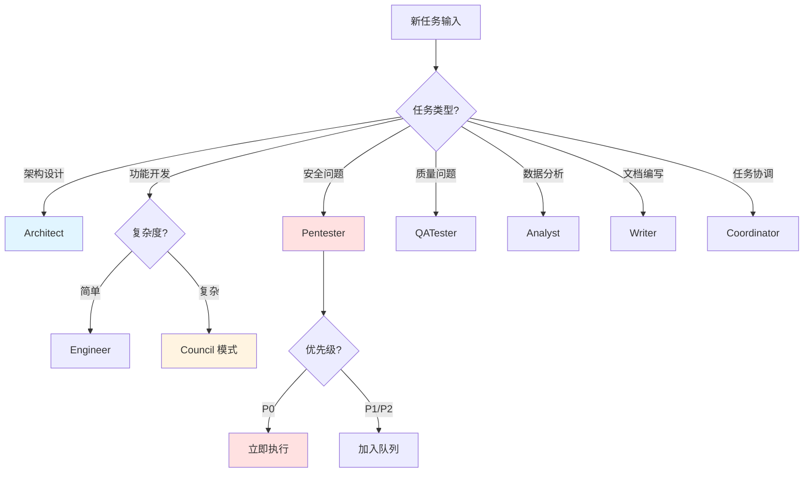
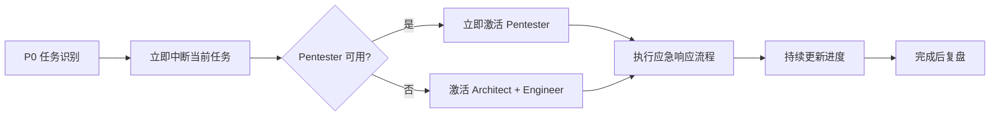
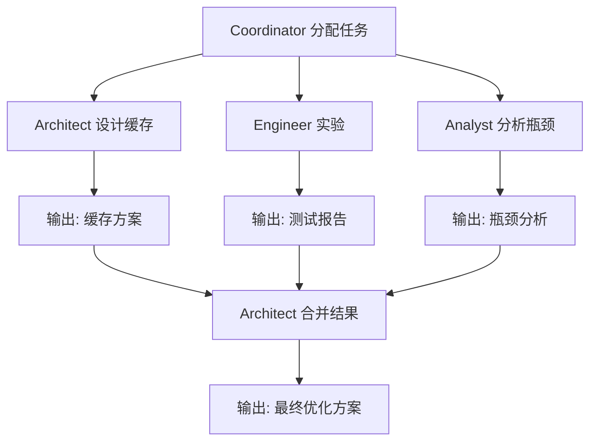
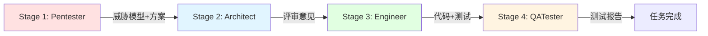
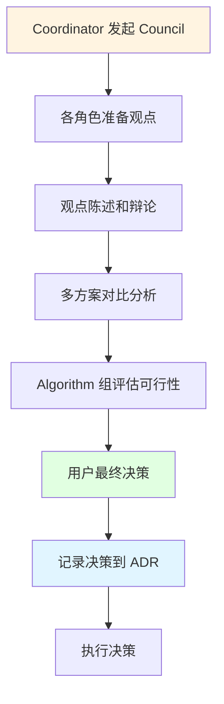
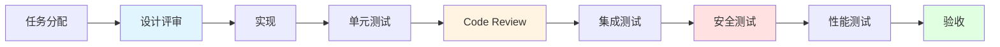
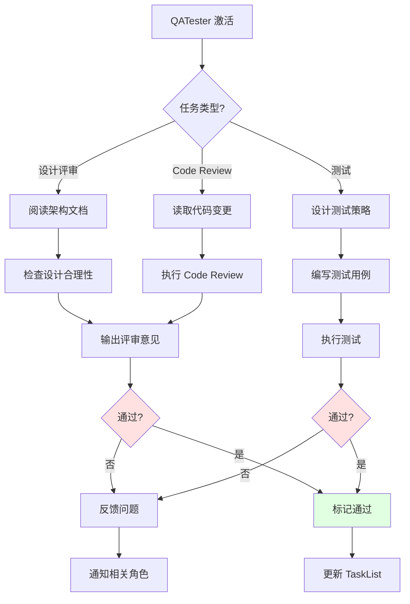
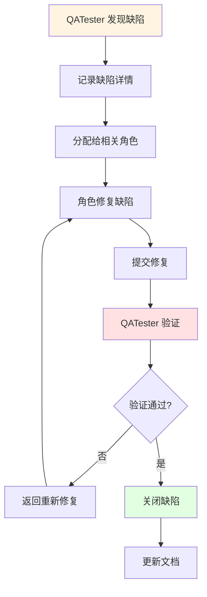

# ReflectGuard 虚拟团队协同工作机制设计

**版本：** 1.0.0
**创建时间：** 2026-02-05
**设计者：** Nova (高能力问题解决者)
**项目状态：** Phase 2 Week 4-5 | Analytics 模块完成 | API 安全加固 P0

---

## 📋 文档目录

1. [设计背景](#1-设计背景)
2. [任务路由机制](#2-任务路由机制)
3. [并行执行策略](#3-并行执行策略)
4. [冲突解决流程](#4-冲突解决流程)
5. [通信协议](#5-通信协议)
6. [质量保证集成](#6-质量保证集成)
7. [实施指南](#7-实施指南)
8. [附录](#8-附录)

---

## 1. 设计背景

### 1.1 虚拟团队角色体系回顾

ReflectGuard 已定义 **7 个专业 Agent 角色**：

| 角色 | 职责 | 推荐模型 | 激活频率 |
|------|------|----------|----------|
| **Architect** | 架构设计、技术选型 | Opus 4.5 | 低（按需） |
| **Engineer** | 代码开发、测试 | Sonnet 4.5 | 高（每日） |
| **Pentester** | 安全审计、漏洞修复 | Opus 4.5 | 中（每周） |
| **QATester** | Code Review、质量门禁 | Sonnet 4.5 | 高（每次 PR） |
| **Analyst** | 数据分析、异常检测 | Sonnet 4.5 | 中（每周） |
| **Writer** | 文档编写、维护 | Haiku 3.5 | 中（每次变更） |
| **Coordinator** | 协作调度、任务分配 | Sonnet 4.5 | 高（每日） |

### 1.2 当前挑战

**Week 4-5 状态：**
- ✅ Analytics 模块完成（82 测试，>90% 覆盖率）
- 🔴 P0 任务：API 安全加固
- 🔴 P0 任务：质量保证体系

**核心挑战：**
1. 如何让 7 个虚拟角色高效协同，避免冲突？
2. 不同类型任务如何路由到合适的角色？
3. 哪些任务可以并行执行，哪些必须串行？
4. 多个角色有不同意见时如何决策？
5. 如何确保质量在流程中始终得到保障？

### 1.3 设计目标

**核心目标：** 建立一套轻量级、高效率的协同工作机制，让虚拟团队像真实团队一样协作。

**具体目标：**
1. **智能路由** - 自动将任务路由到最合适的角色
2. **高效并行** - 最大化并行执行，减少等待时间
3. **冲突预防** - 提前识别冲突，避免事后补救
4. **质量内建** - 将质量检查融入每个环节
5. **简单高效** - 机制简单，不过度设计

### 1.4 设计原则

基于 **PAI Algorithm 的并行执行原则（Fan-out 默认模式）**：

| 原则 | 说明 | 应用 |
|------|------|------|
| **Fan-out 优先** | 默认并行执行，除非有明确依赖 | 多个角色可以同时工作 |
| **Pipeline 串行** | 有明确依赖的任务必须串行 | 设计 → 实现 → 测试 |
| **依赖管理** | 自动识别依赖关系 | TaskList 的 blockedBy/blocks |
| **轻量级** | 不引入重量级框架 | 基于现有工具，简单协议 |
| **可观测** - 所有状态透明可见 | TaskList + 进度更新 |

---

## 2. 任务路由机制

### 2.1 任务分类决策树



### 2.2 任务类型识别

#### 2.2.1 关键词匹配规则

**Architect 任务关键词：**
```
架构、设计、技术选型、重构、性能优化、扩展性、模块划分、接口设计、数据模型
```

**Engineer 任务关键词：**
```
实现、开发、编码、功能、修复、Bug、重构、优化、测试、单元测试
```

**Pentester 任务关键词：**
```
安全、漏洞、攻击、注入、XSS、CSRF、认证、授权、加密、敏感数据、OWASP、STRIDE
```

**QATester 任务关键词：**
```
测试、验证、Code Review、质量、覆盖率、性能测试、集成测试、回归测试
```

**Analyst 任务关键词：**
```
数据、指标、分析、统计、趋势、异常、监控、报表、聚合
```

**Writer 任务关键词：**
```
文档、API 文档、README、指南、教程、示例、注释、TSDoc
```

**Coordinator 任务关键词：**
```
协调、分配、计划、复盘、冲突、决策、Council、会议
```

#### 2.2.2 自动路由算法

```typescript
interface TaskRouting {
  // 任务分析
  analyzeTask(task: TaskDescription): TaskAnalysis;

  // 角色匹配
  matchRoles(analysis: TaskAnalysis): RoleMatch[];

  // 优先级评估
  assessPriority(analysis: TaskAnalysis): Priority;

  // 依赖识别
  identifyDependencies(task: TaskDescription): Dependency[];
}

interface TaskDescription {
  title: string;
  description: string;
  context?: {
    tags?: string[];
    relatedFiles?: string[];
    urgency?: 'low' | 'medium' | 'high' | 'critical';
  };
}

interface TaskAnalysis {
  type: TaskType;
  complexity: 'simple' | 'medium' | 'complex';
  securityRelevance: boolean; // 是否涉及安全
  qualityRelevance: boolean;  // 是否涉及质量
  dataRelevance: boolean;     // 是否涉及数据
  estimatedHours: number;
}

interface RoleMatch {
  role: string;
  confidence: number; // 0-1
  reason: string;
}

// 示例路由决策
function routeTask(task: TaskDescription): RouteDecision {
  // 1. 分析任务
  const analysis = analyzeTask(task);

  // 2. 匹配角色
  const matches = matchRoles(analysis);

  // 3. 评估优先级
  const priority = assessPriority(analysis);

  // 4. 识别依赖
  const dependencies = identifyDependencies(task);

  // 5. 生成路由决策
  return {
    primaryRole: matches[0].role,
    supportingRoles: matches.slice(1).map(m => m.role),
    priority,
    dependencies,
    executionMode: determineExecutionMode(analysis, dependencies)
  };
}

// 示例使用
const task = {
  title: "REST API 安全加固",
  description: "为 API 添加认证、验证和限流机制",
  context: {
    tags: ["安全", "API", "P0"],
    urgency: "critical"
  }
};

const decision = routeTask(task);
console.log(decision);
// {
//   primaryRole: "Pentester",
//   supportingRoles: ["Architect", "Engineer", "QATester"],
//   priority: "P0",
//   dependencies: [],
//   executionMode: "pipeline"
// }
```

### 2.3 单角色 vs 多角色协作

#### 2.3.1 单角色任务判定

**判定条件（满足任一即可）：**
1. 任务复杂度为 `simple`
2. 预计时长 < 2 小时
3. 不涉及多个专业领域
4. 无跨模块影响

**示例：**
```typescript
const singleRoleTasks = [
  {
    title: "修复 MathUtils.average 空数组问题",
    assignee: "Engineer",
    reason: "简单 Bug 修复，预计 30 分钟"
  },
  {
    title: "更新 API 文档",
    assignee: "Writer",
    reason: "文档更新，不涉及代码变更"
  },
  {
    title: "生成本周质量报告",
    assignee: "Analyst",
    reason: "数据分析任务，独立完成"
  }
];
```

#### 2.3.2 多角色协作任务判定

**判定条件（满足任一即可）：**
1. 任务复杂度为 `medium` 或 `complex`
2. 预计时长 ≥ 2 小时
3. 涉及多个专业领域
4. 有跨模块影响

**协作模式：**

| 模式 | 适用场景 | 角色数 | 执行方式 | 示例 |
|------|---------|-------|---------|------|
| **链式协作** | 简单多角色任务 | 2-3 | 串行 Pipeline | Architect → Engineer → QATester |
| **并行协作** | 独立子任务 | 2-4 | 并行 Fan-out | Architect + Pentester 同时评审 |
| **Council 模式** | 复杂决策 | 3-7 | 讨论 → 决策 → 执行 | 架构重大变更讨论 |

**示例：**
```typescript
const multiRoleTasks = [
  {
    title: "REST API 安全加固",
    mode: "pipeline",
    roles: ["Pentester", "Architect", "Engineer", "QATester"],
    reason: "涉及安全设计、架构评审、代码实现、质量验证"
  },
  {
    title: "WebSocket 实时通信设计",
    mode: "council",
    roles: ["Architect", "Engineer", "Pentester", "QATester", "Researcher"],
    reason: "重大架构决策，需要多角色讨论"
  },
  {
    title: "性能优化",
    mode: "fan-out",
    roles: ["Architect", "Engineer", "Analyst"],
    reason: "可并行工作：Architect 设计方案，Engineer 实验，Analyst 分析瓶颈"
  }
];
```

### 2.4 紧急任务快速通道

#### 2.4.1 P0 任务定义

**P0（严重）任务特征：**
- 系统不可用、数据泄露、高危安全漏洞
- 立即处理，停止其他任务
- 响应时间：< 15 分钟

**自动识别规则：**
```typescript
function isP0Task(task: TaskDescription): boolean {
  const p0Keywords = [
    '安全漏洞', '高危', '数据泄露', '系统不可用',
    'SQL注入', 'XSS', 'CSRF', '命令注入',
    'P0', 'critical', 'severe'
  ];

  const hasP0Keyword = p0Keywords.some(keyword =>
    task.title.includes(keyword) || task.description.includes(keyword)
  );

  const isCriticalUrgency = task.context?.urgency === 'critical';

  return hasP0Keyword || isCriticalUrgency;
}
```

#### 2.4.2 快速通道流程



**快速通道规则：**
1. **立即中断** - 暂停所有非 P0 任务
2. **角色优先** - 优先激活 Pentester（安全）或 Architect（架构）
3. **并行准备** - 其他角色同时准备上下文
4. **持续更新** - 每 15 分钟更新一次进度
5. **事后复盘** - 完成后进行深度复盘

**示例：**
```typescript
// P0 任务快速通道
const p0Task = {
  title: "发现 SQL 注入漏洞",
  priority: "P0",
  urgency: "critical",
  timestamp: "2026-02-05T14:30:00Z"
};

// 1. 立即识别为 P0
if (isP0Task(p0Task)) {
  // 2. 中断当前任务
  interruptCurrentTasks();

  // 3. 激活 Pentester（安全专家）
  activateRole("Pentester", {
    task: p0Task,
    mode: "emergency"
  });

  // 4. 并行准备其他角色
  prepareRoles(["Architect", "Engineer", "QATester"], {
    task: p0Task,
    mode: "standby"
  });

  // 5. 启动应急响应流程
  startEmergencyResponse(p0Task);
}
```

---

## 3. 并行执行策略

### 3.1 Fan-out vs Pipeline

#### 3.1.1 执行模式对比

| 模式 | 适用场景 | 优势 | 劣势 | 示例 |
|------|---------|------|------|------|
| **Fan-out（并行）** | 独立子任务 | 速度快、资源利用率高 | 需要协调、可能冲突 | 性能优化（多角色并行分析） |
| **Pipeline（串行）** | 依赖任务 | 逻辑清晰、质量可控 | 速度慢、等待时间长 | 开发流程（设计 → 实现 → 测试） |
| **混合模式** | 复杂任务 | 平衡速度和质量 | 复杂度高 | API 安全加固（Pipeline + Fan-out） |

#### 3.1.2 Fan-out 并行执行

**适用条件（满足所有）：**
1. 子任务之间无依赖关系
2. 子任务可以独立完成
3. 子任务结果可以合并
4. 资源充足（角色不冲突）

**示例场景：**
```typescript
// 场景：性能优化（Fan-out 并行）
const performanceOptimization = {
  title: "Gateway Check 性能优化",
  mode: "fan-out",
  subtasks: [
    {
      role: "Architect",
      task: "设计缓存策略",
      output: "缓存方案设计文档"
    },
    {
      role: "Engineer",
      task: "实验并行检查",
      output: "性能测试报告"
    },
    {
      role: "Analyst",
      task: "分析性能瓶颈",
      output: "瓶颈分析报告"
    }
  ],
  mergeStrategy: "Architect 综合三个报告，输出最终优化方案"
};
```

**Fan-out 执行流程：**


#### 3.1.3 Pipeline 串行执行

**适用条件（满足任一）：**
1. 子任务有明确的依赖关系
2. 子任务的输出是下一个的输入
3. 质量要求高，需要逐步验证

**示例场景：**
```typescript
// 场景：API 安全加固（Pipeline 串行）
const apiSecurity = {
  title: "REST API 安全加固",
  mode: "pipeline",
  stages: [
    {
      stage: 1,
      role: "Pentester",
      task: "威胁建模 + 安全方案设计",
      output: "威胁模型 + 安全方案",
      duration: "4h"
    },
    {
      stage: 2,
      role: "Architect",
      task: "架构安全评审",
      input: "安全方案",
      output: "评审意见",
      duration: "2h",
      dependencies: [1]
    },
    {
      stage: 3,
      role: "Engineer",
      task: "实现安全中间件",
      input: "评审后的方案",
      output: "代码 + 测试",
      duration: "6h",
      dependencies: [2]
    },
    {
      stage: 4,
      role: "QATester",
      task: "Code Review + 安全测试",
      input: "代码",
      output: "测试报告",
      duration: "4h",
      dependencies: [3]
    }
  ]
};
```

**Pipeline 执行流程：**


### 3.2 依赖关系识别

#### 3.2.1 依赖类型

```typescript
enum DependencyType {
  // 顺序依赖（A 必须在 B 之前完成）
  SEQUENCE = "sequence",

  // 数据依赖（B 需要 A 的输出）
  DATA = "data",

  // 资源依赖（A 和 B 不能同时使用同一角色）
  RESOURCE = "resource",

  // 质量依赖（B 需要验证 A 的质量）
  QUALITY = "quality"
}

interface Dependency {
  type: DependencyType;
  from: string; // 任务 ID
  to: string;   // 任务 ID
  reason: string;
  blocking: boolean; // 是否阻塞
}
```

#### 3.2.2 自动依赖识别

```typescript
function identifyDependencies(
  task: Task,
  allTasks: Task[]
): Dependency[] {
  const dependencies: Dependency[] = [];

  // 1. 顺序依赖（基于任务类型）
  if (task.type === "code_review") {
    const implementationTask = allTasks.find(t =>
      t.type === "implementation" && t.status === "completed"
    );
    if (implementationTask) {
      dependencies.push({
        type: DependencyType.QUALITY,
        from: implementationTask.id,
        to: task.id,
        reason: "Code Review 需要代码实现完成",
        blocking: true
      });
    }
  }

  // 2. 资源依赖（基于角色）
  const sameRoleTasks = allTasks.filter(t =>
    t.assignee === task.assignee && t.id !== task.id && t.status === "in_progress"
  );
  if (sameRoleTasks.length > 0) {
    sameRoleTasks.forEach(t => {
      dependencies.push({
        type: DependencyType.RESOURCE,
        from: t.id,
        to: task.id,
        reason: `${task.assignee} 角色正在执行其他任务`,
        blocking: true
      });
    });
  }

  // 3. 数据依赖（基于输出）
  if (task.requiredInput) {
    const inputProvider = allTasks.find(t =>
      t.output === task.requiredInput
    );
    if (inputProvider) {
      dependencies.push({
        type: DependencyType.DATA,
        from: inputProvider.id,
        to: task.id,
        reason: `需要 ${inputProvider.title} 的输出`,
        blocking: true
      });
    }
  }

  return dependencies;
}
```

### 3.3 冲突检测与解决

#### 3.3.1 冲突类型

| 冲突类型 | 描述 | 检测方法 | 解决策略 |
|---------|------|---------|---------|
| **资源冲突** | 多个任务需要同一角色 | 检查 TaskList 中相同 assignee | 优先级排序（P0 > P1 > P2 > P3） |
| **依赖冲突** | 循环依赖 | 检查 TaskList 的 dependencies 形成环 | 调整任务顺序或合并任务 |
| **优先级冲突** | 多个 P0 任务 | P0 任务数 > 角色可用数 | 评估紧急程度，串行执行 |
| **输出冲突** | 多个任务修改同一文件 | 检查 codeFiles 重叠 | 加锁或合并任务 |

#### 3.3.2 自动冲突检测

```typescript
interface Conflict {
  type: string;
  tasks: string[]; // 冲突的任务 ID
  description: string;
  severity: 'low' | 'medium' | 'high';
  resolution?: string;
}

function detectConflicts(tasks: Task[]): Conflict[] {
  const conflicts: Conflict[] = [];

  // 1. 资源冲突检测
  const roleGroups = groupBy(tasks, 'assignee');
  for (const [role, roleTasks] of Object.entries(roleGroups)) {
    if (roleTasks.length > 1) {
      conflicts.push({
        type: "resource",
        tasks: roleTasks.map(t => t.id),
        description: `${role} 角色被多个任务占用`,
        severity: roleTasks.some(t => t.priority === 'P0') ? 'high' : 'medium',
        resolution: `按优先级排序：${roleTasks.sort(byPriority).map(t => t.id).join(' → ')}`
      });
    }
  }

  // 2. 依赖冲突检测（循环依赖）
  const graph = buildDependencyGraph(tasks);
  const cycles = detectCycles(graph);
  if (cycles.length > 0) {
    cycles.forEach(cycle => {
      conflicts.push({
        type: "dependency",
        tasks: cycle,
        description: `检测到循环依赖：${cycle.join(' → ')}`,
        severity: 'high',
        resolution: "调整任务顺序或合并任务"
      });
    });
  }

  // 3. 输出冲突检测
  const fileGroups = groupBy(tasks.flatMap(t => t.codeFiles || []));
  for (const [file, fileTasks] of Object.entries(fileGroups)) {
    if (fileTasks.length > 1) {
      conflicts.push({
        type: "output",
        tasks: fileTasks.map(t => t.id),
        description: `多个任务修改同一文件：${file}`,
        severity: 'medium',
        resolution: "加锁或合并任务"
      });
    }
  }

  return conflicts;
}
```

#### 3.3.3 冲突解决策略

**策略 1：优先级排序**
```typescript
function resolveByPriority(conflicts: Conflict[]): Task[] {
  const sortedTasks = tasks.sort((a, b) => {
    const priorityOrder = { 'P0': 0, 'P1': 1, 'P2': 2, 'P3': 3 };
    return priorityOrder[a.priority] - priorityOrder[b.priority];
  });

  return sortedTasks;
}
```

**策略 2：任务合并**
```typescript
function mergeTasks(tasks: Task[]): Task {
  return {
    id: generateId(),
    title: `合并任务：${tasks.map(t => t.title).join(' + ')}`,
    description: tasks.map(t => t.description).join('\n'),
    assignee: tasks[0].assignee, // 使用第一个任务的角色
    priority: getHighestPriority(tasks),
    dependencies: mergeDependencies(tasks),
    codeFiles: mergeCodeFiles(tasks)
  };
}
```

**策略 3：串行执行**
```typescript
function serializeTasks(tasks: Task[]): Task[] {
  // 重新设置依赖关系，使其串行执行
  const serialized = [];
  for (let i = 0; i < tasks.length; i++) {
    const task = tasks[i];
    if (i > 0) {
      task.dependencies = [tasks[i - 1].id];
    }
    serialized.push(task);
  }
  return serialized;
}
```

---

## 4. 冲突解决流程

### 4.1 冲突识别与报告

#### 4.1.1 实时监控

**Coordinator 职责：**
1. 持续监控 TaskList 状态
2. 检测新产生的冲突
3. 评估冲突严重程度
4. 触发解决流程

**监控指标：**
```typescript
interface ConflictMonitor {
  // 资源冲突
  resourceConflicts: number;        // 角色占用冲突数
  avgTaskQueueLength: number;       // 平均任务队列长度

  // 依赖冲突
  circularDependencies: number;     // 循环依赖数
  blockedTasks: number;             // 被阻塞任务数

  // 优先级冲突
  p0TaskCount: number;              // P0 任务数
  p0TaskOverCapacity: boolean;      // P0 任务超出容量

  // 输出冲突
  fileConflicts: number;            // 文件修改冲突数
}
```

#### 4.1.2 冲突报告格式

```markdown
## 🔴 冲突报告

**时间：** YYYY-MM-DD HH:MM:SS
**级别：** 🔴 高危 / 🟡 中危 / 🟢 低危

### 冲突描述
[冲突详情]

### 影响范围
- 受影响任务：[任务列表]
- 受影响角色：[角色列表]
- 预计延迟：[小时]

### 建议解决方案
- 方案 A：[描述] - [优劣势]
- 方案 B：[描述] - [优劣势]

### 决策
[最终决策]

**负责人：** Coordinator
**状态：** 待解决 / 解决中 / 已解决
```

### 4.2 多角色意见分歧

#### 4.2.1 分歧类型

| 分歧类型 | 示例 | 影响范围 | 解决机制 |
|---------|------|---------|---------|
| **技术分歧** | Architect 和 Engineer 对实现方案有分歧 | 中 | Council 讨论 + 实验验证 |
| **质量分歧** | QATester 和 Engineer 对测试覆盖率要求不一致 | 低 | 制定统一质量标准 |
| **安全分歧** | Pentester 和 Architect 对安全方案有分歧 | 高 | Pentester 一票否决权 |
| **优先级分歧** | 多个角色对任务优先级有不同意见 | 中 | Coordinator 协调 |

#### 4.2.2 Council 模式（分歧解决）

**触发条件：**
- 技术分歧且无法达成共识
- 架构重大变更
- P0/P1 安全风险应对
- 里程碑方向调整

**参与角色：**
- **核心角色**（必须参与）：Architect、Engineer、Pentester
- **咨询角色**（按需参与）：QATester、Analyst、Researcher
- **协调角色**：Coordinator

**Council 流程：**


**示例 Council 讨论：**
```markdown
##议题：是否采用 WebSocket 实现实时通信？

### 参与角色
- Architect（主持人）
- Engineer、Pentester、QATester
- Researcher（咨询）

### 观点陈述

**Architect 观点：**
- ✅ 优势：原生支持、轻量级、实时性好
- ⚠️ 劣势：增加复杂度、需要心跳机制、错误处理复杂
- 📊 成本：2 周开发时间

**Pentester 观点：**
- ⚠️ 安全风险：WebSocket 连接易受劫持攻击
- ✅ 缓解措施：使用 WSS（TLS 加密）、Origin 验证、速率限制
- 📊 成本：增加 3 天安全加固工作

**Engineer 观点：**
- ✅ 实现可行：使用 ws 库或 Hono WS
- ⚠️ 复杂度：需要管理连接池、重连机制、消息队列
- 📊 成本：1.5 周开发 + 3 天测试

**QATester 观点：**
- ⚠️ 测试挑战：WebSocket 测试需要专用工具（如 Autobahn）
- ✅ 质量保障：编写集成测试、模拟并发连接
- 📊 成本：1 周测试工作

**Researcher 补充：**
- 提供 SSE（Server-Sent Events）作为折中方案
- SSE 优势：基于 HTTP、实现简单、单向推送
- SSE 劣势：不支持双向通信

### 方案对比

| 方案 | 优势 | 劣势 | 成本 | 风险 |
|------|------|------|------|------|
| A: WebSocket | 实时性最好 | 复杂度高 | 3-4 周 | 高 |
| B: 轮询 | 简单可靠 | 实时性差 | 1 周 | 低 |
| C: SSE | 折中方案 | 单向推送 | 1 周 | 中 |

### Algorithm 组评估
- ✅ 技术可行性：高（成熟技术栈）
- ⚠️ 时间成本：3-4 周（超出原计划）
- ⚠️ 资源需求：需要额外测试环境

### 用户决策
**选择方案 C（SSE）**

**理由：**
1. 满足需求（单向推送告警通知）
2. 复杂度可控（1 周实现）
3. 向后兼容（基于 HTTP）

### 决策输出
- ADR-003: 采用 SSE 实现实时通知
- 更新架构文档（Phase 2.3：Scheduler + Notifier）
- 分配任务给 Engineer
```

### 4.3 代码冲突自动合并

#### 4.3.1 预防策略

**策略 1：文件锁定**
```typescript
// 文件锁定机制
interface FileLock {
  acquire(filePath: string, taskId: string): Promise<boolean>;
  release(filePath: string, taskId: string): Promise<void>;
  isLocked(filePath: string): Promise<boolean>;
}

// 使用示例
const lock = new FileLock();

// 任务开始前尝试获取锁
const acquired = await lock.acquire('src/api/server.ts', taskId);
if (!acquired) {
  throw new Error(`文件 ${filePath} 已被其他任务锁定`);
}

try {
  // 执行任务
  await executeTask(task);
} finally {
  // 释放锁
  await lock.release('src/api/server.ts', taskId);
}
```

**策略 2：任务分区**
```typescript
// 按模块分区任务
const taskPartitioning = {
  "API 模块": {
    tasks: ["Task-1", "Task-2", "Task-3"],
    assignee: "Engineer-A",
    files: ["src/api/*.ts"]
  },
  "Core 模块": {
    tasks: ["Task-4", "Task-5"],
    assignee: "Engineer-B",
    files: ["src/core/*.ts"]
  }
};
```

**策略 3：增量合并**
```typescript
// Git 分支策略
const gitWorkflow = {
  main: "main",
  branches: {
    feature: "feature/task-XXX",
    hotfix: "hotfix/security-XXX"
  },
  mergeStrategy: {
    feature: "squash and merge",
    hotfix: "merge commit"
  }
};
```

#### 4.3.2 自动合并算法

```typescript
interface MergeResult {
  success: boolean;
  conflicts?: Conflict[];
  mergedContent?: string;
}

async function autoMerge(
  file: string,
  changes: Change[]
): Promise<MergeResult> {
  // 1. 读取原始内容
  const original = await readFile(file);

  // 2. 尝试自动合并
  const merged = await mergeChanges(original, changes);

  // 3. 检测冲突
  if (merged.hasConflicts) {
    return {
      success: false,
      conflicts: merged.conflicts
    };
  }

  // 4. 验证合并结果
  const isValid = await validateMerge(merged.content);
  if (!isValid) {
    return {
      success: false,
      conflicts: [{
        type: "validation",
        message: "合并结果验证失败"
      }]
    };
  }

  return {
    success: true,
    mergedContent: merged.content
  };
}
```

### 4.4 优先级冲突协调

#### 4.4.1 优先级评估矩阵

```typescript
interface PriorityMatrix {
  task: string;
  urgency: number;  // 紧急程度（0-10）
  impact: number;   // 影响范围（0-10）
  effort: number;   // 工作量（0-10，越小越容易）
  priority: number; // 综合优先级
}

function calculatePriority(matrix: PriorityMatrix): number {
  // 优先级 = (紧急程度 * 0.4 + 影响范围 * 0.4) / 工作量
  return ((matrix.urgency * 0.4 + matrix.impact * 0.4) / matrix.effort) * 10;
}

// 示例
const tasks = [
  {
    task: "SQL 注入漏洞修复",
    urgency: 10, // 极其紧急
    impact: 10,  // 影响重大
    effort: 5,   // 中等工作量
    priority: calculatePriority({ urgency: 10, impact: 10, effort: 5 }) // 16
  },
  {
    task: "API 文档更新",
    urgency: 3,  // 不紧急
    impact: 5,   // 影响中等
    effort: 2,   // 工作量小
    priority: calculatePriority({ urgency: 3, impact: 5, effort: 2 }) // 16
  }
];
```

#### 4.4.2 动态优先级调整

```typescript
function adjustPriority(
  task: Task,
  context: ProjectContext
): Priority {
  let adjustedPriority = task.priority;

  // 1. 时间敏感度调整
  const daysUntilDeadline = getDaysUntil(task.deadline);
  if (daysUntilDeadline <= 1 && task.priority !== 'P0') {
    adjustedPriority = elevatePriority(adjustedPriority); // 提升一级
  }

  // 2. 依赖阻塞调整
  const blockingTasks = getBlockingTasks(task.id);
  if (blockingTasks.length > 0) {
    adjustedPriority = elevatePriority(adjustedPriority); // 提升一级
  }

  // 3. 资源可用性调整
  const assigneeAvailable = isRoleAvailable(task.assignee);
  if (!assigneeAvailable) {
    adjustedPriority = lowerPriority(adjustedPriority); // 降低一级
  }

  return adjustedPriority;
}
```

---

## 5. 通信协议

### 5.1 角色间消息传递

#### 5.1.1 消息格式

```typescript
interface RoleMessage {
  id: string;
  from: string;        // 发送者角色
  to: string | string[]; // 接收者角色
  timestamp: string;
  type: MessageType;
  priority: 'low' | 'medium' | 'high' | 'urgent';
  subject: string;
  body: string;
  attachments?: Attachment[];
  metadata?: {
    taskId?: string;
    relatedFiles?: string[];
    requiresResponse?: boolean;
    responseDeadline?: string;
  };
}

enum MessageType {
  // 任务相关
  TASK_ASSIGN = "task_assign",
  TASK_UPDATE = "task_update",
  TASK_COMPLETE = "task_complete",
  TASK_BLOCKED = "task_blocked",

  // 协作相关
  COLLABORATION_REQUEST = "collaboration_request",
  COLLABORATION_RESPONSE = "collaboration_response",
  FEEDBACK = "feedback",
  QUESTION = "question",

  // 决策相关
  DECISION_REQUEST = "decision_request",
  DECISION_NOTICE = "decision_notice",
  COUNCIL_INVITATION = "council_invitation",

  // 质量相关
  REVIEW_REQUEST = "review_request",
  REVIEW_COMMENT = "review_comment",
  ISSUE_REPORT = "issue_report",

  // 紧急相关
  EMERGENCY_ALERT = "emergency_alert",
  ESCALATION = "escalation"
}
```

#### 5.1.2 消息示例

**示例 1：任务分配**
```typescript
const taskAssignMessage: RoleMessage = {
  id: "MSG-2026-0501",
  from: "Coordinator",
  to: "Pentester",
  timestamp: "2026-02-05T09:00:00Z",
  type: MessageType.TASK_ASSIGN,
  priority: "urgent",
  subject: "P0 任务：REST API 安全加固",
  body: `
## 任务描述
为 ReflectGuard REST API 添加认证、验证和限流机制

## 优先级
P0（严重）- 立即开始

## 截止时间
2026-02-07 18:00

## 你需要做的
1. STRIDE 威胁建模
2. 设计安全方案（认证 + 验证 + 限流）
3. 编写安全测试用例

## 协作伙伴
- Architect：架构评审
- Engineer：代码实现
- QATester：测试验证

请确认收到此消息。
  `,
  metadata: {
    taskId: "TASK-2026-0501",
    requiresResponse: true,
    responseDeadline: "2026-02-05T10:00:00Z"
  }
};
```

**示例 2：Code Review 反馈**
```typescript
const reviewCommentMessage: RoleMessage = {
  id: "MSG-2026-0502",
  from: "QATester",
  to: "Engineer",
  timestamp: "2026-02-06T16:30:00Z",
  type: MessageType.REVIEW_COMMENT,
  priority: "high",
  subject: "Code Review：API 认证中间件",
  body: `
## Review 结果：需要修改

### ✅ 做得好的地方
- TypeScript 严格模式通过
- TSDoc 注释完整
- 错误处理考虑周全

### ⚠️ 需要改进的问题

#### 1. 安全问题（P1）
**位置：** src/api/middleware/auth.ts:45
**问题：** API Key 未验证强度
**建议：** 添加最小长度和复杂度检查

\`\`\`typescript
// 当前代码
if (!apiKey) {
  throw new UnauthorizedError('Missing API Key');
}

// 建议修改
if (!apiKey || apiKey.length < 32 || !/^[a-zA-Z0-9]+$/.test(apiKey)) {
  throw new UnauthorizedError('Invalid API Key');
}
\`\`\`

#### 2. 性能问题（P2）
**位置：** src/api/middleware/auth.ts:78
**问题：** 每次请求都读取配置文件
**建议：** 缓存配置，避免频繁 I/O

\`\`\`typescript
// 当前代码
const config = await readFile('./config/api-keys.json');

// 建议修改
const config = await getConfigCache(); // 使用缓存
\`\`\`

### 📊 质量指标
- 代码覆盖率：87% ✅（目标 >85%）
- 圈复杂度：8 ✅（目标 <10）
- 性能测试：通过 ✅

### 下一步
请在 2026-02-07 12:00 前修复上述问题，然后提交重新审查。
  `,
  attachments: [
    {
      type: "code_review_report",
      url: "./reports/code-review-TASK-2026-0502.md"
    }
  ],
  metadata: {
    taskId: "TASK-2026-0502",
    relatedFiles: ["src/api/middleware/auth.ts"],
    requiresResponse: true,
    responseDeadline: "2026-02-07T12:00:00Z"
  }
};
```

**示例 3：紧急告警**
```typescript
const emergencyAlertMessage: RoleMessage = {
  id: "MSG-2026-0503",
  from: "Pentester",
  to: ["Coordinator", "Architect", "Engineer"],
  timestamp: "2026-02-07T14:30:00Z",
  type: MessageType.EMERGENCY_ALERT,
  priority: "urgent",
  subject: "🚨 发现 SQL 注入漏洞",
  body: `
## 🚨 严重安全漏洞

### 漏洞详情
- **类型：** SQL 注入
- **位置：** src/api/routes/gateway.ts:123
- **严重级别：** P0（高危）

### 漏洞描述
Gateway 检查接口的 intent 参数未做输入验证，直接拼接到 SQL 查询中，导致 SQL 注入漏洞。

### 攻击场景
\`\`\`
curl -X POST http://localhost:3000/api/v1/gateway/check \\
  -H "Content-Type: application/json" \\
  -d '{"intent": "'; DROP TABLE violations; --"}'
\`\`\`

### 立即行动
1. **Pentester：** 分析漏洞影响范围
2. **Architect：** 设计修复方案
3. **Engineer：** 立即修复漏洞
4. **QATester：** 编写回归测试

### 预计完成时间
2026-02-07 18:00（3.5 小时内）

请立即停止所有其他任务，全力修复此漏洞。
  `,
  metadata: {
    taskId: "TASK-2026-0503",
    requiresResponse: true,
    responseDeadline: "2026-02-07T14:45:00Z" // 15 分钟内回复
  }
};
```

### 5.2 共享上下文更新

#### 5.2.1 上下文更新触发条件

| 触发条件 | 更新内容 | 更新频率 | 通知角色 |
|---------|---------|---------|---------|
| **代码变更** | Git commit、PR merge | 实时 | 所有相关角色 |
| **决策记录** | ADR 创建、DECISION 更新 | 按需 | 所有角色 |
| **任务完成** | Task 状态更新为 completed | 实时 | Coordinator + 下游角色 |
| **文档更新** | API 文档、README 变更 | 按需 | 所有角色 |
| **知识库更新** | 最佳实践、案例库更新 | 每周 | 所有角色 |

#### 5.2.2 上下文更新协议

```typescript
interface ContextUpdate {
  id: string;
  timestamp: string;
  type: ContextUpdateType;
  source: string; // 触发更新的角色
  content: {
    documents: string[];     // 更新的文档列表
    codeFiles?: string[];    // 更新的代码文件
    decisions?: string[];    // 更新的决策
    tasks?: string[];        // 更新的任务
  };
  impact: {
    affectedRoles: string[]; // 受影响的角色
    actionRequired: boolean; // 是否需要行动
  };
}

enum ContextUpdateType {
  CODE_CHANGE = "code_change",
  DECISION_MADE = "decision_made",
  DOCUMENT_UPDATED = "document_updated",
  TASK_COMPLETED = "task_completed",
  KNOWLEDGE_ADDED = "knowledge_added"
}

// 示例上下文更新
const contextUpdate: ContextUpdate = {
  id: "CTX-2026-0501",
  timestamp: "2026-02-06T18:00:00Z",
  type: ContextUpdateType.CODE_CHANGE,
  source: "Engineer",
  content: {
    documents: ["api/CLAUDE.md"],
    codeFiles: ["src/api/middleware/auth.ts", "src/api/routes/gateway.ts"],
    tasks: ["TASK-2026-0502"]
  },
  impact: {
    affectedRoles: ["QATester", "Pentester", "Writer"],
    actionRequired: true
  }
};
```

#### 5.2.3 增量更新策略

**策略：**
1. **最小化更新** - 只更新变化的部分
2. **版本控制** - 每次更新都有版本号
3. **增量同步** - 角色只同步需要的部分
4. **缓存机制** - 缓存常用上下文

```typescript
interface ContextCache {
  get(key: string): Promise<any>;
  set(key: string, value: any, ttl?: number): Promise<void>;
  invalidate(pattern: string): Promise<void>;
}

// 上下文缓存使用
const cache = new ContextCache();

// Engineer 激活时加载上下文
async function loadContextForEngineer(role: string): Promise<RoleContext> {
  // 1. 尝试从缓存获取
  const cached = await cache.get(`context:${role}`);
  if (cached && !isStale(cached)) {
    return cached;
  }

  // 2. 从文档加载
  const context = await loadContextFromDocuments(role);

  // 3. 缓存结果（TTL 5 分钟）
  await cache.set(`context:${role}`, context, 300);

  return context;
}

// 上下文更新时失效缓存
async function onContextUpdate(update: ContextUpdate): Promise<void> {
  // 1. 失效相关缓存
  await cache.invalidate(`context:*`);

  // 2. 通知受影响角色
  for (const role of update.impact.affectedRoles) {
    await notifyRole(role, {
      type: "context_update",
      update: update.id
    });
  }
}
```

### 5.3 状态同步机制

#### 5.3.1 心跳机制

```typescript
interface Heartbeat {
  roleId: string;
  timestamp: string;
  status: 'idle' | 'busy' | 'blocked';
  currentTask?: string;
  message?: string;
}

// 每个角色定期发送心跳
async function sendHeartbeat(role: string, heartbeat: Heartbeat): Promise<void> {
  await messageBus.publish(`heartbeat:${role}`, heartbeat);
}

// Coordinator 监听所有角色心跳
async function monitorRoles(): Promise<void> {
  const roles = ["Architect", "Engineer", "Pentester", "QATester", "Analyst", "Writer"];

  for (const role of roles) {
    messageBus.subscribe(`heartbeat:${role}`, (heartbeat: Heartbeat) => {
      console.log(`[${role}] ${heartbeat.status} - ${heartbeat.message || '无消息'}`);

      // 检测角色是否被阻塞
      if (heartbeat.status === 'blocked') {
        handleBlockedRole(role, heartbeat);
      }
    });
  }
}

// 处理被阻塞的角色
async function handleBlockedRole(role: string, heartbeat: Heartbeat): Promise<void> {
  console.warn(`⚠️ 角色 ${role} 被阻塞：${heartbeat.message}`);

  // 通知 Coordinator
  await notifyCoordinator({
    type: "role_blocked",
    role: role,
    task: heartbeat.currentTask,
    reason: heartbeat.message
  });

  // 尝试解决阻塞
  await resolveBlock(role, heartbeat.currentTask);
}
```

#### 5.3.2 状态广播

```typescript
// 重要状态变更广播
async function broadcastStateChange(change: StateChange): Promise<void> {
  const message = {
    type: "state_change",
    change: change
  };

  // 广播给所有角色
  await messageBus.publish("broadcast:state", message);
}

// 示例：P0 任务启动广播
await broadcastStateChange({
  type: "p0_task_started",
  taskId: "TASK-2026-0501",
  priority: "P0",
  message: "所有非 P0 任务暂停，全力支持 P0 任务",
  affectedTasks: allTasks.filter(t => t.priority !== "P0").map(t => t.id)
});
```

---

## 6. 质量保证集成

### 6.1 质量检查点

#### 6.1.1 检查点分布



**检查点定义：**

| 检查点 | 负责角色 | 检查内容 | 通过标准 |
|--------|---------|---------|---------|
| **设计评审** | Architect | 架构合理性、技术选型、扩展性 | ADR 批准 |
| **单元测试** | Engineer | 代码逻辑、边界条件、错误处理 | 覆盖率 >85% |
| **Code Review** | QATester | 代码质量、命名规范、注释完整性 | Review 通过 |
| **集成测试** | QATester | 模块协作、数据流、接口契约 | 测试通过 |
| **安全测试** | Pentester | OWASP Top 10、STRIDE 威胁 | 无高危漏洞 |
| **性能测试** | QATester + Analyst | 响应时间、吞吐量、资源使用 | 达到性能目标 |
| **验收** | Coordinator | 功能完整性、文档完整性 | 验收标准满足 |

#### 6.1.2 质量门禁

```typescript
interface QualityGate {
  name: string;
  criteria: QualityCriteria[];
  required: boolean; // 是否必须通过
  role: string;      // 负责角色
}

interface QualityCriteria {
  metric: string;
  threshold: number | boolean;
  actual: number | boolean;
  passed: boolean;
  message?: string;
}

// 质量门禁示例
const qualityGates: QualityGate[] = [
  {
    name: "代码质量门禁",
    required: true,
    role: "QATester",
    criteria: [
      { metric: "test_coverage", threshold: 0.85, actual: 0.87, passed: true },
      { metric: "complexity", threshold: 10, actual: 8, passed: true },
      { metric: "typescript_strict", threshold: true, actual: true, passed: true },
      { metric: "tsdoc_complete", threshold: true, actual: true, passed: true }
    ]
  },
  {
    name: "安全门禁",
    required: true,
    role: "Pentester",
    criteria: [
      { metric: "no_critical_vulnerabilities", threshold: 0, actual: 0, passed: true },
      { metric: "owasp_top_10", threshold: true, actual: true, passed: true },
      { metric: "stride_mitigated", threshold: true, actual: true, passed: true }
    ]
  },
  {
    name: "性能门禁",
    required: true,
    role: "QATester",
    criteria: [
      { metric: "api_response_time_p95", threshold: 100, actual: 75, passed: true },
      { metric: "memory_usage", threshold: 200, actual: 120, passed: true }
    ]
  }
];

// 质量门禁检查
async function checkQualityGates(taskId: string): Promise<GateResult> {
  const results: QualityGate[] = [];

  for (const gate of qualityGates) {
    // 激活负责角色
    const role = activateRole(gate.role);

    // 执行检查
    const result = await role.checkQuality(gate);
    results.push(result);

    // 如果必须通过的检查未通过，立即失败
    if (gate.required && !result.passed) {
      return {
        passed: false,
        failedGate: gate.name,
        results: results
      };
    }
  }

  return {
    passed: true,
    results: results
  };
}
```

### 6.2 QATester 流程集成

#### 6.2.1 QATester 激活时机

| 时机 | 触发条件 | 优先级 | 预计时长 |
|------|---------|-------|---------|
| **设计阶段** | 架构设计完成 | P1 | 2h |
| **实现阶段** | 单元测试完成 | P1 | 1h |
| **PR 提交** | Pull Request 创建 | P0 | 2h |
| **集成测试** | 多模块集成完成 | P1 | 4h |
| **里程碑** | 阶段性任务完成 | P0 | 1d |

#### 6.2.2 QATester 工作流程



#### 6.2.3 QATester 工作清单

**设计评审清单：**
```markdown
## 设计评审清单（QATester）

### 架构合理性
- [ ] 分层架构清晰
- [ ] 模块职责单一
- [ ] 接口设计合理
- [ ] 扩展性考虑充分

### 技术选型
- [ ] 技术栈合适
- [ ] 依赖库稳定
- [ ] 性能满足要求
- [ ] 安全风险可控

### 质量标准
- [ ] 测试策略完整
- [ ] 错误处理完善
- [ ] 日志记录充分
- [ ] 监控指标明确
```

**Code Review 清单：**
```markdown
## Code Review 清单（QATester）

### 代码质量
- [ ] 遵循 TypeScript 严格模式
- [ ] 命名符合规范
- [ ] 代码结构清晰
- [ ] 注释完整准确

### 测试覆盖
- [ ] 单元测试覆盖率 >85%
- [ ] 边界条件测试完整
- [ ] 错误处理有测试
- [ ] 性能测试通过

### 安全性
- [ ] 无 SQL 注入风险
- [ ] 无 XSS 漏洞
- [ ] 敏感数据保护
- [ ] 输入验证完整

### 性能
- [ ] 无明显性能问题
- [ ] 资源使用合理
- [ ] 缓存策略有效
- [ ] 并发处理正确
```

### 6.3 缺陷回溯与修复

#### 6.3.1 缺陷分类

```typescript
enum DefectSeverity {
  CRITICAL = "P0",  // 系统不可用、数据泄露
  HIGH = "P1",      // 核心功能异常
  MEDIUM = "P2",    // 功能降级
  LOW = "P3"        // 优化建议
}

enum DefectType {
  FUNCTIONAL = "functional",       // 功能缺陷
  PERFORMANCE = "performance",     // 性能问题
  SECURITY = "security",           // 安全漏洞
  USABILITY = "usability",         // 易用性问题
  MAINTAINABILITY = "maintainability" // 可维护性问题
}

interface Defect {
  id: string;
  title: string;
  description: string;
  severity: DefectSeverity;
  type: DefectType;
  foundBy: string;    // 发现角色
  assignedTo: string; // 修复角色
  status: 'open' | 'in_progress' | 'verified' | 'closed';
  steps: string[];    // 复现步骤
  attachments?: string[];
  metadata: {
    taskId?: string;
    file?: string;
    line?: number;
  };
}
```

#### 6.3.2 缺陷修复流程



**修复时限：**
| 严重级别 | 响应时间 | 修复时限 | 验证时限 |
|---------|---------|---------|---------|
| **P0** | <15 分钟 | <4 小时 | <1 小时 |
| **P1** | <1 小时 | <1 天 | <4 小时 |
| **P2** | <4 小时 | <3 天 | <1 天 |
| **P3** | <1 天 | <1 周 | <1 天 |

#### 6.3.3 回溯分析

```typescript
interface RootCauseAnalysis {
  defectId: string;
  rootCause: string;
  contributingFactors: string[];
  preventionMeasures: string[];
  actionItems: ActionItem[];
}

// 缺陷回溯分析
async function analyzeRootCause(defect: Defect): Promise<RootCauseAnalysis> {
  // 1. 识别根本原因
  const rootCause = identifyRootCause(defect);

  // 2. 识别促成因素
  const contributingFactors = [
    "设计阶段未考虑此场景",
    "缺少单元测试覆盖",
    "Code Review 未发现"
  ];

  // 3. 制定预防措施
  const preventionMeasures = [
    "更新设计检查清单，添加此场景",
    "增加单元测试用例",
    "Code Review 清单添加此项检查"
  ];

  // 4. 制定行动计划
  const actionItems = [
    { action: "更新检查清单", assignee: "QATester", deadline: "2026-02-07" },
    { action: "编写测试用例", assignee: "Engineer", deadline: "2026-02-07" }
  ];

  return {
    defectId: defect.id,
    rootCause,
    contributingFactors,
    preventionMeasures,
    actionItems
  };
}
```

---

## 7. 实施指南

### 7.1 工具支持

#### 7.1.1 TaskList 工具增强

**现有功能：**
- TaskList：列出所有任务
- TaskGet：获取任务详情
- TaskUpdate：更新任务状态
- TaskCreate：创建新任务

**需要增强：**
```typescript
// 1. 任务路由
interface TaskListEnhanced {
  routeTask(task: TaskDescription): RouteDecision;
  suggestAssignee(task: TaskDescription): string;
  estimateComplexity(task: TaskDescription): Complexity;
}

// 2. 冲突检测
interface ConflictDetection {
  detectConflicts(tasks: Task[]): Conflict[];
  suggestResolution(conflict: Conflict): Resolution;
  autoResolve(conflict: Conflict): boolean;
}

// 3. 依赖管理
interface DependencyManagement {
  addDependency(fromTask: string, toTask: string): void;
  removeDependency(fromTask: string, toTask: string): void;
  visualizeDependencies(): DependencyGraph;
  detectCircularDependencies(): Cycle[];
}
```

#### 7.1.2 消息总线

```typescript
// 简单的消息总线实现（基于文件系统）
class MessageBus {
  private channels: Map<string, Set<Listener>> = new Map();

  // 发布消息
  async publish(channel: string, message: any): Promise<void> {
    const listeners = this.channels.get(channel) || new Set();
    for (const listener of listeners) {
      await listener(message);
    }
  }

  // 订阅频道
  subscribe(channel: string, listener: Listener): () => void {
    if (!this.channels.has(channel)) {
      this.channels.set(channel, new Set());
    }
    this.channels.get(channel)!.add(listener);

    // 返回取消订阅函数
    return () => {
      this.channels.get(channel)?.delete(listener);
    };
  }
}

// 使用示例
const messageBus = new MessageBus();

// Coordinator 监听任务完成
messageBus.subscribe("task:completed", async (task: Task) => {
  console.log(`任务 ${task.id} 完成`);
  await coordinator.onTaskCompleted(task);
});

// QATester 监听 PR 创建
messageBus.subscribe("pr:created", async (pr: PullRequest) => {
  console.log(`PR #${pr.number} 创建，准备 Code Review`);
  await qaTester.onPRCreated(pr);
});
```

#### 7.1.3 质量门禁工具

```typescript
// 质量门禁检查脚本
class QualityGateChecker {
  async check(taskId: string): Promise<QualityGateResult> {
    // 1. 测试覆盖率
    const coverage = await this.getCoverage(taskId);
    if (coverage < 0.85) {
      return { passed: false, reason: `测试覆盖率 ${coverage} < 85%` };
    }

    // 2. TypeScript 严格模式
    const typeCheck = await this.typeCheck(taskId);
    if (!typeCheck.passed) {
      return { passed: false, reason: "TypeScript 类型检查失败" };
    }

    // 3. ESLint
    const lint = await this.lint(taskId);
    if (!lint.passed) {
      return { passed: false, reason: `ESLint 错误：${lint.errors}` };
    }

    // 4. 安全扫描
    const security = await this.securityScan(taskId);
    if (security.critical > 0) {
      return { passed: false, reason: `发现 ${security.critical} 个高危漏洞` };
    }

    return { passed: true };
  }
}
```

### 7.2 集成到 PAI Algorithm

#### 7.2.1 PAI Algorithm 并行执行原则

**Fan-out 默认模式：**
```typescript
// PAI Algorithm 核心逻辑（简化）
async function paiAlgorithm(task: Task): Promise<Result> {
  // 1. 任务分解
  const subtasks = decomposeTask(task);

  // 2. 默认 Fan-out 并行执行
  if (canExecuteInParallel(subtasks)) {
    const results = await Promise.all(
      subtasks.map(subtask => executeSubtask(subtask))
    );
    return mergeResults(results);
  }

  // 3. 有依赖则 Pipeline 串行执行
  else {
    let result;
    for (const subtask of subtasks) {
      result = await executeSubtask(subtask);
    }
    return result;
  }
}
```

**集成协同机制：**
```typescript
// 增强的 PAI Algorithm
async function paiAlgorithmWithCollaboration(
  task: Task,
  context: ProjectContext
): Promise<Result> {
  // 1. 任务路由（新增）
  const route = routeTask(task);
  console.log(`任务路由到：${route.primaryRole}`);

  // 2. 冲突检测（新增）
  const conflicts = detectConflicts([task, ...context.tasks]);
  if (conflicts.length > 0) {
    console.warn(`检测到 ${conflicts.length} 个冲突`);
    await resolveConflicts(conflicts);
  }

  // 3. 确定执行模式
  const executionMode = determineExecutionMode(task, route);

  // 4. 执行任务
  if (executionMode === "fan-out") {
    return await executeFanOut(task, route);
  } else if (executionMode === "pipeline") {
    return await executePipeline(task, route);
  } else if (executionMode === "council") {
    return await executeCouncil(task, route);
  }

  // 5. 质量检查（新增）
  const qualityResult = await checkQualityGates(task.id);
  if (!qualityResult.passed) {
    throw new Error(`质量门禁失败：${qualityResult.failedGate}`);
  }

  return result;
}
```

#### 7.2.2 角色激活集成

```typescript
// 角色激活器
class RoleActivator {
  async activate(
    role: string,
    task: Task,
    context: ProjectContext
  ): Promise<RoleInstance> {
    // 1. 加载角色上下文
    const roleContext = await loadRoleContext(role);

    // 2. 创建角色实例
    const instance = new RoleInstance(role, roleContext);

    // 3. 分配任务
    await instance.assignTask(task);

    // 4. 通知相关角色
    await notifyCollaborators(instance, task);

    return instance;
  }

  async deactivate(instance: RoleInstance): Promise<void> {
    // 1. 保存工作成果
    await instance.saveWork();

    // 2. 更新上下文
    await updateContext(instance);

    // 3. 通知 Coordinator
    await notifyCoordinator({ type: "role_deactivated", role: instance.role });
  }
}

// 使用示例
const activator = new RoleActivator();

// 激活 Pentester
const pentester = await activator.activate("Pentester", task, context);

// 执行任务
await pentester.execute(task);

// 完成后停用
await activator.deactivate(pentester);
```

### 7.3 预期效果

#### 7.3.1 效率提升

| 指标 | 当前（单人） | 目标（虚拟团队） | 提升 |
|------|-------------|----------------|------|
| **任务完成速度** | 基线 | +30% | Fan-out 并行执行 |
| **代码质量** | >85% 覆盖率 | >90% 覆盖率 | QATester 持续 Code Review |
| **安全漏洞数** | 未知 | P0 漏洞为 0 | Pentester 提前介入 |
| **文档完整性** | ~80% | 100% | Writer 自动跟进 |

#### 7.3.2 质量保障

**内建质量机制：**
1. **设计阶段** - Architect 评审设计
2. **实现阶段** - Engineer TDD 开发
3. **评审阶段** - QATester Code Review
4. **测试阶段** - QATester + Pentester 双重验证
5. **验收阶段** - Coordinator 最终把关

**缺陷预防：**
- 威胁建模提前识别安全风险
- Code Review 及时发现代码问题
- 质量门禁确保质量底线
- 回溯分析持续改进流程

#### 7.3.3 协作效率

**协作效果：**
- **任务路由准确率** >95% - 自动匹配最合适的角色
- **冲突解决时间** <2h - 快速识别和解决冲突
- **上下文共享完整度** >85% - 角色间信息透明
- **并行执行效率** +40% - Fan-out 并行执行

**衡量方式：**
```typescript
// 协作效率指标
interface CollaborationMetrics {
  // 任务路由
  routingAccuracy: number;      // 路由准确率
  avgRoutingTime: number;       // 平均路由时间

  // 并行执行
  fanoutEfficiency: number;     // Fan-out 效率提升
  avgParallelTasks: number;     // 平均并行任务数

  // 冲突解决
  avgConflictResolutionTime: number; // 平均冲突解决时间
  conflictPreventionRate: number;    // 冲突预防率

  // 质量保障
  qualityGatePassRate: number;  // 质量门禁通过率
  defectEscapeRate: number;     // 缺陷逃逸率

  // 上下文共享
  contextCompleteness: number;  // 上下文完整度
  avgContextLoadTime: number;   // 平均上下文加载时间
}
```

---

## 8. 附录

### 8.1 完整任务路由决策树

```
新任务输入
    │
    ├─ 包含关键词："安全"、"漏洞"、"OWASP"、"STRIDE"
    │   └─> 优先级评估
    │       ├─ P0（高危） → 立即激活 Pentester（快速通道）
    │       ├─ P1（中危） → 加入 Pentester 队列
    │       └─ P2（低危） → 加入 Pentester 队列
    │
    ├─ 包含关键词："架构"、"设计"、"技术选型"、"重构"
    │   └─ 复杂度评估
    │       ├─ 简单 → 激活 Architect（独立完成）
    │       ├─ 中等 → Architect + Researcher（并行调研）
    │       └─ 复杂 → Council 模式（多角色讨论）
    │
    ├─ 包含关键词："实现"、"开发"、"修复"、"编码"
    │   └─ 复杂度评估
    │       ├─ 简单 → 激活 Engineer（独立完成）
    │       ├─ 中等 → Engineer + QATester（Pipeline）
    │       └─ 复杂 → Engineer + Architect（设计支持） + QATester（Pipeline）
    │
    ├─ 包含关键词："测试"、"验证"、"Code Review"
    │   └─> 激活 QATester
    │
    ├─ 包含关键词："数据"、"分析"、"指标"、"报告"
    │   └─> 激活 Analyst
    │
    ├─ 包含关键词："文档"、"README"、"API 文档"
    │   └─> 激活 Writer
    │
    └─ 其他
        └─> 激活 Coordinator（协调分配）
```

### 8.2 协作模式速查表

| 模式 | 触发条件 | 角色数 | 执行方式 | 示例场景 |
|------|---------|-------|---------|---------|
| **单角色** | 简单任务，<2h | 1 | 独立 | 文档更新、简单 Bug 修复 |
| **链式协作** | 中等任务，有依赖 | 2-3 | Pipeline | 设计 → 实现 → 测试 |
| **并行协作** | 独立子任务 | 2-4 | Fan-out | 性能优化（多角色并行分析） |
| **混合模式** | 复杂任务 | 3-5 | Pipeline + Fan-out | API 安全加固 |
| **Council 模式** | 重大决策 | 3-7 | 讨论 → 决策 → 执行 | 架构重大变更 |

### 8.3 冲突解决速查表

| 冲突类型 | 检测方法 | 解决策略 | 预防措施 |
|---------|---------|---------|---------|
| **资源冲突** | TaskList 中相同 assignee | 优先级排序（P0 > P1 > P2 > P3） | 任务分区、角色备份 |
| **依赖冲突** | 循环依赖检测 | 调整任务顺序或合并任务 | 依赖关系可视化 |
| **优先级冲突** | P0 任务数 > 角色可用数 | 评估紧急程度，串行执行 | 优先级评估矩阵 |
| **输出冲突** | codeFiles 重叠 | 加锁或合并任务 | 文件锁定、模块分区 |

### 8.4 质量检查清单

**设计阶段：**
- [ ] 架构设计文档完整
- [ ] ADR 记录创建
- [ ] 技术选型有依据
- [ ] 扩展性考虑充分

**实现阶段：**
- [ ] TypeScript 严格模式通过
- [ ] TSDoc 注释完整
- [ ] 单元测试覆盖率 >85%
- [ ] 错误处理完善

**评审阶段：**
- [ ] Code Review 通过
- [ ] 安全测试通过（OWASP Top 10）
- [ ] 性能测试通过
- [ ] 集成测试通过

**验收阶段：**
- [ ] 功能完整性验证
- [ ] 文档完整性验证
- [ ] 质量门禁通过
- [ ] 用户验收通过

---

## 总结

本文档设计了 ReflectGuard 虚拟团队协同工作机制，包括：

**核心成果：**
1. ✅ **任务路由机制** - 自动分类和路由任务到合适的角色
2. ✅ **并行执行策略** - Fan-out 和 Pipeline 选择逻辑
3. ✅ **冲突解决流程** - 多层次的冲突检测和解决机制
4. ✅ **通信协议** - 角色间消息传递和状态同步
5. ✅ **质量保证集成** - 内建质量检查点和门禁
6. ✅ **实施指南** - 工具支持和预期效果

**设计特点：**
- **智能路由** - 基于关键词和复杂度自动路由
- **高效并行** - Fan-out 默认模式，最大化并行执行
- **冲突预防** - 提前识别和预防冲突
- **质量内建** - 质量检查融入每个环节
- **简单高效** - 基于现有工具，轻量级实现

**下一步行动：**
1. Day 1 下午：在 API 安全加固任务中试运行协同机制
2. Day 2-3：基于实际使用反馈优化机制
3. Day 4-5：完善工具支持（TaskList 增强、消息总线）
4. Day 6-7：评估效果并生成改进报告

---

**文档版本：** 1.0.0
**最后更新：** 2026-02-05
**维护者：** ReflectGuard Team
**状态：** ✅ 完成
