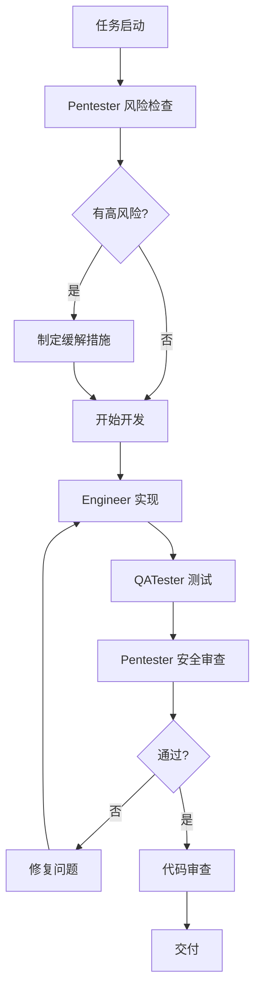
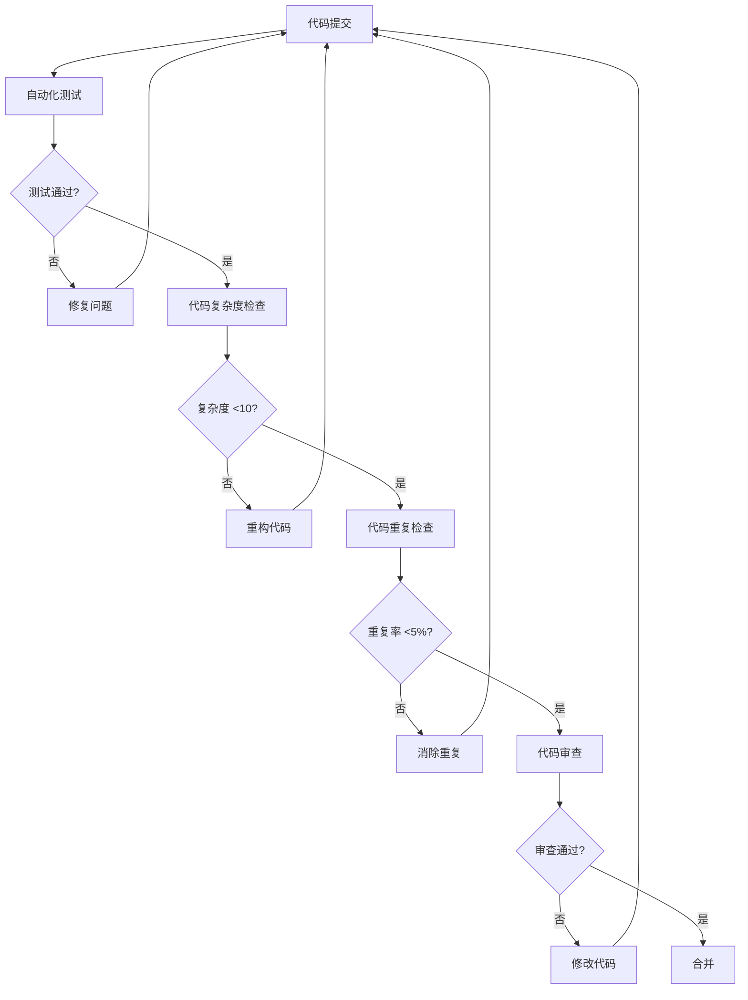
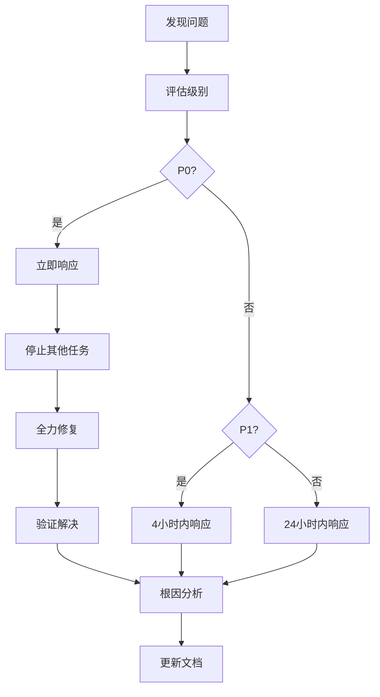
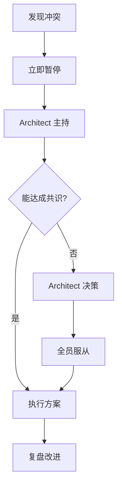

# Week 4-5 详细实施计划

**文档版本：** 1.0.0
**创建时间：** 2026-02-06
**规划者：** Nova Agent
**适用范围：** Week 4-5 Analytics + REST API 实施
**工期：** 10天（2026-02-06 至 2026-02-15）

---

## 目录

1. [执行摘要](#1-执行摘要)
2. [详细时间表（Day 1-10）](#2-详细时间表day-1-10)
3. [执行流程](#3-执行流程)
4. [工具和模板](#4-工具和模板)
5. [应急预案](#5-应急预案)
6. [成功指标和监控](#6-成功指标和监控)
7. [虚拟团队协作](#7-虚拟团队协作)

---

## 1. 执行摘要

### 1.1 项目目标

**核心目标：** 在 10 天内完成 Analytics 模块和 REST API 的开发，同时建立**安全加固**和**质量保证体系**。

**交付物：**
- ✅ Analytics 模块（已通过 82 个测试）
- 🔄 REST API 开发（10 个端点）
- 🔄 API 安全加固（P0 优先级）
- 🔄 质量保证体系（P1 优先级）
- 🔄 虚拟团队实施流程（P1 优先级）

### 1.2 虚拟团队角色

| 角色 | Agent | 职责 | 工作量 |
|------|-------|------|--------|
| **Pentester** | 安全专家 | 安全审查、威胁建模、漏洞扫描 | 30% |
| **Architect** | 架构师 | 架构设计、性能优化、技术决策 | 25% |
| **QATester** | 测试工程师 | 测试策略、质量门禁、自动化测试 | 25% |
| **Engineer** | 实施工程师 | 功能开发、代码实现、集成 | 40% |
| **CodeReviewer** | 代码审查者 | 代码审查、规范检查、最佳实践 | 20% |
| **Algorithm** | 算法专家 | 算法设计、准确性验证、优化 | 15% |
| **DocWriter** | 文档专家 | API 文档、使用指南、示例代码 | 15% |

**说明：** 工作量百分比表示该角色的参与度，角色可能并行工作。

### 1.3 优先级矩阵

| 优先级 | 任务 | 理由 | 截止时间 |
|--------|------|------|----------|
| **P0** | API 安全加固 | 阻断性问题，影响系统安全性 | Day 5 |
| **P0** | 核心端点实现 | 基础功能，影响后续开发 | Day 6 |
| **P1** | 质量保证体系 | 确保代码质量，防止技术债务 | Day 8 |
| **P1** | 虚拟团队实施 | 建立协作流程，提升效率 | Day 9 |
| **P2** | 文档完善 | 提升可维护性，可延后 | Day 10 |
| **P2** | 性能优化 | 优化项，非阻断 | Day 10 |

### 1.4 关键里程碑

| 里程碑 | 日期 | 验收标准 | 负责人 |
|--------|------|----------|--------|
| **M1: API 安全加固完成** | Day 5 | 所有 P0 安全问题修复，测试通过 | Pentester |
| **M2: 核心 API 端点实现** | Day 6 | 10 个端点全部实现，集成测试通过 | Engineer |
| **M3: 质量体系建立** | Day 8 | 测试覆盖率 >90%，质量门禁通过 | QATester |
| **M4: 虚拟团队流程验证** | Day 9 | 所有角色协作顺畅，无阻塞问题 | Architect |
| **M5: 项目交付** | Day 10 | 所有文档完成，验收通过 | 全体 |

---

## 2. 详细时间表（Day 1-10）

### Day 1 (2026-02-06)：环境准备 + 需求确认

**目标：** 建立开发环境，确认需求，设置监控框架

#### Morning（3 小时）

| 时间 | 任务 | 负责人 | 产出 |
|------|------|--------|------|
| 09:00-09:30 | **Standup 会议** | Architect | 任务分配，依赖确认 |
| 09:30-10:30 | **环境准备** | Engineer | 开发环境就绪，依赖安装 |
| 10:30-11:30 | **需求确认** | Architect + Pentester | 需求文档更新，风险评估 |
| 11:30-12:00 | **风险框架部署** | Pentester | 风险监控看板初始化 |

#### Afternoon（4 小时）

| 时间 | 任务 | 负责人 | 产出 |
|------|------|--------|------|
| 13:30-14:30 | **API 设计审查** | Architect + Engineer | API 接口文档（OpenAPI） |
| 14:30-15:30 | **安全威胁建模** | Pentester | 威胁模型文档（STRIDE） |
| 15:30-16:30 | **测试策略制定** | QATester | 测试计划和用例大纲 |
| 16:30-17:30 | **质量监控配置** | QATester + Pentester | 质量看板，告警规则 |

#### Evening（1 小时）

| 时间 | 任务 | 负责人 | 产出 |
|------|------|--------|------|
| 17:30-18:00 | **Day 1 验收 + 复盘** | 全体 | Day 1 完成报告，风险更新 |

**Day 1 验收标准：**
- ✅ 开发环境就绪（所有依赖安装）
- ✅ API 接口文档完成（至少 10 个端点）
- ✅ 威胁模型完成（至少 5 个威胁场景）
- ✅ 质量看板运行（能采集基础指标）
- ✅ 风险检查清单已填写

**Day 1 风险：**
- 🟡 中风险：API 设计可能需要调整
- 🟢 低风险：环境配置可能遇到兼容性问题

---

### Day 2 (2026-02-07)：认证授权 + 输入验证

**目标：** 实现 API 认证授权机制和输入验证层（P0 安全优先）

#### Morning（3 小时）

| 时间 | 任务 | 负责人 | 产出 |
|------|------|--------|------|
| 09:00-09:15 | **Standup + 风险检查** | Pentester | 风险检查清单 |
| 09:15-11:00 | **认证中间件实现** | Engineer + Pentester | JWT 认证中间件 |
| 11:00-12:00 | **输入验证层实现** | Engineer + Pentester | Zod schema 定义 |

#### Afternoon（4 小时）

| 时间 | 任务 | 负责人 | 产出 |
|------|------|--------|------|
| 13:30-14:30 | **安全测试编写** | QATester + Pentester | 安全测试用例（20+） |
| 14:30-15:30 | **认证授权测试** | QATester | 测试通过率 100% |
| 15:30-16:30 | **输入验证测试** | QATester | 负面测试用例通过 |
| 16:30-17:30 | **代码审查** | CodeReviewer + Pentester | 审查通过，无安全问题 |

#### Evening（1 小时）

| 时间 | 任务 | 负责人 | 产出 |
|------|------|--------|------|
| 17:30-18:00 | **Day 2 验收 + 安全扫描** | Pentester | 安全扫描报告，无高危漏洞 |

**Day 2 验收标准：**
- ✅ JWT 认证中间件实现并测试通过
- ✅ 所有 API 端点输入验证完整（Zod schema）
- ✅ 安全测试覆盖率 100%（SQL注入、XSS、命令注入）
- ✅ 安全扫描通过（bun audit，无高危漏洞）
- ✅ 代码审查通过（无安全 issues）

**Day 2 风险：**
- 🟡 中风险：Zod schema 可能需要调整
- 🔴 高风险：认证绕过漏洞（需重点测试）

---

### Day 3 (2026-02-08)：Analytics API 端点实现（第 1 部分）

**目标：** 实现 Analytics 相关的 5 个核心 API 端点

#### Morning（3 小时）

| 时间 | 任务 | 负责人 | 产出 |
|------|------|--------|------|
| 09:00-09:15 | **Standup + 风险检查** | Pentester | 风险检查清单 |
| 09:15-10:15 | **GET /api/v1/analytics/usage** | Engineer | 端点实现 + 单元测试 |
| 10:15-11:15 | **GET /api/v1/analytics/quality** | Engineer | 端点实现 + 单元测试 |
| 11:15-12:00 | **GET /api/v1/analytics/performance** | Engineer | 端点实现 + 单元测试 |

#### Afternoon（4 小时）

| 时间 | 任务 | 负责人 | 产出 |
|------|------|--------|------|
| 13:30-14:30 | **GET /api/v1/analytics/trends** | Engineer | 端点实现 + 单元测试 |
| 14:30-15:30 | **GET /api/v1/anomalies** | Engineer | 端点实现 + 单元测试 |
| 15:30-16:30 | **集成测试** | QATester | 5 个端点集成测试通过 |
| 16:30-17:30 | **性能测试** | Architect + QATester | P95 <100ms 验证 |

#### Evening（1 小时）

| 时间 | 任务 | 负责人 | 产出 |
|------|------|--------|------|
| 17:30-18:00 | **Day 3 验收 + 质量检查** | QATester | 质量报告，测试覆盖率 >90% |

**Day 3 验收标准：**
- ✅ 5 个 Analytics 端点全部实现
- ✅ 单元测试覆盖率 >90%
- ✅ 集成测试通过（端到端场景）
- ✅ 性能测试通过（P95 <100ms）
- ✅ 代码审查通过

**Day 3 风险：**
- 🟡 中风险：Analytics 数据可能需要缓存优化
- 🟢 低风险：单元测试可能需要补充边界条件

---

### Day 4 (2026-02-09)：Analytics API 端点实现（第 2 部分）

**目标：** 实现剩余 5 个 API 端点（Dashboard + 管理）

#### Morning（3 小时）

| 时间 | 任务 | 负责人 | 产出 |
|------|------|--------|------|
| 09:00-09:15 | **Standup + 风险检查** | Pentester | 风险检查清单 |
| 09:15-10:15 | **GET /api/v1/analytics/dashboard** | Engineer | 端点实现 + 单元测试 |
| 10:15-11:15 | **POST /api/v1/analytics/refresh** | Engineer | 端点实现 + 单元测试 |
| 11:15-12:00 | **DELETE /api/v1/analytics/cache** | Engineer | 端点实现 + 单元测试 |

#### Afternoon（4 小时）

| 时间 | 任务 | 负责人 | 产出 |
|------|------|--------|------|
| 13:30-14:30 | **GET /api/v1/analytics/export** | Engineer | 端点实现 + 单元测试 |
| 14:30-15:30 | **GET /api/v1/health** | Engineer | 端点实现 + 单元测试 |
| 15:30-16:30 | **集成测试** | QATester | 10 个端点集成测试通过 |
| 16:30-17:30 | **性能优化** | Architect + Engineer | 性能优化（缓存、索引） |

#### Evening（1 小时）

| 时间 | 任务 | 负责人 | 产出 |
|------|------|--------|------|
| 17:30-18:00 | **Day 4 验收 + 质量检查** | QATester | 质量报告，覆盖率 >90% |

**Day 4 验收标准：**
- ✅ 10 个 API 端点全部实现
- ✅ 单元测试覆盖率 >90%
- ✅ 集成测试通过（所有端点）
- ✅ 性能优化完成（P95 <100ms）
- ✅ 代码审查通过

**Day 4 风险：**
- 🟡 中风险：Dashboard 端点可能需要优化查询
- 🟢 低风险：缓存失效策略可能需要调整

---

### Day 5 (2026-02-10)：API 安全加固（P0 里程碑）

**目标：** 完成所有安全加固工作，达到 P0 安全标准

#### Morning（3 小时）

| 时间 | 任务 | 负责人 | 产出 |
|------|------|--------|------|
| 09:00-09:15 | **Standup + 安全扫描** | Pentester | 安全扫描报告 |
| 09:15-10:30 | **安全漏洞修复** | Engineer + Pentester | 所有已知漏洞修复 |
| 10:30-11:30 | **错误处理安全化** | Engineer + Pentester | 错误信息不泄露内部信息 |
| 11:30-12:00 | **依赖库更新** | Engineer | 依赖库无已知漏洞 |

#### Afternoon（4 小时）

| 时间 | 任务 | 负责人 | 产出 |
|------|------|--------|------|
| 13:30-14:30 | **安全测试** | QATester + Pentester | 安全测试 100% 通过 |
| 14:30-15:30 | **模糊测试** | Pentester | 模糊测试无崩溃 |
| 15:30-16:30 | **渗透测试** | Pentester | 渗透测试报告 |
| 16:30-17:30 | **安全审查** | Pentester + CodeReviewer | 安全审查通过 |

#### Evening（1 小时）

| 时间 | 任务 | 负责人 | 产出 |
|------|------|--------|------|
| 17:30-18:00 | **M1 里程碑验收** | Pentester | API 安全加固完成报告 |

**Day 5 验收标准：**
- ✅ 所有 P0 安全问题修复
- ✅ 安全扫描通过（bun audit，无高危漏洞）
- ✅ 安全测试覆盖率 100%
- ✅ 模糊测试无崩溃
- ✅ 渗透测试报告通过
- ✅ **M1 里程碑达成** ✅

**Day 5 风险：**
- 🔴 高风险：可能发现严重安全漏洞
- 🟡 中风险：依赖库更新可能引入兼容性问题

---

### Day 6 (2026-02-11)：集成 + 端到端测试

**目标：** 完成 API 集成，通过所有端到端测试（M2 里程碑）

#### Morning（3 小时）

| 时间 | 任务 | 负责人 | 产出 |
|------|------|--------|------|
| 09:00-09:15 | **Standup + 风险检查** | Pentester | 风险检查清单 |
| 09:15-10:30 | **API 集成** | Engineer + Architect | 所有端点集成完成 |
| 10:30-11:30 | **端到端测试编写** | QATester | E2E 测试场景（10+） |
| 11:30-12:00 | **数据迁移验证** | Engineer | 数据迁移测试通过 |

#### Afternoon（4 小时）

| 时间 | 任务 | 负责人 | 产出 |
|------|------|--------|------|
| 13:30-15:00 | **端到端测试执行** | QATester | 所有 E2E 测试通过 |
| 15:00-16:00 | **性能压测** | Architect + QATester | 压力测试通过 |
| 16:00-17:00 | **兼容性测试** | Engineer | 向后兼容性验证 |
| 17:00-17:30 | **Bug 修复** | Engineer | 所有测试缺陷修复 |

#### Evening（1 小时）

| 时间 | 任务 | 负责人 | 产出 |
|------|------|--------|------|
| 17:30-18:00 | **M2 里程碑验收** | Architect | 核心 API 端点实现完成报告 |

**Day 6 验收标准：**
- ✅ 所有 API 端点集成完成
- ✅ 端到端测试 100% 通过
- ✅ 性能压测通过（1000 QPS，P95 <100ms）
- ✅ 向后兼容性验证通过
- ✅ 所有测试缺陷修复
- ✅ **M2 里程碑达成** ✅

**Day 6 风险：**
- 🟡 中风险：性能压测可能发现性能瓶颈
- 🟢 低风险：向后兼容性问题

---

### Day 7 (2026-02-12)：质量保证体系建立（第 1 部分）

**目标：** 建立测试框架、质量门禁、自动化检查

#### Morning（3 小时）

| 时间 | 任务 | 负责人 | 产出 |
|------|------|--------|------|
| 09:00-09:15 | **Standup + 质量检查** | QATester | 质量指标采集 |
| 09:15-10:30 | **测试框架优化** | QATester | 测试框架文档 |
| 10:30-11:30 | **质量门禁实现** | QATester + Architect | 质量门禁脚本 |
| 11:30-12:00 | **自动化测试配置** | QATester | CI/CD 集成 |

#### Afternoon（4 小时）

| 时间 | 任务 | 负责人 | 产出 |
|------|------|--------|------|
| 13:30-14:30 | **代码复杂度检查** | CodeReviewer | 复杂度报告 |
| 14:30-15:30 | **代码重复检测** | CodeReviewer | 重复代码报告 |
| 15:30-16:30 | **TypeScript 严格模式** | Engineer + CodeReviewer | 严格错误修复 |
| 16:30-17:30 | **ESLint 规则完善** | CodeReviewer | ESLint 配置 |

#### Evening（1 小时）

| 时间 | 任务 | 负责人 | 产出 |
|------|------|--------|------|
| 17:30-18:00 | **Day 7 验收 + 质量报告** | QATester | 质量报告 |

**Day 7 验收标准：**
- ✅ 测试框架文档完整
- ✅ 质量门禁脚本运行正常
- ✅ 自动化测试集成到 CI/CD
- ✅ 代码复杂度 <10
- ✅ 代码重复率 <5%
- ✅ TypeScript 严格模式通过

**Day 7 风险：**
- 🟡 中风险：质量门禁可能过于严格，影响开发
- 🟢 低风险：代码复杂度可能需要重构

---

### Day 8 (2026-02-13)：质量保证体系建立（第 2 部分）

**目标：** 完成质量保证体系，测试覆盖率 >90%（M3 里程碑）

#### Morning（3 小时）

| 时间 | 任务 | 负责人 | 产出 |
|------|------|--------|------|
| 09:00-09:15 | **Standup + 质量检查** | QATester | 质量指标采集 |
| 09:15-10:30 | **测试覆盖率提升** | Engineer + QATester | 覆盖率 >90% |
| 10:30-11:30 | **性能基准测试** | Architect + QATester | 性能基准文档 |
| 11:30-12:00 | **回归测试** | QATester | 回归测试通过 |

#### Afternoon（4 小时）

| 时间 | 任务 | 负责人 | 产出 |
|------|------|--------|------|
| 13:30-14:30 | **安全测试完善** | Pentester | 安全测试文档 |
| 14:30-15:30 | **文档测试** | DocWriter | 文档完整性验证 |
| 15:30-16:30 | **质量监控看板** | QATester + Pentester | 看板运行正常 |
| 16:30-17:30 | **告警规则验证** | QATester + Pentester | 告警规则测试 |

#### Evening（1 小时）

| 时间 | 任务 | 负责人 | 产出 |
|------|------|--------|------|
| 17:30-18:00 | **M3 里程碑验收** | QATester | 质量保证体系完成报告 |

**Day 8 验收标准：**
- ✅ 测试覆盖率 >90%
- ✅ 性能基准测试通过
- ✅ 回归测试 100% 通过
- ✅ 安全测试文档完整
- ✅ 质量监控看板运行正常
- ✅ **M3 里程碑达成** ✅

**Day 8 风险：**
- 🟡 中风险：测试覆盖率可能难以达到 90%
- 🟢 低风险：告警规则可能需要调整

---

### Day 9 (2026-02-14)：虚拟团队协作验证

**目标：** 验证虚拟团队协作流程，所有角色配合顺畅（M4 里程碑）

#### Morning（3 小时）

| 时间 | 任务 | 负责人 | 产出 |
|------|------|--------|------|
| 09:00-09:30 | **虚拟团队 Standup** | Architect | 协作流程验证 |
| 09:30-10:30 | **角色职责演练** | 全体 | 角色协作场景 |
| 10:30-11:30 | **沟通流程测试** | Architect | 沟通效率验证 |
| 11:30-12:00 | **工具链验证** | Engineer + QATester | 工具链集成测试 |

#### Afternoon（4 小时）

| 时间 | 任务 | 负责人 | 产出 |
|------|------|--------|------|
| 13:30-14:30 | **跨角色协作场景** | 全体 | 协作场景测试 |
| 14:30-15:30 | **问题响应流程** | Architect + Pentester | 应急响应演练 |
| 15:30-16:30 | **决策流程验证** | Architect | 决策效率验证 |
| 16:30-17:30 | **团队复盘** | Architect | 协作流程改进 |

#### Evening（1 小时）

| 时间 | 任务 | 负责人 | 产出 |
|------|------|--------|------|
| 17:30-18:00 | **M4 里程碑验收** | Architect | 虚拟团队流程验证报告 |

**Day 9 验收标准：**
- ✅ 虚拟团队 Standup 流程顺畅
- ✅ 角色职责清晰，无重叠或遗漏
- ✅ 沟通效率高，无阻塞问题
- ✅ 工具链集成正常
- ✅ 跨角色协作场景通过
- ✅ 应急响应流程验证通过
- ✅ **M4 里程碑达成** ✅

**Day 9 风险：**
- 🟡 中风险：角色职责可能有重叠
- 🟢 低风险：工具链可能有兼容性问题

---

### Day 10 (2026-02-15)：文档完善 + 项目交付

**目标：** 完成所有文档，项目验收交付（M5 里程碑）

#### Morning（3 小时）

| 时间 | 任务 | 负责人 | 产出 |
|------|------|--------|------|
| 09:00-09:15 | **Standup + 最终检查** | Architect | 最终检查清单 |
| 09:15-10:30 | **API 文档完善** | DocWriter + Engineer | API 文档（OpenAPI） |
| 10:30-11:30 | **使用指南编写** | DocWriter | 使用指南 |
| 11:30-12:00 | **示例代码编写** | DocWriter + Engineer | 示例代码库 |

#### Afternoon（4 小时）

| 时间 | 任务 | 负责人 | 产出 |
|------|------|--------|------|
| 13:30-14:30 | **部署文档** | Engineer + DocWriter | 部署文档 |
| 14:30-15:30 | **项目验收准备** | Architect + QATester | 验收检查清单 |
| 15:30-16:30 | **最终验收测试** | QATester + Pentester | 验收测试通过 |
| 16:30-17:30 | **项目交付文档** | Architect | 项目交付报告 |

#### Evening（1 小时）

| 时间 | 任务 | 负责人 | 产出 |
|------|------|--------|------|
| 17:30-18:00 | **M5 里程碑验收 + 庆祝** | 全体 | 项目交付完成 |

**Day 10 验收标准：**
- ✅ API 文档完整（OpenAPI 规范）
- ✅ 使用指南完整（安装、配置、使用）
- ✅ 示例代码可运行
- ✅ 部署文档完整
- ✅ 验收测试 100% 通过
- ✅ 项目交付报告完整
- ✅ **M5 里程碑达成** ✅
- ✅ **Week 4-5 项目成功交付** 🎉

**Day 10 风险：**
- 🟢 低风险：文档可能有遗漏
- 🟢 低风险：验收测试可能发现小问题

---

## 3. 执行流程

### 3.1 每日工作流程

#### Morning Routine（09:00-12:00）

```
09:00-09:15  Standup 会议（15分钟）
             ├─ 昨日完成情况回顾
             ├─ 今日任务分配
             ├─ 阻塞问题识别
             └─ 风险检查清单填写

09:15-12:00   核心开发时间（2小时45分钟）
             ├─ P0 任务优先执行
             ├─ 持续集成测试
             └─ 代码提交和审查
```

#### Afternoon Routine（13:30-17:30）

```
13:30-17:30   持续开发 + 协作（4小时）
             ├─ 任务执行
             ├─ 代码审查（每2小时一次）
             ├─ 质量检查（每4小时一次）
             └─ 安全扫描（每天至少一次）
```

#### Evening Routine（17:30-18:00）

```
17:30-18:00   验收 + 复盘（30分钟）
             ├─ 验收标准检查
             ├─ 质量指标更新
             ├─ 风险看板更新
             └─ 明日计划确认
```

### 3.2 角色协作流程

#### 流程 1：安全优先流程



#### 流程 2：质量保证流程



#### 流程 3：应急响应流程



### 3.3 质量检查点

#### 检查点 1：代码提交前

```yaml
检查项:
  - 单元测试通过
  - TypeScript 严格模式通过
  - ESLint 无错误
  - 代码复杂度 <10
  - 安全扫描通过（如有变更）
```

#### 检查点 2：代码合并前

```yaml
检查项:
  - 所有测试通过（单元 + 集成）
  - 代码审查通过（至少 1 人审查）
  - 性能测试通过（如有变更）
  - 安全审查通过（如有变更）
  - 文档更新（如有需要）
```

#### 检查点 3：里程碑验收前

```yaml
检查项:
  - 所有验收标准达成
  - 测试覆盖率 >90%
  - 性能指标达标
  - 安全扫描通过
  - 文档完整
  - 风险看板更新
```

---

## 4. 工具和模板

### 4.1 任务跟踪模板

```markdown
# Task ###: [任务名称]

**优先级：** P0 / P1 / P2
**状态：** Pending / In Progress / Completed
**负责人：** [Agent]
**预计时间：** [小时]
**实际时间：** [小时]
**截止时间：** YYYY-MM-DD

## 任务描述

[详细描述任务内容]

## 验收标准

- [ ] 标准 1
- [ ] 标准 2
- [ ] 标准 3

## 依赖任务

- Task ###
- Task ###

## 子任务

- [ ] 子任务 1
- [ ] 子任务 2
- [ ] 子任务 3

## 时间记录

| 日期 | 计划 | 实际 | 状态 |
|------|------|------|------|
| YYYY-MM-DD | 2h | 2.5h | ✅ |
| YYYY-MM-DD | 3h | - | 🔄 |

## 风险和问题

| 风险/问题 | 级别 | 状态 | 缓解措施 |
|-----------|------|------|----------|
| [描述] | 🔴/🟡/🟢 | Open/Closed | [措施] |

## 完成记录

**完成时间：** YYYY-MM-DD HH:MM
**完成人：** [Agent]
**验收人：** [Agent]
**备注：** [备注]
```

### 4.2 每日进度报告模板

```markdown
# Day X 进度报告 (YYYY-MM-DD)

## 📊 今日概览

| 指标 | 计划 | 实际 | 达成率 |
|------|------|------|--------|
| 任务完成 | __ | __ | __% |
| 代码提交 | __ | __ | __% |
| 测试通过 | __ | __ | __% |

## ✅ 今日完成

- [Task ###] 任务描述（负责人，状态）
- [Task ###] 任务描述（负责人，状态）

## 🔄 进行中

- [Task ###] 任务描述（负责人，进度 __%）

## ⚠️ 今日问题

| 问题 | 级别 | 负责人 | 状态 |
|------|------|--------|------|
| [描述] | 🔴/🟡/🟢 | [Agent] | Open/Closed |

## 📈 质量指标

| 指标 | 目标 | 实际 | 状态 |
|------|------|------|------|
| 测试覆盖率 | >90% | __% | 🟢/🟡/🔴 |
| 代码复杂度 | <10 | __ | 🟢/🟡/🔴 |
| API P95 | <100ms | __ms | 🟢/🟡/🔴 |

## 📝 明日计划

- [Task ###] 任务描述（负责人）
- [Task ###] 任务描述（负责人）

## 💡 改进建议

- [建议 1]
- [建议 2]

---

**报告人：** [Agent]
**报告时间：** YYYY-MM-DD 18:00
```

### 4.3 里程碑验收模板

```markdown
# M[X] 里程碑验收报告

**里程碑名称：** [名称]
**验收时间：** YYYY-MM-DD HH:MM
**验收人：** [Agent]

## 验收标准

| 标准 | 目标 | 实际 | 达成 |
|------|------|------|------|
| [标准 1] | [值] | [值] | ✅/❌ |
| [标准 2] | [值] | [值] | ✅/❌ |
| [标准 3] | [值] | [值] | ✅/❌ |

## 交付物

- [ ] 交付物 1
- [ ] 交付物 2
- [ ] 交付物 3

## 质量指标

| 指标 | 目标 | 实际 | 达成 |
|------|------|------|------|
| 测试覆盖率 | >90% | __% | ✅/❌ |
| 性能 | <100ms | __ms | ✅/❌ |
| 安全 | 0 高危 | __ | ✅/❌ |

## 风险评估

| 风险 | 级别 | 缓解措施 |
|------|------|----------|
| [风险 1] | 🔴/🟡/🟢 | [措施] |

## 验收结论

**状态：** ✅ 通过 / ❌ 不通过 / ⚠️ 有条件通过

**备注：**
[备注]

## 遗留问题

- [问题 1]
- [问题 2]

## 后续行动

- [ ] 行动 1（负责人，截止时间）
- [ ] 行动 2（负责人，截止时间）

---

**验收签字：** ____________ 日期：__________
```

### 4.4 风险跟踪表

```markdown
# Week 4-5 风险跟踪表

**更新时间：** YYYY-MM-DD HH:MM:SS

## 当前风险

| ID | 风险描述 | 级别 | 负责人 | 状态 | 截止时间 |
|----|---------|------|--------|------|----------|
| R001 | [描述] | 🔴/🟡/🟢 | [Agent] | Open/Monitor/Closed | YYYY-MM-DD |
| R002 | [描述] | 🔴/🟡/🟢 | [Agent] | Open/Monitor/Closed | YYYY-MM-DD |

## 风险历史

### YYYY-MM-DD

**新增风险：**
- [R001] [描述]

**关闭风险：**
- [R002] [描述]

**升级风险：**
- [R003] 🟡 → 🔴 [原因]

## 风险统计

| 级别 | 数量 | 占比 |
|------|------|------|
| 🔴 高风险 | __ | __% |
| 🟡 中风险 | __ | __% |
| 🟢 低风险 | __ | __% |

## 趋势分析

```
风险数量趋势
7 │
6 │
5 │
4 │
3 │
2 │
1 │
0 └─────────────
  D1 D2 D3 D4 D5 D6 D7 D8 D9 D10
```
```

---

## 5. 应急预案

### 5.1 进度延迟应对

#### 场景 1：单日任务延迟 <4 小时

**触发条件：**
- 当日任务完成度 <75%
- 延迟时间 <4 小时

**应对措施：**
1. **评估延迟原因**（15分钟）
   - 估时不足？技术难题？外部阻塞？
2. **调整次日计划**（15分钟）
   - 将未完成任务优先级提升
   - 压缩非紧急任务
3. **加班补救**（可选）
   - 当日加班 2-3 小时完成关键任务
4. **更新风险跟踪表**
   - 记录延迟原因和影响

**决策树：**
```
延迟 <4h?
  ├─ 是 → 评估原因
  │       ├─ 估时不足 → 调整估时，补充任务
  │       ├─ 技术难题 → 寻求帮助，增加资源
  │       └─ 外部阻塞 → 协调资源，解除阻塞
  └─ 否 → 启动场景 2
```

#### 场景 2：单日任务延迟 >4 小时

**触发条件：**
- 当日任务完成度 <50%
- 延迟时间 >4 小时

**应对措施：**
1. **紧急会议**（30分钟）
   - 全体成员参加
   - 评估延迟影响
   - 制定恢复计划
2. **重新排期**（1小时）
   - 调整里程碑日期
   - 削减非核心功能
   - 重新分配资源
3. **增加资源**（如需要）
   - 调用其他 Agent 协助
   - 延长工作时间
4. **通知相关方**
   - 更新项目状态
   - 沟通新的交付时间

**恢复计划模板：**
```markdown
# 进度恢复计划

**触发时间：** YYYY-MM-DD HH:MM
**延迟时长：** __ 小时
**影响范围：** [描述]

## 延迟原因

[根本原因分析]

## 恢复措施

| 措施 | 负责人 | 截止时间 | 状态 |
|------|--------|----------|------|
| [措施 1] | [Agent] | YYYY-MM-DD | 🔄 |
| [措施 2] | [Agent] | YYYY-MM-DD | 🔄 |

## 调整后的计划

| 里程碑 | 原日期 | 新日期 | 变化 |
|--------|--------|--------|------|
| M1 | YYYY-MM-DD | YYYY-MM-DD | +X天 |

## 资源需求

- [ ] 需要增加资源
- [ ] 需要延长工作时间
- [ ] 需要削减功能

---

**制定人：** [Agent]
**审批人：** [Agent]
**制定时间：** YYYY-MM-DD HH:MM
```

### 5.2 技术难题应对

#### 场景 1：单个技术难题

**触发条件：**
- 遇到未预见的技术难题
- 预计解决时间 >2 小时

**应对措施：**
1. **快速评估**（15分钟）
   - 问题严重程度
   - 影响范围
   - 是否阻塞其他任务
2. **寻求帮助**（30分钟）
   - 咨询 Architect 或 Algorithm
   - 搜索解决方案
   - 评估替代方案
3. **制定方案**（30分钟）
   - 方案 A：[描述]（优点/缺点）
   - 方案 B：[描述]（优点/缺点）
   - 选择最优方案
4. **实施验证**（1-2小时）
   - 快速原型验证
   - 确认可行性
   - 推进实施

**升级条件：**
- 2 小时内无法解决 → 升级为场景 2

#### 场景 2：严重技术难题

**触发条件：**
- 技术难题阻塞核心功能
- 预计解决时间 >1 天

**应对措施：**
1. **停止相关开发**（立即）
   - 避免浪费时间
   - 重新评估优先级
2. **紧急技术评审**（1小时）
   - Architect 主导
   - Algorithm 参与深度分析
   - 制定解决方案
3. **方案评审**（1小时）
   - 评估多个方案
   - 权衡利弊
   - 风险评估
4. **快速决策**（30分钟）
   - Architect 最终决策
   - 全力执行
5. **持续跟踪**（每 2 小时）
   - 进度更新
   - 风险评估
   - 调整策略

**替代方案：**
- 削减相关功能
- 使用临时解决方案
- 延后到下个迭代

### 5.3 质量问题应对

#### 场景 1：测试覆盖率不足

**触发条件：**
- 测试覆盖率 <85%（预警阈值）
- 测试覆盖率 <90%（目标值）

**应对措施：**
1. **立即分析**（30分钟）
   - 识别未覆盖代码
   - 分类未覆盖原因
   - 评估补充难度
2. **补充测试**（2-4小时）
   - 优先级：核心功能 > 边界条件 > 异常处理
   - 编写测试用例
   - 运行并验证
3. **重构代码**（如需要）
   - 提高可测试性
   - 降低复杂度
4. **持续监控**
   - 每次提交检查覆盖率
   - 设置覆盖率门禁

**预防措施：**
- TDD 开发模式
- 代码审查时检查测试
- 自动化覆盖率检查

#### 场景 2：性能不达标

**触发条件：**
- API P95 >100ms
- API P99 >200ms

**应对措施：**
1. **性能分析**（1小时）
   - 使用性能分析工具
   - 定位瓶颈
   - 确定优化方向
2. **优化方案**（1-2小时）
   - 方案 A：添加缓存
   - 方案 B：算法优化
   - 方案 C：异步处理
   - 选择最优方案
3. **实施优化**（2-4小时）
   - 实施优化
   - 性能测试验证
   - 回归测试
4. **降级方案**（如优化失败）
   - 添加缓存层
   - 异步处理
   - 分页/限流

**性能优化清单：**
```markdown
# 性能优化清单

| 优化项 | 当前值 | 目标值 | 方案 | 状态 |
|--------|--------|--------|------|------|
| API P95 | __ms | <100ms | [方案] | 🔄 |
| API P99 | __ms | <200ms | [方案] | 🔄 |
| 内存占用 | __MB | <200MB | [方案] | 🔄 |
| 查询时间 | __ms | <50ms | [方案] | 🔄 |

## 优化历史

### YYYY-MM-DD
- [优化项] 当前值 → 优化后值（提升 __%）
```

#### 场景 3：发现安全漏洞

**触发条件：**
- 发现高危或严重安全漏洞
- 安全扫描失败

**应对措施：**
1. **立即止损**（0-15分钟）
   - 停止相关功能开发
   - 如已部署，立即回滚
   - 通知相关人员
2. **漏洞分析**（15-60分钟）
   - Pentester 主导分析
   - 确认漏洞细节
   - 评估影响范围
3. **修复方案**（1-2小时）
   - 设计修复方案
   - 评估修复风险
   - 获得批准
4. **修复实施**（2-4小时）
   - 编写修复代码
   - 编写/更新测试
   - 验证修复
5. **回归测试**（1小时）
   - 安全测试验证
   - 功能回归测试
   - 性能回归测试
6. **复盘总结**（完成后）
   - 漏洞来源分析
   - 流程改进建议
   - 威胁模型更新

**漏洞报告模板：**
```markdown
# 安全漏洞报告

**漏洞编号：** SEC-YYYYMMDD-###
**发现时间：** YYYY-MM-DD HH:MM:SS
**严重级别：** 🔴 严重 / 🟡 中危 / 🟢 低危
**状态：** Open / In Progress / Fixed

## 漏洞描述

- **漏洞类型：** [SQL注入/XSS/命令注入/等]
- **影响版本：** [版本号]
- **影响组件：** [组件名]
- **CVSS 评分：** [评分]

## 技术细节

- **漏洞位置：** `src/xxx/yyy.ts:123`
- **漏洞成因：** [描述]
- **漏洞利用方式：** [PoC]

```typescript
// 漏洞代码示例
...
```

## 影响评估

- **数据泄露风险：** 是/否
- **系统控制风险：** 是/否
- **影响用户数：** [估计]
- **影响功能：** [列表]

## 修复方案

### 修复代码

```diff
- // 漏洞代码
+ // 修复代码
```

### 修复后测试

- [ ] 单元测试通过
- [ ] 集成测试通过
- [ ] 安全测试通过
- [ ] 性能测试通过

## 预防措施

- [ ] 更新威胁模型
- [ ] 更新代码审查清单
- [ ] 更新安全测试用例
- [ ] 培训团队成员

## 时间线

| 时间 | 事件 | 负责人 |
|------|------|--------|
| YYYY-MM-DD HH:MM | 漏洞发现 | [Agent] |
| YYYY-MM-DD HH:MM | 漏洞修复 | [Agent] |
| YYYY-MM-DD HH:MM | 验证完成 | [Agent] |

---

**报告人：** Pentester Agent
**审核人：** ____________
**完成时间：** YYYY-MM-DD HH:MM
```

### 5.4 人员冲突应对

#### 场景：角色职责冲突

**触发条件：**
- 多个 Agent 对同一任务有不同理解
- 角色职责重叠导致冲突

**应对措施：**
1. **立即暂停**（15分钟）
   - 停止争论
   - 冷静 5 分钟
2. **明确职责**（30分钟）
   - Architect 主持会议
   - 查阅角色定义文档
   - 明确各自职责边界
3. **寻求共识**（1小时）
   - 充分沟通
   - 理解对方观点
   - 寻求双赢方案
4. **Architect 决策**（30分钟）
   - 如无法达成共识
   - Architect 最终决策
   - 全员服从
5. **流程改进**（完成后）
   - 更新角色定义
   - 避免类似冲突

**冲突解决流程：**


---

## 6. 成功指标和监控

### 6.1 每日跟踪指标

#### 进度指标

| 指标 | 计算方式 | 目标值 | 预警阈值 | 危险阈值 |
|------|---------|--------|---------|---------|
| **任务完成率** | 已完成任务 / 计划任务 | 100% | <80% | <50% |
| **工时达成率** | 实际工时 / 计划工时 | 100% | <90% | <75% |
| **里程碑准时率** | 按时完成里程碑 / 总里程碑 | 100% | 延迟1天 | 延迟2天 |

#### 质量指标

| 指标 | 计算方式 | 目标值 | 预警阈值 | 危险阈值 |
|------|---------|--------|---------|---------|
| **测试覆盖率** | 已覆盖行 / 总行数 | >90% | <90% | <85% |
| **测试通过率** | 通过测试 / 总测试 | 100% | <100% | <95% |
| **代码复杂度** | 函数平均复杂度 | <10 | >10 | >15 |
| **代码重复率** | 重复行 / 总行数 | <5% | >5% | >8% |

#### 性能指标

| 指标 | 计算方式 | 目标值 | 预警阈值 | 危险阈值 |
|------|---------|--------|---------|---------|
| **API P95** | 95% 请求响应时间 | <100ms | >80ms | >100ms |
| **API P99** | 99% 请求响应时间 | <200ms | >150ms | >200ms |
| **内存占用** | 堆内存使用量 | <200MB | >150MB | >200MB |
| **测试执行时间** | 全量测试耗时 | <30s | >30s | >60s |

#### 安全指标

| 指标 | 计算方式 | 目标值 | 预警阈值 | 危险阈值 |
|------|---------|--------|---------|---------|
| **高危漏洞数** | 依赖库高危漏洞 | 0 | 0 | >0 |
| **中危漏洞数** | 依赖库中危漏洞 | 0 | >1 | >3 |
| **安全问题数** | 代码审计发现问题 | 0 | >0 | >2 |

### 6.2 每周评估维度

#### Week 4 评估（Day 1-5）

**核心问题：**
1. API 安全加固是否完成？（M1 里程碑）
2. 核心 API 端点是否实现？（进度）
3. 质量指标是否达标？（测试覆盖率、性能）

**评估清单：**
```markdown
# Week 4 评估清单

## M1 里程碑验收

- [ ] API 安全加固完成
- [ ] 所有 P0 安全问题修复
- [ ] 安全扫描通过
- [ ] 安全测试覆盖率 100%

## 进度评估

- [ ] Day 1-5 任务完成率 >=80%
- [ ] 核心 API 端点实现 >=8/10
- [ ] 里程碑 M1 按时达成

## 质量评估

- [ ] 测试覆盖率 >90%
- [ ] API P95 <100ms
- [ ] 代码复杂度 <10
- [ ] 安全扫描通过

## 团队协作

- [ ] 虚拟团队协作顺畅
- [ ] 角色职责清晰
- [ ] 无阻塞问题 >24小时

## 风险评估

- [ ] 无高风险遗留
- [ ] 中风险有缓解方案
- [ ] 风险看板更新及时

**Week 4 总体评分：** __ / 10

**改进建议：**
- [建议 1]
- [建议 2]
```

#### Week 5 评估（Day 6-10）

**核心问题：**
1. 所有 API 端点是否完成？（M2 里程碑）
2. 质量保证体系是否建立？（M3 里程碑）
3. 虚拟团队流程是否验证？（M4 里程碑）
4. 项目是否按时交付？（M5 里程碑）

**评估清单：**
```markdown
# Week 5 评估清单

## 里程碑验收

- [ ] M2: 核心 API 端点实现完成
- [ ] M3: 质量保证体系建立
- [ ] M4: 虚拟团队流程验证
- [ ] M5: 项目交付完成

## 功能完整性

- [ ] 10 个 API 端点全部实现
- [ ] 所有功能测试通过
- [ ] 集成测试通过
- [ ] 端到端测试通过

## 质量达标

- [ ] 测试覆盖率 >90%
- [ ] 性能指标达标
- [ ] 安全指标达标
- [ ] 代码质量达标

## 文档完整

- [ ] API 文档完整
- [ ] 使用指南完整
- [ ] 部署文档完整
- [ ] 示例代码可运行

## 项目交付

- [ ] 所有验收标准达成
- [ ] 遗留问题有解决方案
- [ ] 交付文档完整

**Week 5 总体评分：** __ / 10

**改进建议：**
- [建议 1]
- [建议 2]
```

### 6.3 项目成功标准

#### 硬性指标（必须达成）

```yaml
功能完整性:
  - 10个API端点全部实现: ✅/❌
  - 所有功能测试通过: ✅/❌
  - 集成测试通过: ✅/❌
  - 端到端测试通过: ✅/❌

质量指标:
  - 测试覆盖率 >90%: ✅/❌
  - 代码复杂度 <10: ✅/❌
  - 代码重复率 <5%: ✅/❌

性能指标:
  - API P95 <100ms: ✅/❌
  - API P99 <200ms: ✅/❌
  - 内存占用 <200MB: ✅/❌

安全指标:
  - 高危漏洞数 = 0: ✅/❌
  - 安全测试覆盖率 = 100%: ✅/❌

里程碑达成:
  - M1: API安全加固完成: ✅/❌
  - M2: 核心API端点实现: ✅/❌
  - M3: 质量保证体系建立: ✅/❌
  - M4: 虚拟团队流程验证: ✅/❌
  - M5: 项目交付完成: ✅/❌

文档完整性:
  - API文档完整: ✅/❌
  - 使用指南完整: ✅/❌
  - 部署文档完整: ✅/❌
```

#### 软性指标（争取达成）

```yaml
团队协作:
  - 虚拟团队协作顺畅: 评分 __/10
  - 角色职责清晰: 评分 __/10
  - 沟通效率高: 评分 __/10

流程改进:
  - 质量保证体系可复用: ✅/❌
  - 虚拟团队流程可复用: ✅/❌
  - 应急预案验证有效: ✅/❌

技术创新:
  - 性能优化 >20%: ✅/❌
  - 安全加固创新: ✅/❌
  - 工具链集成完善: ✅/❌
```

#### 最终评分

| 维度 | 权重 | 评分（0-10） | 加权分 |
|------|------|--------------|--------|
| 功能完整性 | 30% | __ | __ |
| 质量指标 | 25% | __ | __ |
| 性能指标 | 15% | __ | __ |
| 安全指标 | 15% | __ | __ |
| 文档完整性 | 10% | __ | __ |
| 团队协作 | 5% | __ | __ |
| **总计** | **100%** | - | **__** |

**成功标准：**
- **优秀：** 总分 >=9.0
- **良好：** 总分 >=8.0
- **及格：** 总分 >=7.0
- **不及格：** 总分 <7.0

### 6.4 监控机制

#### 实时监控

**自动化监控脚本：**
```bash
# scripts/monitor.sh

#!/bin/bash

# 每小时运行一次
while true; do
  # 采集指标
  bun run scripts/collect-metrics.ts

  # 检查告警
  bun run scripts/check-alerts.ts

  # 更新看板
  bun run scripts/update-dashboard.ts

  # 等待 1 小时
  sleep 3600
done
```

#### 每日监控

**每日检查清单：**
- [ ] 09:00 Standup 会议
- [ ] 09:15 风险检查清单填写
- [ ] 12:00 上午进度检查
- [ ] 17:30 质量指标检查
- [ ] 18:00 风险看板更新
- [ ] 18:00 每日进度报告

#### 每周监控

**每周评估会议：**
- Week 4 评估（Day 5 下午）
- Week 5 评估（Day 10 下午）

---

## 7. 虚拟团队协作

### 7.1 角色职责矩阵

| 角色 | 主要职责 | 日常工作 | 关键决策 |
|------|----------|----------|----------|
| **Pentester** | 安全审查、威胁建模 | 每日风险检查、安全扫描 | 安全方案决策、漏洞级别判定 |
| **Architect** | 架构设计、技术指导 | Standup 主持、技术评审 | 架构决策、技术选型、冲突解决 |
| **QATester** | 测试策略、质量门禁 | 测试编写、质量检查 | 测试策略、质量标准、验收决策 |
| **Engineer** | 功能开发、代码实现 | 端点开发、测试编写 | 实现方案、代码优化 |
| **CodeReviewer** | 代码审查、规范检查 | 代码审查、复杂度检查 | 代码规范、最佳实践 |
| **Algorithm** | 算法设计、准确性验证 | 算法优化、性能分析 | 算法方案、优化策略 |
| **DocWriter** | 文档编写、示例代码 | API 文档、使用指南 | 文档结构、示例选择 |

### 7.2 协作场景

#### 场景 1：日常开发协作

```
Engineer 开发 → QATester 测试 → CodeReviewer 审查 → Pentester 安全审查 → 合并
     ↑                                                                         ↓
     └────────────────────── Architect 技术指导 ────────────────────────────────┘
```

#### 场景 2：安全问题协作

```
Pentester 发现漏洞 → Architect 评估 → Engineer 修复 → QATester 验证 → Pentester 复查
     ↓
Algorithm 协助分析（如需要）
```

#### 场景 3：性能优化协作

```
QATester 发现性能问题 → Architect 分析 → Algorithm 优化 → Engineer 实施 → QATester 验证
```

#### 场景 4：决策流程

```
问题提出 → Architect 主持 → 团队讨论 → 方案评估 → Architect 决策 → 执行
                                                                 ↓
                                                            DocWriter 记录
```

### 7.3 沟通协议

#### Standup 会议（每日 09:00-09:15）

**格式：**
```markdown
## Standup 会议模板

**日期：** YYYY-MM-DD
**主持人：** Architect

### 今日计划

| Agent | 今日任务 | 预计完成 | 阻塞问题 |
|-------|---------|---------|---------|
| Pentester | [任务] | HH:MM | - |
| Architect | [任务] | HH:MM | - |
| QATester | [任务] | HH:MM | [描述] |
| Engineer | [任务] | HH:MM | - |

### 昨日完成

- [Agent] [任务]（状态）
- [Agent] [任务]（状态）

### 阻塞问题

| 问题 | 负责人 | 解决方案 | 截止时间 |
|------|--------|----------|----------|
| [描述] | [Agent] | [方案] | HH:MM |

### 风险提示

- [风险 1]（级别）
- [风险 2]（级别）

**会议记录：** [DocWriter]
```

#### 技术评审会议（按需）

**触发条件：**
- 架构变更
- 技术选型
- 复杂问题

**参与角色：**
- Architect（主持）
- 相关角色（根据议题）

**输出：**
- 技术方案文档
- 决策记录

#### 应急响应会议（紧急情况）

**触发条件：**
- P0 级别问题
- 严重安全漏洞
- 里程碑延迟风险

**参与角色：**
- 全体 Agent

**响应时间：**
- 立即（15 分钟内开始）

**输出：**
- 应急响应计划
- 行动项清单

### 7.4 工具链集成

#### 项目管理

```yaml
工具: 任务跟踪表
用途: 跟踪任务进度、时间记录、风险
更新频率: 每日
负责人: Architect
```

#### 质量监控

```yaml
工具: 质量监控看板
用途: 实时显示质量指标、告警
更新频率: 每小时
负责人: QATester + Pentester
```

#### 风险管理

```yaml
工具: 风险跟踪表 + 风险看板
用途: 跟踪风险、告警、趋势分析
更新频率: 每日
负责人: Pentester
```

#### 文档协作

```yaml
工具: Markdown 文档 + 模板
用途: 文档编写、知识共享
更新频率: 实时
负责人: DocWriter
```

---

## 附录

### A. 快速参考

#### 重要日期

| 里程碑 | 日期 | 验收时间 |
|--------|------|----------|
| M1: API 安全加固完成 | Day 5 (2026-02-10) | 17:30-18:00 |
| M2: 核心 API 端点实现 | Day 6 (2026-02-11) | 17:30-18:00 |
| M3: 质量保证体系建立 | Day 8 (2026-02-13) | 17:30-18:00 |
| M4: 虚拟团队流程验证 | Day 9 (2026-02-14) | 17:30-18:00 |
| M5: 项目交付完成 | Day 10 (2026-02-15) | 17:30-18:00 |

#### 紧急联系

| 角色 | Agent | 职责 | 响应时间 |
|------|-------|------|----------|
| 项目负责人 | Architect | 项目决策、冲突解决 | 立即 |
| 安全负责人 | Pentester | 安全问题、应急响应 | 立即 |
| 质量负责人 | QATester | 质量问题、测试验证 | 1 小时 |
| 技术负责人 | Architect | 技术难题、架构决策 | 1 小时 |

#### 关键文档

| 文档 | 路径 | 用途 |
|------|------|------|
| 风险监控框架 | `reports/WEEK4-5_RISK_MONITORING_FRAMEWORK.md` | 风险管理指南 |
| 每日风险检查清单 | `reports/WEEK4-5_DAILY_RISK_CHECKLIST.md` | 每日风险检查 |
| 应急响应预案 | `reports/WEEK4-5_EMERGENCY_RESPONSE_PLAN.md` | 应急响应流程 |
| 质量监控看板 | `reports/WEEK4-5_QUALITY_MONITORING_DASHBOARD.md` | 质量指标监控 |
| **实施计划（本文档）** | `reports/WEEK4-5_IMPLEMENTATION_PLAN.md` | 执行计划 |

### B. 模板文件清单

```
templates/
├── task-template.md              # 任务跟踪模板
├── daily-report-template.md      # 每日进度报告模板
├── milestone-template.md         # 里程碑验收模板
├── risk-tracking-template.md     # 风险跟踪表模板
├── security-vulnerability.md     # 安全漏洞报告模板
├── recovery-plan.md              # 进度恢复计划模板
└── standup-meeting.md            # Standup 会议模板
```

### C. 检查清单汇总

#### 每日检查清单

- [ ] 09:00 Standup 会议
- [ ] 09:15 风险检查清单填写
- [ ] 12:00 上午进度检查
- [ ] 15:00 下午进度检查
- [ ] 17:30 质量指标检查
- [ ] 18:00 风险看板更新
- [ ] 18:00 每日进度报告

#### 里程碑验收清单

- [ ] 所有验收标准达成
- [ ] 测试覆盖率 >90%
- [ ] 性能指标达标
- [ ] 安全指标达标
- [ ] 代码质量达标
- [ ] 文档完整
- [ ] 风险看板更新
- [ ] 验收报告完成

---

## 结语

本实施计划基于**敏捷开发最佳实践**，结合 ReflectGuard 项目的实际情况，提供了详细的 Day 1-10 任务安排、执行流程、工具模板和应急预案。

**核心原则：**
- **迭代增量** - 每天交付可验证的成果
- **持续反馈** - 每日检查、每周评估
- **风险前置** - 每日风险检查、事前预防
- **质量优先** - 测试驱动、质量门禁
- **安全第一** - P0 安全优先、持续扫描

**成功关键：**
- 严格遵守每日工作流程
- 及时更新风险跟踪表
- 保持质量指标监控
- 快速响应问题和风险
- 高效的虚拟团队协作

祝 Week 4-5 项目成功！🎉

---

**文档版本：** 1.0.0
**创建时间：** 2026-02-06
**规划者：** Nova Agent
**审核者：** Architect Agent

**PAI - Personal AI Infrastructure**
**Version: 2.5**
