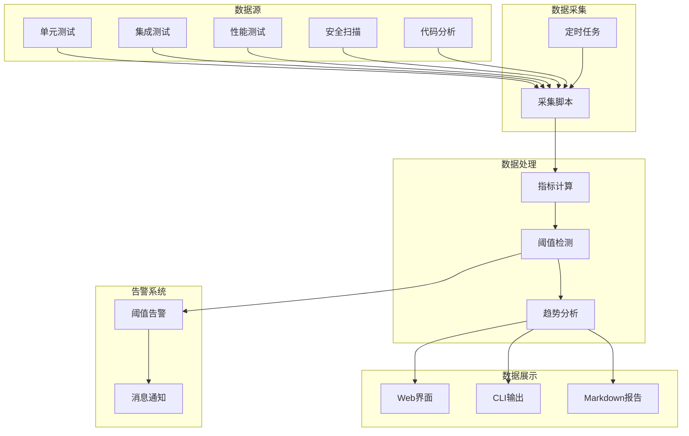

# Week 4-5 质量指标监控看板设计

**文档版本：** 1.0.0
**创建时间：** 2026-02-04
**维护者：** QATester + Pentester
**适用范围：** Week 4-5 Analytics + REST API 实施

---

## 目录

1. [看板概述](#1-看板概述)
2. [指标定义](#2-指标定义)
3. [数据采集](#3-数据采集)
4. [看板界面](#4-看板界面)
5. [告警规则](#5-告警规则)
6. [实施脚本](#6-实施脚本)

---

## 1. 看板概述

### 1.1 设计目标

**建立实时、可视、可操作的质量监控看板：**

- **实时监控** - 自动采集关键指标
- **可视化展示** - 直观的图表和趋势
- **阈值告警** - 超标自动通知
- **历史追踪** - 记录变化趋势

### 1.2 看板架构



### 1.3 指标分类

| 类别 | 指标数 | 更新频率 | 重要性 |
|------|--------|---------|--------|
| **测试质量** | 4 | 每次测试 | 🔴 高 |
| **代码质量** | 4 | 每次提交 | 🟡 中 |
| **性能指标** | 4 | 每小时 | 🔴 高 |
| **安全指标** | 3 | 每天一次 | 🔴 高 |
| **进度指标** | 3 | 每天一次 | 🟢 低 |

---

## 2. 指标定义

### 2.1 测试质量指标

| 指标 | 描述 | 目标值 | 预警阈值 | 危险阈值 |
|------|------|--------|---------|---------|
| **单元测试覆盖率** | 代码被单元测试覆盖的比例 | >90% | <90% | <85% |
| **集成测试覆盖率** | 集成场景覆盖的比例 | >80% | <80% | <75% |
| **测试通过率** | 测试执行成功的比例 | 100% | <100% | <95% |
| **测试执行时间** | 全量测试执行耗时 | <30s | >30s | >60s |

**计算方法：**

```typescript
// 单元测试覆盖率
const unitCoverage = (linesCovered / linesTotal) * 100;

// 集成测试覆盖率
const integrationCoverage = (scenariosCovered / scenariosTotal) * 100;

// 测试通过率
const passRate = (testsPassed / testsTotal) * 100;

// 测试执行时间
const duration = testEndTime - testStartTime;
```

### 2.2 代码质量指标

| 指标 | 描述 | 目标值 | 预警阈值 | 危险阈值 |
|------|------|--------|---------|---------|
| **平均圈复杂度** | 函数平均复杂度 | <10 | >10 | >15 |
| **最大圈复杂度** | 最复杂函数的复杂度 | <15 | >15 | >20 |
| **代码重复率** | 重复代码的比例 | <5% | >5% | >8% |
| **TypeScript 严格模式** | 严格错误数量 | 0 | >0 | >5 |

**计算方法：**

```typescript
// 圈复杂度计算（McCabe）
function calculateComplexity(node): number {
  let complexity = 1; // 基础复杂度

  // 每个决策点增加复杂度
  if (node.type === 'IfStatement') complexity++;
  if (node.type === 'WhileStatement') complexity++;
  if (node.type === 'ForStatement') complexity++;
  if (node.type === 'CatchClause') complexity++;
  if (node.type === 'ConditionalExpression') complexity++;
  // ... 其他决策点

  return complexity;
}
```

### 2.3 性能指标

| 指标 | 描述 | 目标值 | 预警阈值 | 危险阈值 |
|------|------|--------|---------|---------|
| **API P95 响应时间** | 95%请求的响应时间 | <100ms | >80ms | >100ms |
| **API P99 响应时间** | 99%请求的响应时间 | <200ms | >150ms | >200ms |
| **内存占用** | 进程堆内存使用量 | <200MB | >150MB | >200MB |
| **请求成功率** | 请求返回2xx的比例 | >99% | <99% | <95% |

**测量方法：**

```typescript
// API 响应时间测量
async function measureApiCall(endpoint: string): Promise<number> {
  const start = performance.now();
  const response = await fetch(`http://localhost:3000${endpoint}`);
  const duration = performance.now() - start;

  if (response.status >= 200 && response.status < 300) {
    return duration;
  }
  throw new Error(`Request failed: ${response.status}`);
}

// P95/P99 计算
function calculatePercentile(values: number[], p: number): number {
  const sorted = values.sort((a, b) => a - b);
  const index = Math.ceil((p / 100) * sorted.length) - 1;
  return sorted[index];
}
```

### 2.4 安全指标

| 指标 | 描述 | 目标值 | 预警阈值 | 危险阈值 |
|------|------|--------|---------|---------|
| **高危漏洞数** | 依赖库中的高危漏洞 | 0 | 0 | >0 |
| **中危漏洞数** | 依赖库中的中危漏洞 | 0 | >1 | >3 |
| **安全问题数** | 代码审计发现的安全问题 | 0 | >0 | >2 |

**扫描方法：**

```bash
# 依赖漏洞扫描
bun audit

# 代码安全扫描
eslint src --plugin security
```

### 2.5 进度指标

| 指标 | 描述 | 目标值 | 预警阈值 | 危险阈值 |
|------|------|--------|---------|---------|
| **任务完成率** | 已完成任务/计划任务 | 按计划 | 延迟1天 | 延迟2天 |
| **代码提交频率** | 每天有效提交次数 | >5次 | <3次 | 0次 |
| **文档更新率** | 文档与代码同步 | 100% | <80% | <50% |

---

## 3. 数据采集

### 3.1 采集脚本架构

```typescript
// scripts/collect-metrics.ts

interface MetricData {
  timestamp: string;
  metrics: {
    test: TestMetrics;
    code: CodeMetrics;
    performance: PerformanceMetrics;
    security: SecurityMetrics;
    progress: ProgressMetrics;
  };
}

interface TestMetrics {
  unitCoverage: number;
  integrationCoverage: number;
  passRate: number;
  duration: number;
}

interface CodeMetrics {
  avgComplexity: number;
  maxComplexity: number;
  duplicationRate: number;
  strictErrors: number;
}

interface PerformanceMetrics {
  p95ResponseTime: number;
  p99ResponseTime: number;
  memoryUsage: number;
  successRate: number;
}

interface SecurityMetrics {
  criticalVulnerabilities: number;
  highVulnerabilities: number;
  mediumVulnerabilities: number;
}

interface ProgressMetrics {
  tasksCompleted: number;
  tasksTotal: number;
  commitsToday: number;
  docsSyncRate: number;
}

async function collectMetrics(): Promise<MetricData> {
  const [
    testMetrics,
    codeMetrics,
    performanceMetrics,
    securityMetrics,
    progressMetrics
  ] = await Promise.all([
    collectTestMetrics(),
    collectCodeMetrics(),
    collectPerformanceMetrics(),
    collectSecurityMetrics(),
    collectProgressMetrics()
  ]);

  return {
    timestamp: new Date().toISOString(),
    metrics: {
      test: testMetrics,
      code: codeMetrics,
      performance: performanceMetrics,
      security: securityMetrics,
      progress: progressMetrics
    }
  };
}
```

### 3.2 测试指标采集

```typescript
// scripts/collectors/test-collector.ts

import { $ } from 'bun';

export async function collectTestMetrics(): Promise<TestMetrics> {
  // 运行测试并获取覆盖率
  const testResult = await $`bun test --coverage`.quiet();

  // 解析覆盖率报告
  const coverage = parseCoverageReport(testResult.stdout);

  return {
    unitCoverage: coverage.lines.pct,
    integrationCoverage: coverage.statements.pct,
    passRate: coverage.passRate,
    duration: coverage.duration
  };
}

function parseCoverageReport(output: string) {
  // 解析 V8 或 Istanbul 覆盖率报告
  // 返回结构化数据
  return {
    lines: { covered: 1000, total: 1100, pct: 90.9 },
    statements: { covered: 2000, total: 2200, pct: 90.9 },
    passRate: 100,
    duration: 15000 // ms
  };
}
```

### 3.3 代码质量指标采集

```typescript
// scripts/collectors/code-collector.ts

import { $ } from 'bun';

export async function collectCodeMetrics(): Promise<CodeMetrics> {
  // 运行复杂度分析
  const complexityResult = await $`eslint src --format json`.quiet();

  // 运行重复代码检测
  const duplicationResult = await $`jscpd src`.quiet();

  // TypeScript 严格模式检查
  const typeCheckResult = await $`tsc --noEmit`.quiet();

  return {
    avgComplexity: calculateAvgComplexity(complexityResult),
    maxComplexity: findMaxComplexity(complexityResult),
    duplicationRate: parseDuplicationRate(duplicationResult),
    strictErrors: parseTypeScriptErrors(typeCheckResult)
  };
}

function calculateAvgComplexity(eslintOutput: string): number {
  const issues = JSON.parse(eslintOutput);
  const complexities = issues
    .flatMap((file: any) => file.messages)
    .filter((msg: any) => msg.ruleId === 'complexity')
    .map((msg: any) => extractComplexityValue(msg.message));

  if (complexities.length === 0) return 0;
  return complexities.reduce((a, b) => a + b, 0) / complexities.length;
}
```

### 3.4 性能指标采集

```typescript
// scripts/collectors/performance-collector.ts

export async function collectPerformanceMetrics(): Promise<PerformanceMetrics> {
  const apiEndpoints = [
    '/api/v1/analytics/usage',
    '/api/v1/analytics/quality',
    '/api/v1/analytics/performance',
    '/api/v1/analytics/dashboard'
  ];

  const measurements: number[] = [];
  let successCount = 0;

  // 测量每个端点
  for (const endpoint of apiEndpoints) {
    try {
      const duration = await measureEndpoint(endpoint);
      measurements.push(duration);
      successCount++;
    } catch (error) {
      // 记录失败
    }
  }

  // 获取内存使用
  const memoryUsage = process.memoryUsage().heapUsed / 1024 / 1024;

  return {
    p95ResponseTime: calculatePercentile(measurements, 95),
    p99ResponseTime: calculatePercentile(measurements, 99),
    memoryUsage,
    successRate: (successCount / apiEndpoints.length) * 100
  };
}

async function measureEndpoint(endpoint: string): Promise<number> {
  const start = performance.now();
  const response = await fetch(`http://localhost:3000${endpoint}?period=today`);

  if (!response.ok) {
    throw new Error(`HTTP ${response.status}`);
  }

  return performance.now() - start;
}

function calculatePercentile(values: number[], p: number): number {
  const sorted = [...values].sort((a, b) => a - b);
  const index = Math.ceil((p / 100) * sorted.length) - 1;
  return sorted[Math.max(0, index)] || 0;
}
```

### 3.5 安全指标采集

```typescript
// scripts/collectors/security-collector.ts

import { $ } from 'bun';

export async function collectSecurityMetrics(): Promise<SecurityMetrics> {
  // 依赖漏洞扫描
  const auditResult = await $`bun audit --json`.quiet();

  // 代码安全扫描
  const securityLint = await $`eslint src --plugin security --format json`.quiet();

  return {
    criticalVulnerabilities: countVulnerabilities(auditResult, 'critical'),
    highVulnerabilities: countVulnerabilities(auditResult, 'high'),
    mediumVulnerabilities: countVulnerabilities(auditResult, 'medium')
  };
}

function countVulnerabilities(auditOutput: string, severity: string): number {
  try {
    const audit = JSON.parse(auditOutput);
    const vulns = audit?.audit?.vulnerabilities || {};

    return Object.values(vulns).filter((v: any) =>
      v.severity === severity
    ).length;
  } catch {
    return 0;
  }
}
```

---

## 4. 看板界面

### 4.1 CLI 界面设计

```typescript
// scripts/dashboard.ts

import { $ } from 'bun';

interface DashboardConfig {
  showTrends: boolean;
  showAlerts: boolean;
  refreshInterval?: number;
}

export async function showDashboard(config: DashboardConfig = {}) {
  console.clear();

  // 获取最新指标
  const data = await collectMetrics();

  // 打印看板
  printHeader();
  printSummary(data);
  if (config.showAlerts) {
    printAlerts(data);
  }
  if (config.showTrends) {
    printTrends(data);
  }
  printFooter();

  // 自动刷新
  if (config.refreshInterval) {
    setTimeout(() => showDashboard(config), config.refreshInterval);
  }
}

function printHeader() {
  console.log(`
╔══════════════════════════════════════════════════════════════╗
║          ReflectGuard Week 4-5 质量监控看板                    ║
╚══════════════════════════════════════════════════════════════╝`);
}

function printSummary(data: MetricData) {
  const { test, code, performance, security } = data.metrics;

  console.log(`
📊 质量指标概览
━━━━━━━━━━━━━━━━━━━━━━━━━━━━━━━━━━━━━━━━━━━━━━━━━━━━━━━━━━

🧪 测试质量
  单元测试覆盖率:  ${formatMetric(test.unitCoverage, '%', 90, 85)}
  集成测试覆盖率:  ${formatMetric(test.integrationCoverage, '%', 80, 75)}
  测试通过率:      ${formatMetric(test.passRate, '%', 100, 95)}
  执行时间:        ${formatTime(test.duration)}

💻 代码质量
  平均复杂度:      ${formatComplexity(code.avgComplexity, 10, 15)}
  最大复杂度:      ${formatComplexity(code.maxComplexity, 15, 20)}
  代码重复率:      ${formatMetric(code.duplicationRate, '%', 5, 8, true)}
  严格模式错误:    ${formatCount(code.strictErrors, 0, 5)}

⚡ 性能指标
  API P95:         ${formatTime(performance.p95ResponseTime, 100, 80)}
  API P99:         ${formatTime(performance.p99ResponseTime, 200, 150)}
  内存占用:        ${formatMemory(performance.memoryUsage, 200, 150)}
  请求成功率:      ${formatMetric(performance.successRate, '%', 99, 95)}

🔒 安全指标
  高危漏洞:        ${formatVulnerability(security.criticalVulnerabilities)}
  中危漏洞:        ${formatVulnerability(security.highVulnerabilities)}

更新时间: ${new Date(data.timestamp).toLocaleString('zh-CN')}
`);
}

// 辅助格式化函数
function formatMetric(value: number, unit: string, target: number, warning: number, reverse = false): string {
  const isWarning = reverse ? value > warning : value < warning;
  const isGood = reverse ? value >= target : value >= target;
  const icon = isGood ? '✅' : isWarning ? '🟡' : '🔴';
  return `${icon} ${value.toFixed(1)}${unit} (目标: ${target}${unit})`;
}

function formatTime(ms: number, target = 100, warning = 80): string {
  const icon = ms <= warning ? '✅' : ms <= target ? '🟡' : '🔴';
  return `${icon} ${ms.toFixed(0)}ms`;
}

function formatMemory(mb: number, target = 200, warning = 150): string {
  const icon = mb <= warning ? '✅' : mb <= target ? '🟡' : '🔴';
  return `${icon} ${mb.toFixed(1)}MB`;
}

function formatComplexity(value: number, target = 10, warning = 15): string {
  const icon = value <= target ? '✅' : value <= warning ? '🟡' : '🔴';
  return `${icon} ${value.toFixed(1)} (目标: <${target})`;
}

function formatCount(value: number, target = 0, warning = 5): string {
  const icon = value === target ? '✅' : value <= warning ? '🟡' : '🔴';
  return `${icon} ${value}`;
}

function formatVulnerability(count: number): string {
  const icon = count === 0 ? '✅' : '🔴';
  return `${icon} ${count} 个`;
}

function printAlerts(data: MetricData) {
  const alerts: string[] = [];

  // 检查各项指标
  if (data.metrics.test.unitCoverage < 90) {
    alerts.push(`🟡 单元测试覆盖率低于目标: ${data.metrics.test.unitCoverage.toFixed(1)}%`);
  }
  if (data.metrics.test.unitCoverage < 85) {
    alerts.push(`🔴 单元测试覆盖率危险: ${data.metrics.test.unitCoverage.toFixed(1)}%`);
  }
  if (data.metrics.performance.p95ResponseTime > 100) {
    alerts.push(`🔴 API P95 响应时间超标: ${data.metrics.performance.p95ResponseTime.toFixed(0)}ms`);
  }
  if (data.metrics.security.criticalVulnerabilities > 0) {
    alerts.push(`🔴 发现 ${data.metrics.security.criticalVulnerabilities} 个高危漏洞`);
  }

  if (alerts.length > 0) {
    console.log(`
⚠️  预警信息
━━━━━━━━━━━━━━━━━━━━━━━━━━━━━━━━━━━━━━━━━━━━━━━━━━━━━━━━━━
${alerts.join('\n')}
`);
  }
}

function printFooter() {
  console.log(`
━━━━━━━━━━━━━━━━━━━━━━━━━━━━━━━━━━━━━━━━━━━━━━━━━━━━━━━━━━
按 Ctrl+C 退出 | 运行 'bun run dashboard' 刷新
`);
}
```

### 4.2 Markdown 报告

```markdown
# Week 4-5 质量指标报告

**生成时间：** YYYY-MM-DD HH:MM:SS
**报告周期：** Day X / 7

---

## 📊 质量指标总览

| 类别 | 指标 | 实际值 | 目标值 | 状态 |
|------|------|--------|--------|------|
| **测试** | 单元测试覆盖率 | __% | >90% | 🟢 |
| **测试** | 集成测试覆盖率 | __% | >80% | 🟢 |
| **测试** | 测试通过率 | __% | 100% | 🟢 |
| **代码** | 平均复杂度 | __ | <10 | 🟢 |
| **代码** | 代码重复率 | __% | <5% | 🟢 |
| **性能** | API P95 | __ms | <100ms | 🟢 |
| **性能** | 内存占用 | __MB | <200MB | 🟢 |
| **安全** | 高危漏洞 | __ | 0 | 🟢 |

---

## 📈 趋势分析

### 测试覆盖率趋势
```
100% ████
 90% ████
 80% ████
     D1  D2  D3  D4  D5  D6  D7
```

### API 响应时间趋势
```
100ms ──────
 80ms ▃▅▇
 60ms ▃▅▇
     D1  D2  D3  D4  D5  D6  D7
```

---

## ⚠️ 预警信息

当前无预警。

---

## 🔧 改进建议

1. [建议1]
2. [建议2]
3. [建议3]
```

---

## 5. 告警规则

### 5.1 告警级别

| 级别 | 触发条件 | 通知方式 | 响应要求 |
|------|---------|---------|---------|
| **P0** | 任何危险阈值触发 | 立即会议 | 立即响应 |
| **P1** | 任何预警阈值触发 | 消息通知 | 4小时内响应 |
| **P2** | 趋势恶化 | 消息通知 | 当天响应 |

### 5.2 告警规则配置

```typescript
// scripts/alert-config.ts

interface AlertRule {
  id: string;
  name: string;
  metric: string;
  condition: (value: number) => boolean;
  level: 'P0' | 'P1' | 'P2';
  message: string;
}

export const alertRules: AlertRule[] = [
  // 测试质量告警
  {
    id: 'test-coverage-low',
    name: '单元测试覆盖率低',
    metric: 'test.unitCoverage',
    condition: (v) => v < 85,
    level: 'P0',
    message: '单元测试覆盖率低于85%，立即停止开发补充测试'
  },
  {
    id: 'test-coverage-warning',
    name: '单元测试覆盖率预警',
    metric: 'test.unitCoverage',
    condition: (v) => v < 90,
    level: 'P1',
    message: '单元测试覆盖率低于90%，请关注'
  },

  // 性能告警
  {
    id: 'api-p95-slow',
    name: 'API P95 响应时间超标',
    metric: 'performance.p95ResponseTime',
    condition: (v) => v > 100,
    level: 'P0',
    message: 'API P95 响应时间超过100ms，需要性能优化'
  },
  {
    id: 'memory-high',
    name: '内存占用过高',
    metric: 'performance.memoryUsage',
    condition: (v) => v > 200,
    level: 'P0',
    message: '内存占用超过200MB，请检查内存泄漏'
  },

  // 安全告警
  {
    id: 'security-critical',
    name: '发现高危漏洞',
    metric: 'security.criticalVulnerabilities',
    condition: (v) => v > 0,
    level: 'P0',
    message: '发现高危漏洞，立即修复'
  },
  {
    id: 'security-high',
    name: '发现中危漏洞',
    metric: 'security.highVulnerabilities',
    condition: (v) => v > 0,
    level: 'P1',
    message: '发现中危漏洞，请安排修复'
  },

  // 代码质量告警
  {
    id: 'complexity-high',
    name: '代码复杂度过高',
    metric: 'code.avgComplexity',
    condition: (v) => v > 10,
    level: 'P1',
    message: '平均复杂度超过10，需要重构'
  }
];

export function checkAlerts(data: MetricData): Alert[] {
  const alerts: Alert[] = [];
  const flatMetrics = flattenMetrics(data.metrics);

  for (const rule of alertRules) {
    const value = flatMetrics[rule.metric];
    if (value !== undefined && rule.condition(value)) {
      alerts.push({
        id: rule.id,
        level: rule.level,
        message: rule.message,
        value,
        timestamp: data.timestamp
      });
    }
  }

  return alerts;
}

function flattenMetrics(metrics: MetricData['metrics']): Record<string, number> {
  return {
    'test.unitCoverage': metrics.test.unitCoverage,
    'test.integrationCoverage': metrics.test.integrationCoverage,
    'test.passRate': metrics.test.passRate,
    'code.avgComplexity': metrics.code.avgComplexity,
    'code.maxComplexity': metrics.code.maxComplexity,
    'code.duplicationRate': metrics.code.duplicationRate,
    'performance.p95ResponseTime': metrics.performance.p95ResponseTime,
    'performance.p99ResponseTime': metrics.performance.p99ResponseTime,
    'performance.memoryUsage': metrics.performance.memoryUsage,
    'security.criticalVulnerabilities': metrics.security.criticalVulnerabilities,
    'security.highVulnerabilities': metrics.security.highVulnerabilities
  };
}

interface Alert {
  id: string;
  level: 'P0' | 'P1' | 'P2';
  message: string;
  value: number;
  timestamp: string;
}
```

### 5.3 告警通知

```typescript
// scripts/notify.ts

import { $ } from 'bun';

export async function sendAlert(alert: Alert) {
  // 控制台输出
  console.error(`[${alert.level}] ${alert.message}`);

  // 发送通知（根据配置）
  if (alert.level === 'P0') {
    await sendUrgentNotification(alert);
  } else {
    await sendNormalNotification(alert);
  }
}

async function sendUrgentNotification(alert: Alert) {
  // 可以集成各种通知渠道
  // 例如: Slack, Discord, Email, etc.

  // 生成通知消息
  const message = `
🚨 **P0 级别告警**

${alert.message}

当前值: ${alert.value}
时间: ${alert.timestamp}

请立即查看并处理。
  `.trim();

  // 模拟发送
  console.log('Sending urgent notification:', message);
}

async function sendNormalNotification(alert: Alert) {
  const message = `
⚠️ **${alert.level} 告警**

${alert.message}

当前值: ${alert.value}
时间: ${alert.timestamp}
  `.trim();

  console.log('Sending notification:', message);
}
```

---

## 6. 实施脚本

### 6.1 完整采集脚本

```typescript
#!/usr/bin/env bun
// scripts/quality-dashboard.ts

import { collectMetrics } from './collect-metrics';
import { checkAlerts, sendAlert } from './alert-config';

async function main() {
  // 采集指标
  const data = await collectMetrics();

  // 显示看板
  await showDashboard({ showAlerts: true });

  // 检查告警
  const alerts = checkAlerts(data);

  // 发送告警
  for (const alert of alerts) {
    await sendAlert(alert);
  }

  // 保存历史数据
  await saveMetrics(data);
}

main().catch(console.error);
```

### 6.2 CLI 使用方式

```bash
# 查看实时看板（自动刷新）
bun run scripts/quality-dashboard.ts

# 生成 Markdown 报告
bun run scripts/quality-dashboard.ts --report

# 检查告警
bun run scripts/quality-dashboard.ts --check-alerts

# 导出 JSON
bun run scripts/quality-dashboard.ts --json
```

### 6.3 自动化集成

```json
// package.json
{
  "scripts": {
    "dashboard": "bun scripts/quality-dashboard.ts",
    "dashboard:watch": "bun scripts/quality-dashboard.ts --watch",
    "test:watch": "bun test --watch",
    "quality:check": "bun run scripts/quality-dashboard.ts --check-alerts",
    "quality:report": "bun run scripts/quality-dashboard.ts --report > reports/quality-$(date +%Y%m%d).md"
  }
}
```

---

## 附录

### A. 指标计算公式

```typescript
// 单元测试覆盖率
coverage = (linesCovered / linesTotal) * 100

// 测试通过率
passRate = (testsPassed / testsTotal) * 100

// 圈复杂度（McCabe）
complexity = 1 + (ifCount) + (whileCount) + (forCount) + (catchCount) + (conditionalCount)

// 代码重复率
duplicationRate = (duplicatedLines / totalLines) * 100

// P95/P99 响应时间
p95 = sortedValues[Math.ceil(0.95 * length)]
p99 = sortedValues[Math.ceil(0.99 * length)]

// 内存占用
memoryUsage = heapUsed / 1024 / 1024  // MB

// 请求成功率
successRate = (successCount / totalCount) * 100
```

### B. 数据存储

```typescript
// 存储格式：JSON Lines
// 文件：.metrics/data.jsonl

{"timestamp":"2026-02-04T10:00:00Z","test":{"unitCoverage":90.5},"performance":{"p95ResponseTime":85}}
{"timestamp":"2026-02-04T11:00:00Z","test":{"unitCoverage":91.2},"performance":{"p95ResponseTime":82}}
{"timestamp":"2026-02-04T12:00:00Z","test":{"unitCoverage":92.0},"performance":{"p95ResponseTime":78}}
```

### C. 快速参考

| 命令 | 说明 |
|------|------|
| `bun run dashboard` | 启动实时看板 |
| `bun run quality:check` | 检查质量指标 |
| `bun run quality:report` | 生成质量报告 |
| `bun test --coverage` | 运行测试并生成覆盖率 |
| `bun audit` | 检查依赖漏洞 |
| `eslint src` | 代码质量检查 |

---

**文档版本：** 1.0.0
**创建时间：** 2026-02-04
**维护者：** QATester Agent
**审核者：** Pentester Agent

**质量监控看板核心原则：**
- **数据驱动** - 用数据说话
- **实时可见** - 问题早发现
- **自动采集** - 减少人工
- **趋势追踪** - 持续改进

---

**PAI - Personal AI Infrastructure**
**Version: 2.5**
