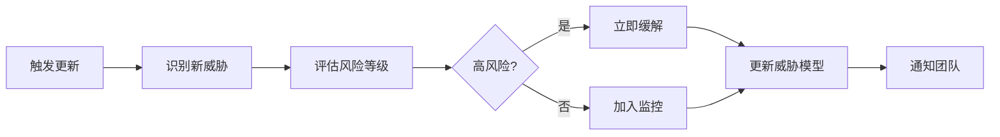
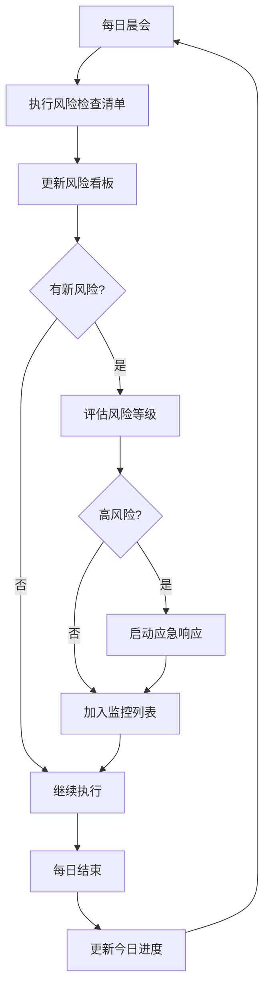

# ReflectGuard Week 4-5 持续风险监控框架

**文档版本：** 1.0.0
**创建时间：** 2026-02-04
**安全专家：** Pentester Agent
**项目阶段：** Week 4-5 Analytics + REST API 实施
**工期：** 7天

---

## 目录

1. [框架概述](#1-框架概述)
2. [每日风险评估框架](#2-每日风险评估框架)
3. [威胁建模（动态更新）](#3-威胁建模动态更新)
4. [应急响应预案](#4-应急响应预案)
5. [质量指标监控](#5-质量指标监控)
6. [风险看板设计](#6-风险看板设计)

---

## 1. 框架概述

### 1.1 监控目标

**建立全周期、多维度、可操作的持续风险监控机制：**

- **事前预防** - 任务开始前的风险检查
- **事中监控** - 执行过程中的风险预警
- **事后验证** - 任务完成后的风险确认

### 1.2 监控原则

| 原则 | 说明 | 应用 |
|------|------|------|
| **早期发现** | 风险越早发现，成本越低 | 每日风险检查 |
| **快速响应** | 风险识别后立即行动 | 应急响应预案 |
| **数据驱动** | 基于指标而非感觉 | 质量指标监控 |
| **闭环管理** | 风险处理跟踪到闭环 | 风险看板 |

### 1.3 项目背景

**项目信息：**
- **模块：** Analytics 模块 + REST API
- **组织：** 实施组（Architect, Engineer, QATester）+ 审核组（CodeReviewer, Algorithm, Pentester）
- **工期：** 7天
- **代码规模：** 预计 ~2500 行

**已识别高风险项（5个）：**
1. **API 安全漏洞** - 输入验证、认证授权
2. **性能不达标** - API 响应时间 >100ms
3. **测试覆盖率不足** - <90% 覆盖率
4. **Analytics 算法准确性** - 趋势分析偏差
5. **数据一致性** - 并发写入导致数据损坏

---

## 2. 每日风险评估框架

### 2.1 任务开始前检查清单

**时间点：** 每日晨会 / 任务启动前
**执行人：** Pentester + Architect
**耗时：** 5-10 分钟

#### 检查清单模板

```markdown
## 日期：YYYY-MM-DD 任务前风险检查

### 📋 任务信息
- 任务编号：Task ###
- 任务名称：[描述]
- 负责Agent：[名称]
- 预计时间：[小时]

### ⚠️ 风险检查

#### 安全风险 (Pentester)
- [ ] 输入验证是否完整？（SQL注入、XSS、命令注入）
- [ ] 认证授权是否正确？
- [ ] 敏感数据是否加密？
- [ ] 错误信息是否安全（不泄露内部信息）？
- [ ] 依赖库是否有已知漏洞？

#### 性能风险 (Architect)
- [ ] 是否有 N+1 查询问题？
- [ ] 是否有潜在内存泄漏？
- [ ] 缓存策略是否合理？
- [ ] 大数据量场景是否考虑？

#### 质量风险 (QATester)
- [ ] 测试用例是否完整？
- [ ] 边界条件是否覆盖？
- [ ] 错误处理是否测试？
- [ ] 并发场景是否考虑？

#### 集成风险 (Engineer)
- [ ] API 接口是否稳定？
- [ ] 数据格式是否兼容？
- [ ] 向后兼容性是否保证？

### 风险评级
- 高风险 (0): ___
- 中风险 (0): ___
- 低风险 (0): ___

### 放行条件
- [ ] 所有高风险已缓解
- [ ] 中风险有监控方案
- [ ] 团队已知悉所有风险

**决策：** □ 放行 □ 有条件放行 □ 阻断
**签字：** ____________
```

### 2.2 任务执行中风险预警信号

**时间点：** 任务执行过程中持续监控
**监控方式：** 自动化检测 + 人工观察

#### 自动化预警阈值

| 指标 | 预警阈值 | 危险阈值 | 响应措施 |
|------|---------|---------|----------|
| **测试失败率** | >5% | >10% | 停止开发，修复测试 |
| **代码复杂度** | 圈复杂度>8 | 圈复杂度>15 | 重构代码 |
| **API 响应时间** | >80ms | >100ms | 性能优化 |
| **内存占用** | 增长>10MB/小时 | 增长>50MB/小时 | 检查内存泄漏 |
| **安全扫描** | 1个中危 | 1个高危 | 立即修复 |

#### 人工观察信号

**危险信号：**
- 🔴 连续3次测试失败
- 🔴 需求理解偏差（需要重新确认）
- 🔴 架构设计变更（影响范围 > 1个模块）
- 🔴 依赖外部服务不稳定

**预警信号：**
- 🟡 单次测试失败（非破坏性）
- 🟡 性能接近阈值（±10%）
- 🟡 代码审查意见 >3 条

#### 实时风险报告格式

```markdown
## 🔴 风险预警报告

**时间：** YYYY-MM-DD HH:MM:SS
**级别：** 🔴 危险 / 🟡 预警 / 🟢 正常

### 问题描述
- [风险详情描述]

### 影响范围
- 受影响模块：[模块名]
- 受影响功能：[功能名]

### 紧急措施
- [ ] 立即执行的缓解措施

### 后续跟进
- 负责人：[Agent]
- 截止时间：[时间]
- 验证方式：[描述]
```

### 2.3 任务完成后风险验证标准

**时间点：** 任务提交前 / Pull Request 创建
**执行人：** CodeReviewer + Pentester
**耗时：** 15-30 分钟

#### 验证清单

```markdown
## 日期：YYYY-MM-DD 任务完成风险验证

### ✅ 安全验证 (Pentester)
- [ ] 无 SQL 注入漏洞
- [ ] 无 XSS 漏洞
- [ ] 无命令注入漏洞
- [ ] 无敏感信息泄露
- [ ] 依赖库无已知高危漏洞
- [ ] 认证授权正确实现

### ✅ 性能验证 (Architect)
- [ ] API 响应时间 <100ms (P95)
- [ ] 无内存泄漏
- [ ] 无性能退化
- [ ] 资源使用合理

### ✅ 质量验证 (QATester)
- [ ] 测试覆盖率 >=90%
- [ ] 所有测试通过
- [ ] 无 skipped 测试（除非有说明）
- [ ] 性能测试通过

### ✅ 代码规范验证 (CodeReviewer)
- [ ] TypeScript 严格模式通过
- [ ] ESLint 无错误
- [ ] 代码复杂度 <10
- [ ] TSDoc 注释完整
- [ ] 命名符合规范

### ✅ 集成验证 (Engineer)
- [ ] 与现有模块集成成功
- [ ] API 契约测试通过
- [ ] 数据迁移无问题
- [ ] 向后兼容

### 遗留风险
- [ ] 风险1: [描述] - [缓解措施]
- [ ] 风险2: [描述] - [缓解措施]

### 验证结论
**状态：** □ 通过 □ 有条件通过 □ 不通过
**建议：** [具体建议]

**签字：** ____________
```

---

## 3. 威胁建模（动态更新）

### 3.1 威胁模型框架

**使用 STRIDE 方法论进行威胁建模：**

| 威胁类型 | 描述 | Analytics 模块 | REST API |
|---------|------|---------------|----------|
| **S**poofing | 伪装 | 低（内部服务） | 高（需要认证） |
| **T**ampering | 篡改 | 中（数据完整性） | 高（请求/响应） |
| **R**epudiation | 抵赖 | 低（操作日志） | 中（审计日志） |
| **I**nformation Disclosure | 信息泄露 | 中（敏感指标） | 高（数据暴露） |
| **D**enial of Service | 拒绝服务 | 中（资源耗尽） | 高（API 限流） |
| **E**levation of Privilege | 提权 | 低（无权限系统） | 高（越权访问） |

### 3.2 Week 4-5 特定威胁模型

#### 威胁 #1: API 输入验证不足

**威胁类型：** Tampering, Information Disclosure
**影响：** 高
**概率：** 中
**风险等级：** 🔴 高风险

```yaml
攻击场景:
  1. 恶意构造的 period 参数导致目录遍历
  2. 超大的 metric 名称导致内存溢出
  3. 特殊字符注入导致日志注入攻击

缓解措施:
  - 输入: 使用 Zod schema 严格验证
  - 处理: 白名单过滤，拒绝无效输入
  - 输出: 错误信息不泄露内部路径

验证方式:
  - 模糊测试 (Fuzzing)
  - 边界值测试
  - 负面测试用例
```

#### 威胁 #2: Analytics 数据投毒

**威胁类型：** Tampering
**影响：** 高
**概率：** 低
**风险等级：** 🟡 中风险

```yaml
攻击场景:
  1. 恶意写入大量虚假复盘记录
  2. 修改历史违规记录
  3. 破坏索引文件

缓解措施:
  - 写入: FileLock 保护并发写入
  - 验证: 数据完整性校验 (checksum)
  - 检测: 异常检测算法识别异常数据

验证方式:
  - 并发写入测试
  - 数据完整性测试
  - 恢复测试
```

#### 威胁 #3: 时序攻击

**威胁类型：** Information Disclosure
**影响：** 中
**概率：** 低
**风险等级：** 🟢 低风险

```yaml
攻击场景:
  1. 通过响应时间推断数据存在
  2. 缓存时序分析

缓解措施:
  - 缓存: 添加随机延迟
  - 响应: 统一成功/失败响应时间

验证方式:
  - 时序分析测试
```

### 3.3 威胁模型更新流程

**触发条件：**
- 新功能引入
- 架构变更
- 发现新的攻击向量
- 外部威胁情报更新

**更新流程：**



---

## 4. 应急响应预案

### 4.1 响应级别定义

| 级别 | 条件 | 响应时间 | 处理方式 |
|------|------|---------|---------|
| **P0 严重** | 系统不可用、数据泄露、高危漏洞 | 立即 | 停止开发，全力修复 |
| **P1 紧急** | 核心功能异常、中危漏洞 | 1小时内 | 优先处理，暂停其他任务 |
| **P2 重要** | 性能退化、测试失败率>10% | 4小时内 | 计划修复，当天完成 |
| **P3 一般** | 非核心问题、优化建议 | 24小时内 | 正常排期处理 |

### 4.2 场景一：测试失败率 >10%

**触发条件：**
- 单次测试运行失败率 >10%
- 连续3次测试运行失败率 >5%
- 核心功能测试失败

**响应流程：**

```yaml
第一阶段: 立即响应 (0-15分钟)
  - 停止新功能开发
  - 识别失败测试类别
  - 判定影响范围

第二阶段: 问题诊断 (15-60分钟)
  - 分析失败原因
  - 确定是代码问题还是测试问题
  - 评估修复时间

第三阶段: 修复执行 (1-4小时)
  - 修复代码或测试
  - 修复后立即验证
  - 确认无回归问题

第四阶段: 根因分析 (完成后)
  - 记录根本原因
  - 更新预防措施
  - 更新检查清单
```

**升级条件：**
- 1小时内无法修复 → 升级为 P1
- 影响交付里程碑 → 升级为 P0

### 4.3 场景二：发现严重安全漏洞

**触发条件：**
- SQL 注入、命令执行等高危漏洞
- 敏感数据泄露
- 认证绕过

**响应流程：**

```yaml
第一阶段: 紧急止损 (0-5分钟)
  - 停止相关功能开发
  - 如已部署，立即回滚
  - 通知相关人员

第二阶段: 漏洞分析 (5-30分钟)
  - 确认漏洞细节
  - 评估影响范围
  - 确定攻击面

第三阶段: 修复开发 (30分钟-4小时)
  - 设计修复方案
  - 编写修复代码
  - 编写/更新测试用例

第四阶段: 验证部署 (4-8小时)
  - 安全测试验证
  - 回归测试
  - 代码审查（双审查）

第五阶段: 复盘总结 (完成后)
  - 漏洞来源分析
  - 流程改进建议
  - 威胁模型更新
```

**漏洞报告模板：**

```markdown
## 🔴 安全漏洞报告

**漏洞编号：** SEC-YYYYMMDD-###
**发现时间：** YYYY-MM-DD HH:MM:SS
**严重级别：** 🔴 严重 / 🟡 中危 / 🟢 低危

### 漏洞描述
- 漏洞类型：[SQL注入/XSS/命令注入/等]
- 影响版本：[版本号]
- 影响组件：[组件名]

### 技术细节
- 漏洞代码位置：`src/xxx/yyy.ts:123`
- 漏洞成因：[描述]
- 漏洞利用方式：[PoC]

### 影响评估
- 数据泄露风险：[是/否]
- 系统控制风险：[是/否]
- 影响用户数：[估计]

### 修复方案
- 修复代码：[diff]
- 修复后测试：[测试结果]

### 预防措施
- [ ] 更新威胁模型
- [ ] 更新代码审查清单
- [ ] 更新安全测试用例

**报告人：** Pentester Agent
**审核人：** ____________
```

### 4.4 场景三：性能不达标

**触发条件：**
- API 响应时间 P95 >100ms
- 内存占用 >200MB
- CPU 使用率持续 >80%

**响应流程：**

```yaml
第一阶段: 性能分析 (0-30分钟)
  - 使用性能分析工具定位瓶颈
  - 确定是算法问题还是实现问题
  - 评估优化收益

第二阶段: 优化方案 (30分钟-2小时)
  - 设计优化方案
  - 评估优化风险
  - 获得团队批准

第三阶段: 优化实施 (2-8小时)
  - 实施性能优化
  - 保持测试通过
  - 性能基准测试

第四阶段: 验证确认 (8-12小时)
  - 确认性能达标
  - 确认无功能回归
  - 更新性能文档
```

**降级方案：**

```yaml
降级条件:
  - 优化后仍不达标
  - 优化成本过高

降级措施:
  - 添加缓存层
  - 异步处理
  - 分页/限流
  - 文档说明已知限制

恢复计划:
  - 记录技术债务
  - 计划后续优化
  - 监控性能指标
```

### 4.5 场景四：数据一致性问题

**触发条件：**
- 并发写入导致数据损坏
- 读写不一致
- 数据迁移失败

**响应流程：**

```yaml
第一阶段: 紧急保护 (0-5分钟)
  - 停止写入操作
  - 备份现有数据
  - 隔离问题环境

第二阶段: 问题诊断 (5-30分钟)
  - 分析日志定位问题
  - 确定数据损坏范围
  - 评估数据可恢复性

第三阶段: 数据恢复 (30分钟-4小时)
  - 从备份恢复
  - 重新执行迁移
  - 验证数据完整性

第四阶段: 根因修复 (4-8小时)
  - 修复并发控制
  - 增强数据验证
  - 更新 FileLock 逻辑
```

---

## 5. 质量指标监控

### 5.1 实时指标看板

**目标：** 7x24小时自动监控关键指标

| 指标类别 | 指标名称 | 目标值 | 预警阈值 | 实际值 | 状态 |
|---------|---------|--------|---------|--------|------|
| **测试** | 单元测试覆盖率 | >90% | <85% | ___ | 🟢 |
| **测试** | 集成测试覆盖率 | >80% | <75% | ___ | 🟢 |
| **测试** | 测试通过率 | 100% | <95% | ___ | 🟢 |
| **性能** | API P95 响应时间 | <100ms | >80ms | ___ | 🟢 |
| **性能** | API P99 响应时间 | <200ms | >150ms | ___ | 🟢 |
| **性能** | 内存占用 | <200MB | >150MB | ___ | 🟢 |
| **安全** | 高危漏洞数 | 0 | 0 | ___ | 🟢 |
| **安全** | 中危漏洞数 | 0 | >1 | ___ | 🟢 |
| **代码** | 圈复杂度平均 | <10 | >8 | ___ | 🟢 |
| **代码** | 代码重复率 | <5% | >8% | ___ | 🟢 |

### 5.2 指标采集方案

#### 测试覆盖率监控

```typescript
// tests/scripts/coverage-monitor.ts

import { $ } from 'bun';

interface CoverageReport {
  lines: { covered: number; total: number; percentage: number };
  functions: { covered: number; total: number; percentage: number };
  branches: { covered: number; total: number; percentage: number };
  statements: { covered: number; total: number; percentage: number };
}

async function getCoverage(): Promise<CoverageReport> {
  const result = await $`bun test --coverage`.json();
  return parseCoverage(result);
}

function validateCoverage(report: CoverageReport) {
  const issues: string[] = [];

  if (report.lines.percentage < 90) {
    issues.push(`Line coverage ${report.lines.percentage}% < 90%`);
  }
  if (report.functions.percentage < 90) {
    issues.push(`Function coverage ${report.functions.percentage}% < 90%`);
  }
  if (report.branches.percentage < 85) {
    issues.push(`Branch coverage ${report.branches.percentage}% < 85%`);
  }

  return {
    passed: issues.length === 0,
    issues
  };
}

// 每次运行时自动检查
const coverage = await getCoverage();
const validation = validateCoverage(coverage);

if (!validation.passed) {
  console.error('Coverage validation failed:');
  validation.issues.forEach(issue => console.error(`  - ${issue}`));
  process.exit(1);
}
```

#### 性能监控

```typescript
// tests/scripts/performance-monitor.ts

import { describe, it, expect, beforeAll } from 'bun:test';

interface PerformanceMetrics {
  apiCalls: Array<{ endpoint: string; duration: number }>;
  memoryUsage: Array<{ timestamp: number; heapUsed: number }>;
}

const metrics: PerformanceMetrics = {
  apiCalls: [],
  memoryUsage: []
};

// 性能基准测试
describe('API Performance Benchmarks', () => {
  it('GET /api/v1/analytics/usage < 100ms', async () => {
    const start = performance.now();
    const response = await fetch('http://localhost:3000/api/v1/analytics/usage?period=today');
    const duration = performance.now() - start;

    metrics.apiCalls.push({ endpoint: '/usage', duration });

    expect(response.status).toBe(200);
    expect(duration).toBeLessThan(100);
  });

  it('Memory usage < 200MB', () => {
    const usage = process.memoryUsage();
    const heapUsedMB = usage.heapUsed / 1024 / 1024;

    metrics.memoryUsage.push({
      timestamp: Date.now(),
      heapUsed: heapUsedMB
    });

    expect(heapUsedMB).toBeLessThan(200);
  });
});
```

### 5.3 代码复杂度监控

```typescript
// tsconfig.complexity.json

{
  "rules": {
    "complexity": {
      "level": "error",
      "options": [10],
      "description": "Cyclomatic complexity must be <= 10"
    }
  }
}

// scripts/complexity-check.ts

import { $ } from 'bun';

async function checkComplexity() {
  const result = await $`eslint src --format json`.quiet();

  const issues = JSON.parse(result.stdout.toString())
    .flatMap((file: any) => file.messages)
    .filter((msg: any) => msg.ruleId === 'complexity');

  if (issues.length > 0) {
    console.error(`Found ${issues.length} complexity issues:`);
    issues.forEach((issue: any) => {
      console.error(`  ${issue.message} at ${issue.line}:${issue.column}`);
    });
    process.exit(1);
  }

  console.log('Complexity check passed!');
}
```

### 5.4 安全扫描

```typescript
// scripts/security-scan.ts

import { $ } from 'bun';

interface SecurityIssue {
  type: 'vulnerability' | 'sast' | 'dependency';
  severity: 'critical' | 'high' | 'medium' | 'low';
  description: string;
  file?: string;
  line?: number;
}

async function runSecurityScan(): Promise<SecurityIssue[]> {
  const issues: SecurityIssue[] = [];

  // 1. 依赖漏洞扫描
  const auditResult = await $`bun audit`.quiet();
  if (auditResult.exitCode !== 0) {
    issues.push({
      type: 'dependency',
      severity: 'high',
      description: 'Vulnerable dependencies detected'
    });
  }

  // 2. 代码安全扫描 (使用 eslint-plugin-security)
  const sastResult = await $`eslint src --plugin security`.quiet();
  // 解析结果...

  return issues;
}

async function main() {
  const issues = await runSecurityScan();

  const criticalIssues = issues.filter(i => i.severity === 'critical' || i.severity === 'high');

  if (criticalIssues.length > 0) {
    console.error('Security scan failed:');
    criticalIssues.forEach(issue => {
      console.error(`  [${issue.severity.toUpperCase()}] ${issue.description}`);
    });
    process.exit(1);
  }

  console.log('Security scan passed!');
}
```

---

## 6. 风险看板设计

### 6.1 看板结构

```markdown
# Week 4-5 风险监控看板

**更新时间：** YYYY-MM-DD HH:MM:SS
**监控周期：** Day X / 7

---

## 🎯 项目概览

| 维度 | 目标 | 当前进度 | 状态 |
|------|------|---------|------|
| 任务完成 | 100% | __% | 🟢/🟡/🔴 |
| 测试覆盖 | >90% | __% | 🟢/🟡/🔴 |
| 性能达标 | <100ms | __ms | 🟢/🟡/🔴 |
| 安全漏洞 | 0 | __ | 🟢/🟡/🔴 |

---

## ⚠️ 当前风险

### 🔴 高风险 (0)

| 风险ID | 描述 | 负责人 | 截止时间 | 状态 |
|--------|------|--------|---------|------|
| - | - | - | - | - |

### 🟡 中风险 (0)

| 风险ID | 描述 | 负责人 | 截止时间 | 状态 |
|--------|------|--------|---------|------|
| - | - | - | - | - |

---

## 📊 质量指标趋势

### 测试覆盖率
```
100% ████
 90% ████  ← 目标线
 80% ████
 70% ████
     D1  D2  D3  D4  D5  D6  D7
```

### API 响应时间 (P95)
```
100ms ────── ← 目标线
 80ms ▂▃▅▇
 60ms ▂▃▅▇
     D1  D2  D3  D4  D5  D6  D7
```

---

## ✅ 今日检查清单

### 任务开始前 (Morning)
- [ ] 风险检查完成
- [ ] 团队已知悉今日风险
- [ ] 放行条件满足

### 任务执行中 (During)
- [ ] 无预警信号触发
- [ ] 性能指标正常
- [ ] 测试持续通过

### 任务完成后 (Evening)
- [ ] 代码审查完成
- [ ] 安全验证通过
- [ ] 质量门禁通过

---

## 📝 风险日志

### YYYY-MM-DD
- [新增风险] 描述...
- [关闭风险] 描述...
- [风险升级] 描述...

---

## 🔄 应急响应状态

当前无活跃的应急响应事件。
```

### 6.2 看板更新流程



---

## 7. 实施指南

### 7.1 第一天准备

**时间：** Day 0（项目启动前一天）

```markdown
## Day 0 准备清单

### 环境准备
- [ ] 创建风险监控看板文件
- [ ] 设置自动化监控脚本
- [ ] 配置通知渠道（邮件/消息）

### 工具准备
- [ ] 测试覆盖率工具配置
- [ ] 性能监控脚本就绪
- [ ] 安全扫描工具就绪
- [ ] 代码复杂度检查配置

### 团队准备
- [ ] 团队熟悉风险框架
- [ ] 应急响应预案已阅读
- [ ] 角色职责已明确
```

### 7.2 每日执行流程

**Morning（任务开始前）：**
1. Pentester 执行风险检查清单（5-10分钟）
2. 更新风险看板状态
3. 团队晨会同步风险情况（5分钟）
4. 确认放行条件

**During（执行中）：**
1. 自动化监控持续运行
2. 触发预警时立即通知
3. 人工观察项目状态

**Evening（任务结束后）：**
1. 执行完成验证清单
2. 更新风险日志
3. 记录今日风险事件

### 7.3 风险升级路径

```
发现问题 → 评估级别 → 通知负责人 → 执行响应 → 验证解决 → 更新文档
    ↑                                                        ↓
    └──────────────────────────── 闭环 ────────────────────────┘
```

---

## 8. 附录

### 8.1 风险类别定义

| 类别 | 定义 | 示例 |
|------|------|------|
| **安全风险** | 可能被恶意利用的漏洞 | SQL注入、XSS、认证绕过 |
| **性能风险** | 影响系统性能的问题 | 慢查询、内存泄漏 |
| **质量风险** | 影响代码质量的问题 | 高复杂度、低覆盖率 |
| **集成风险** | 影响模块集成的问题 | 接口不兼容、数据格式 |
| **进度风险** | 影响交付时间的问题 | 估时不足、依赖阻塞 |

### 8.2 应急联系人

| 角色 | Agent | 职责 | 联系方式 |
|------|-------|------|---------|
| 风险负责人 | Pentester | 风险评估、安全审查 | @mention |
| 技术负责人 | Architect | 架构决策、技术指导 | @mention |
| 质量负责人 | QATester | 质量门禁、测试验证 | @mention |
| 实施负责人 | Engineer | 功能实现、问题修复 | @mention |

### 8.3 工具和脚本

```bash
# 风险监控脚本目录
scripts/
├── risk-check.sh           # 每日风险检查
├── coverage-monitor.ts     # 测试覆盖率监控
├── performance-monitor.ts  # 性能监控
├── complexity-check.ts     # 代码复杂度检查
├── security-scan.ts        # 安全扫描
└── update-dashboard.ts     # 更新风险看板

# 使用方式
bun run scripts/risk-check.sh          # 执行风险检查
bun run scripts/coverage-monitor.ts    # 检查测试覆盖率
bun run scripts/security-scan.ts       # 执行安全扫描
```

---

**文档版本：** 1.0.0
**创建时间：** 2026-02-04
**维护者：** Pentester Agent
**审核者：** Architect Agent

**框架核心原则：**
- **早发现** - 每日检查，预防为主
- **快响应** - 预案明确，行动迅速
- **数据驱动** - 指标监控，客观评估
- **闭环管理** - 跟踪到底，持续改进

---

**PAI - Personal AI Infrastructure**
**Version: 2.5**
